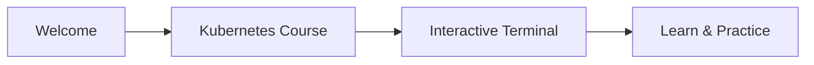

# Guide de création de cours

Ce guide explique comment créer des modules et des cours pour la plateforme kube-simulator.

## Architecture modulaire

Le système utilise une architecture modulaire où :
- **Modules** = Concepts techniques réutilisables (ex: Pods, Deployments, Services)
- **Cours** = Collections de chapitres sélectionnés depuis différents modules

## Méthodologie de rédaction

Pour garantir l'exactitude et l'exhaustivité, suivez ce workflow basé sur la documentation Kubernetes officielle :

### 1. Utiliser la documentation officielle

**Référence principale** : https://kubernetes.io/docs/

**Sections utiles** :
- **Concepts** : https://kubernetes.io/docs/concepts/ (Pods, Deployments, Services, etc.)
- **Tasks** : https://kubernetes.io/docs/tasks/ (Guides pratiques)
- **Reference** : https://kubernetes.io/docs/reference/ (API, kubectl)
- **Tutorials** : https://kubernetes.io/docs/tutorials/

**Pour créer un module sur un concept** :
- Consultez la page correspondante sur kubernetes.io/docs/concepts/
- Utilisez cette documentation comme référence principale

### 2. Générer le plan structuré

Consultez la documentation officielle et utilisez l'IA pour générer un plan de module avec :
- 3-5 chapitres logiques
- 3-5 leçons par chapitre (25-30 lignes chacune)
- Ordre pédagogique optimal

**Prompt type** : "Voici la documentation officielle Kubernetes sur [concept] (https://kubernetes.io/docs/concepts/[concept]/). Génère un plan de module structuré avec chapitres et leçons."

### 3. Générer la structure de fichiers

Demandez à l'IA de générer :
- `module.ts` avec métadonnées
- `chapter.json` pour chaque chapitre
- Structure de dossiers complète

### 4. Générer le contenu des leçons

Pour chaque leçon, générez le `content.md` avec l'IA :
- Format : 25-30 lignes, micro-learning
- Structure : H1 titre + introduction + concept + points clés + exemple
- Référence : Basé sur la section pertinente de la doc officielle

### 5. Générer les quiz

Générez `quiz.ts` avec 3-5 questions :
- Questions multiple-choice basées sur le contenu
- Questions terminal-command si applicable
- Validation contre la doc officielle

### 6. Validation finale

Vérifiez avec l'IA que :
- Le contenu est conforme à la doc officielle
- Les commandes kubectl sont correctes
- Les exemples YAML sont valides
- Pas d'informations obsolètes

**Ressources** :
- Documentation officielle : https://kubernetes.io/docs/
- Concepts : https://kubernetes.io/docs/concepts/
- API Reference : https://kubernetes.io/docs/reference/kubernetes-api/

## Structure des modules

Les modules sont organisés dans `/src/courses/modules/` :

```
src/courses/modules/
└── nom-du-module/
    ├── module.ts                    # Métadonnées du module
    └── {NN-chapter-name}/           # Chapitres préfixés avec numéro (directement dans le module)
        ├── chapter.json             # Métadonnées du chapitre (inclut l'environnement)
        └── {NN-lesson-name}/        # Leçons préfixées (directement dans le chapitre)
            ├── fr/
            │   ├── content.md
            │   ├── quiz.ts          # Optionnel
            │   └── nom-diagramme.mmd  # Optionnel
            └── en/
                ├── content.md
                ├── quiz.ts          # Optionnel
                └── nom-diagramme.mmd  # Optionnel
```

**Important** : Les chapitres sont directement dans le module (pas de dossier `chapters/`), et les leçons sont directement dans le chapitre (pas de dossier `lessons/`).

## Structure d'un cours

Un cours référence des chapitres de modules via `course-structure.ts` :

```
src/courses/
└── nom-du-cours/
    ├── course.ts                    # Métadonnées du cours
    └── course-structure.ts          # Références aux chapitres de modules
```

## 1. Créer un module

### 1.1 Créer module.ts

Créez `module.ts` à la racine du module :

```typescript
import type { LocalModule } from '../../types';

export const module: LocalModule = {
    title: {
        en: 'Pods',
        fr: 'Les Pods',
    },
    description: {
        en: 'Learn about Pods, the smallest deployable unit in Kubernetes',
        fr: 'Apprenez à utiliser les Pods, la plus petite unité déployable dans Kubernetes',
    },
    tags: ['CKA', 'CKAD', 'fondamental'],  // Optionnel
};
```

### 1.2 Créer les chapitres

Chaque chapitre est directement dans le module `{NN-chapter-name}/` avec un `chapter.json` :

```json
{
    "title": {
        "en": "Understanding Pods",
        "fr": "Comprendre les Pods"
    },
    "description": {
        "en": "Learn the fundamentals of Pods",
        "fr": "Apprenez les fondamentaux des Pods"
    },
    "isFree": true,
    "environment": "minimal"
}
```

**Propriétés** :
- `title` / `description` : Métadonnées multilingues
- `isFree` : Accès gratuit sans inscription
- `environment` : Nom du scénario à charger (optionnel, défaut : `"empty"`)

**Scénarios disponibles** : `empty`, `default`, `troubleshooting`, `multi-namespace`

Voir la section [Système de Seeds](#système-de-seeds) pour créer des scénarios personnalisés.

### 1.3 Créer les leçons

Chaque leçon est directement dans le chapitre `{NN-chapter-name}/{NN-lesson-name}/`. Une leçon est détectée automatiquement par la présence de fichiers `content.md` dans les dossiers `fr/` et/ou `en/`.

**Note** : Le titre de la leçon est extrait automatiquement du H1 du fichier `content.md`. Aucun fichier `lesson.json` n'est nécessaire.

## 2. Créer un cours

### 2.1 Créer course.ts

Créez `course.ts` dans le dossier du cours :

```typescript
import type { LocalCourse } from '~/learnable/local-course-loader';

export const course: LocalCourse = {
    title: {
        en: 'Kubernetes Introduction',
        fr: 'Introduction à Kubernetes',
    },
    description: {
        en: 'Course description',
        fr: 'Description du cours',
    },
    isActive: true,
    isFree: true,    // Optionnel : affiche un badge "Free" sur la carte du cours
    price: 0,        // 0 = gratuit
    order: 1,        // Ordre d'affichage
};
```

### 2.2 Créer course-structure.ts

Référencez les chapitres de modules que vous voulez inclure :

```typescript
import type { CourseStructure } from '../types';

export const courseStructure: CourseStructure = {
    chapters: [
        { moduleId: 'decouverte', chapterId: 'all' },      // Tous les chapitres du module
        { moduleId: 'kubectl', chapterId: 'all' },
        { moduleId: 'pod', chapterId: 'bases' },          // Seulement le chapitre "bases"
        { moduleId: 'deployment', chapterId: 'all' },
    ],
};
```

**Options** :
- `chapterId: 'all'` : Inclut tous les chapitres du module
- `chapterId: 'bases'` : Inclut uniquement le chapitre avec l'ID "bases"
- `order?: number` : Optionnel, pour réordonner dans le cours

## 3. Créer le contenu d'une leçon

Chaque leçon doit avoir un fichier `content.md` dans les dossiers `fr/` et `en/`.

### Format du markdown

Le contenu est en Markdown standard. Respectez les règles suivantes :

- **Longueur** : 25-30 lignes maximum par leçon (format micro-learning)
- **Focus** : Un seul concept par leçon
- **Structure** : Introduction courte (2-3 lignes) + concept principal + points clés (3-5 points)
- **Titre H1 obligatoire** : La première ligne doit être un titre H1 (`# Titre`) qui sera utilisé comme titre de la leçon

### Exemple

```markdown
# Titre de la leçon

Introduction courte qui contextualise le concept.

## Concept principal

Explication du concept avec des exemples si nécessaire.

## Points clés

- Point 1
- Point 2
- Point 3

## Exemple

```bash
kubectl get pods
```

Cette commande fait...
```

**Important** : Le titre H1 (`# Titre de la leçon`) sera automatiquement extrait et utilisé comme titre de la leçon dans l'interface. Assurez-vous qu'il soit présent et cohérent entre les versions `fr/` et `en/`.

## 4. Ajouter un diagramme Mermaid

### Méthode recommandée : Bloc mermaid direct dans le markdown

Vous pouvez ajouter directement un bloc de code mermaid dans votre fichier `content.md` :

```markdown
Voici l'architecture :



Le système détectera automatiquement les blocs de code avec le langage `mermaid` et les rendra comme des diagrammes interactifs.

**Avantages** :
- Plus simple : tout est dans un seul fichier
- Plus facile à maintenir : pas de fichiers séparés
- Support complet de la syntaxe Mermaid

### Méthode alternative : Fichiers séparés (dépréciée)

Si vous préférez utiliser des fichiers séparés, créez un fichier `.mmd` dans les dossiers `en/` et/ou `fr/` de la leçon, puis utilisez la syntaxe `{{diagram:nom}}` dans le markdown. Cette méthode est toujours supportée mais moins recommandée.

## 5. Ajouter des callouts (cartes d'alerte)

Vous pouvez ajouter des cartes d'alerte avec icônes dans votre contenu markdown pour mettre en évidence des informations importantes.

### Syntaxe

Utilisez la syntaxe suivante dans votre fichier `content.md` :

```markdown
:::info
Ceci est une information importante.
:::

:::warning
Attention à cette étape !
:::

:::important
Point crucial à retenir.
:::
```

### Types de callouts disponibles

- **`:::info`** : Pour des informations générales (icône bleue)
- **`:::warning`** : Pour des avertissements (icône jaune/orange)
- **`:::important`** : Pour des points importants (icône rouge)
- **`:::command`** : Pour suggérer des commandes à exécuter dans le terminal (icône terminal, fond gris)

### Callout `:::command` pour les commandes

Le callout `:::command` est spécialement conçu pour encourager les apprenants à exécuter des commandes dans le terminal. Il affiche un fond gris avec une icône de terminal.

**Format recommandé** :

```markdown
:::command
To view the nodes in your cluster, run:

```bash
kubectl get nodes
```

<a target="_blank" href="https://kubernetes.io/docs/reference/kubectl/kubectl/">Learn more about kubectl</a>
:::
```

**Règles importantes** :
- Utilisez des **blocs de code avec triple backticks** (```bash) pour la commande, pas de code inline
- Utilisez des **balises HTML `<a target="_blank" href="...">`** pour les liens vers la documentation, pas la syntaxe markdown `[texte](url)`
- Le lien est optionnel mais recommandé pour pointer vers la documentation officielle

### Contenu des callouts

Le contenu des callouts supporte le markdown standard. Vous pouvez utiliser :

- **Texte simple** : `:::info\nTexte simple\n:::`
- **Listes** : `:::info\n- Point 1\n- Point 2\n:::`
- **Liens** : `:::info\n<a target="_blank" href="https://example.com">Lien</a>\n:::` (utilisez des balises HTML avec `target="_blank"` pour les liens externes)
- **Code inline** : `:::info\nUtilisez `kubectl get pods`\n:::`
- **Paragraphes multiples** : `:::info\nParagraphe 1\n\nParagraphe 2\n:::`

### Exemple complet

```markdown
## Architecture du Control Plane

Le control plane est composé de plusieurs composants.

:::info
Dans le cas où le control plane est dupliqué (haute disponibilité), il faudra isoler la base de données (etcd) ailleurs pour éviter les problèmes de cohérence et améliorer la performance.
:::

### Composants principaux

- API Server
- etcd
- Scheduler
```

**Note** : Les callouts sont automatiquement stylisés avec des couleurs adaptées au thème (dark/light) et incluent des icônes SVG inline.

## 6. Créer un quiz

### Structure du fichier quiz.ts

Créez un fichier `quiz.ts` dans les dossiers `fr/` et/ou `en/` de la leçon.

**Exemple : `fr/quiz.ts`**

```typescript
// ═══════════════════════════════════════════════════════════════════════════
// QUIZ - Nom de la leçon
// ═══════════════════════════════════════════════════════════════════════════

import type { Quiz } from '~/types/quiz'

export const quiz: Quiz = {
  questions: [
    {
      id: 'q1',
      type: 'multiple-choice',
      question: 'Qu\'est-ce qu\'un Pod dans Kubernetes ?',
      options: [
        'Un conteneur',
        'La plus petite unité déployable dans Kubernetes',
        'Un service',
        'Un namespace',
      ],
      correctAnswer: 1,  // Index de la bonne réponse (0-based)
    },
    {
      id: 'q2',
      type: 'terminal-command',
      question: 'Liste tous les pods dans le namespace default',
      expectedCommand: 'kubectl get pods',
      validationMode: 'exact',  // 'exact' | 'contains' | 'regex'
      normalizeCommand: true,    // Normalise la commande (trim, lowercase)
    },
  ],
}
```

### Types de questions disponibles

#### Question à choix multiple

```typescript
{
  id: 'q1',
  type: 'multiple-choice',
  question: 'Votre question ?',
  options: [
    'Option 1',
    'Option 2',
    'Option 3',
    'Option 4',
  ],
  correctAnswer: 1,  // Index de la bonne réponse (0-based)
}
```

#### Question commande terminal

```typescript
{
  id: 'q2',
  type: 'terminal-command',
  question: 'Exécutez la commande pour lister les pods',
  expectedCommand: 'kubectl get pods',
  validationMode: 'exact',      // 'exact' | 'contains' | 'regex'
  normalizeCommand: true,        // Normalise avant comparaison
}
```

**Modes de validation** :
- `exact` : La commande doit correspondre exactement
- `contains` : La commande doit contenir la chaîne attendue
- `regex` : Validation par expression régulière (à venir)

**Note** : Si un fichier `quiz.ts` existe, il sera automatiquement détecté et associé à la leçon. Vous n'avez pas besoin de le déclarer dans les métadonnées.

## 7. Environnements

L'environnement (cluster + filesystem) est défini au niveau du chapitre via la clé `environment` dans `chapter.json`.

Scénarios disponibles : `empty` (défaut), `default`, `troubleshooting`, `multi-namespace`.

Voir [seeds/readme.md](/seeds/readme.md) pour créer des scénarios personnalisés.

## Détection automatique

Le système détecte automatiquement :

- **Leçons** : Détectées par la présence de fichiers `content.md` dans les dossiers `fr/` ou `en/`
- **Titres des leçons** : Extrait du H1 du fichier `content.md`
- **Quiz** : Présence de fichiers `quiz.ts` dans `fr/` ou `en/`
- **Diagrammes** : Blocs de code `mermaid` directement dans `content.md`

## Règles importantes

1. **Nommage** : Utilisez le format `{NN-nom}` avec un préfixe numérique à 2 chiffres (01, 02, 03, etc.)
2. **Ordre** : Déterminé par le préfixe numérique
3. **IDs** : Générés automatiquement en supprimant le préfixe (ex: `01-introduction` → `introduction`)
4. **Titres des leçons** : Doivent être dans le H1 du fichier `content.md`
5. **Traductions** : Créez toujours `content.md` (et `quiz.ts` si nécessaire) dans `fr/` et `en/`
6. **Environnement** : Défini au niveau du chapitre dans `chapter.json`, pas par leçon

## Synchronisation avec la base de données

Les cours et modules sont stockés dans Supabase. Après avoir créé ou modifié des cours/modules localement, synchronisez-les avec la base de données :

```bash
just sync-courses
```

Cette commande synchronise :
- Les métadonnées des cours
- Les métadonnées des modules
- Les chapitres et leurs environnements
- Les leçons avec leur contenu et quiz

**Note** : Le contenu des leçons (markdown) et les quiz sont stockés en JSONB dans la base de données.

## Avantages du système modulaire

- **Réutilisabilité** : Un module peut être utilisé dans plusieurs cours
- **Maintenance** : Une mise à jour d'un module se propage à tous les cours qui l'utilisent
- **Flexibilité** : Les cours peuvent sélectionner des chapitres spécifiques de modules
