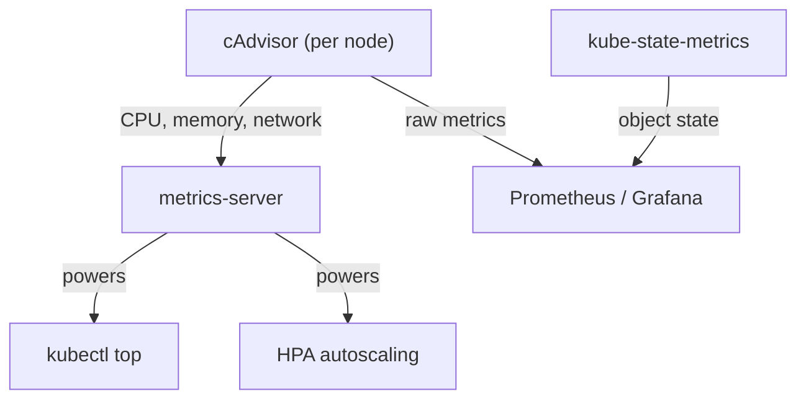

# Metrics Overview

Logs tell you *what happened*. Metrics tell you *how things are performing right now*. Together, they form the foundation of Kubernetes observability. In this lesson, we'll explore where Kubernetes metrics come from and how to start using them.

## The Three Pillars of Kubernetes Metrics

Kubernetes doesn't have a single "metrics system." Instead, metrics come from three complementary sources, each answering different questions:

**cAdvisor** is embedded directly in the kubelet. It collects per-container resource metrics: CPU usage, memory consumption, filesystem activity, and network traffic. Every node runs cAdvisor automatically — you don't need to install anything.

**metrics-server** aggregates resource usage data from all nodes and exposes it through the Kubernetes Metrics API. It's what powers `kubectl top` and the HorizontalPodAutoscaler (HPA). Think of it as a dashboard that summarizes "how much CPU and memory is everything using right now?"

**kube-state-metrics** takes a different angle. Instead of resource usage, it watches the Kubernetes API and generates metrics about *object state*: How many replicas does this Deployment want? How many are actually available? Are any Pods stuck in Pending? This is invaluable for alerting and dashboards.



:::info
The **metrics-server** provides real-time resource metrics and is required for `kubectl top` and HPA. However, it doesn't store historical data. For long-term metrics, dashboards, and alerting, you'll want <a target="_blank" href="https://prometheus.io/">Prometheus</a> or a similar time-series database.
:::

## Using kubectl top

The quickest way to see resource usage is `kubectl top`. It queries the metrics-server and shows CPU and memory consumption for nodes (`kubectl top nodes`) and Pods (`kubectl top pods`). You can filter by namespace with `-n`, get per-container breakdown with `--containers`, or sort by CPU or memory with `--sort-by`.

If `kubectl top` returns "metrics not available," the metrics-server probably isn't installed or isn't ready yet.

## Querying the Metrics API Directly

Under the hood, `kubectl top` calls the Metrics API. You can query it directly for more detailed data:

```bash
# Raw node metrics
kubectl get --raw /apis/metrics.k8s.io/v1beta1/nodes

# Raw Pod metrics in a namespace
kubectl get --raw /apis/metrics.k8s.io/v1beta1/namespaces/default/pods
```

This is the same API that the HPA controller uses to make scaling decisions. When you set up autoscaling based on CPU or memory, the HPA reads from this endpoint to determine whether to scale up or down.

## Verifying the Metrics Pipeline

A quick health check: verify the metrics-server Deployment is running in `kube-system`, confirm the Metrics API is registered via `kubectl get apiservice`, and test data availability with `kubectl top`. If any step fails, the metrics pipeline needs attention.

## Troubleshooting

**"Unable to get metrics"** — The metrics-server is either not installed or not ready. Check the Deployment and its logs:

```bash
kubectl logs -n kube-system -l k8s-app=metrics-server
```

**Stale or zero values** — The metrics-server needs a minute or two after Pods start before it has data. Give it time.

**HPA not scaling** — Verify three things: the metrics-server is running, the HPA targets the correct resource type (cpu or memory), and the target Pods have `requests` defined (HPA calculates utilization as a percentage of requests).

:::warning
The metrics-server is a snapshot tool — it shows current usage, not history. If you need to answer questions like "What was CPU usage at 3 AM?" or "How has memory trended over the past week?", you need a time-series database like Prometheus. We'll cover that in the next lessons.
:::

---

## Hands-On Practice

### Step 1: Verify the Metrics Pipeline

```bash
kubectl get deployment metrics-server -n kube-system
kubectl get apiservice | grep metrics
```

### Step 2: Check Node and Pod Usage

```bash
kubectl top nodes
kubectl top pods -A
```

### Step 3: Explore Sorting and Filtering

```bash
kubectl top pods --sort-by=cpu
kubectl top pods --containers
kubectl top pods -n kube-system
```

## Wrapping Up

Kubernetes metrics come from three sources: cAdvisor (container-level resource usage), metrics-server (aggregated resource metrics for `kubectl top` and HPA), and kube-state-metrics (object state for alerting and dashboards). Start with `kubectl top` to see what's happening right now, and plan for Prometheus when you need history and alerting. In the next lesson, we'll dive deeper into kube-state-metrics and the insights it provides about your cluster's health.
