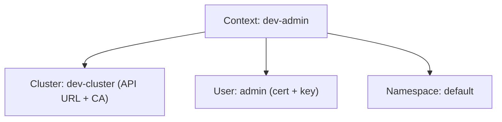

# kubeconfig and Client Certificates

Every time you run a `kubectl` command, it needs to know three things: *which cluster* to talk to, *who you are*, and *which namespace* to default to. All of this information lives in your **kubeconfig** file — typically at `~/.kube/config`.

Let's explore how kubeconfig works and how client certificates fit into the authentication picture.

## The Three Sections of kubeconfig

A kubeconfig file has three main sections that work together:

**Clusters** — Each entry defines a Kubernetes cluster: its API server URL and the CA certificate used to verify the server's identity.

**Users** — Each entry defines credentials: client certificates, tokens, or other authentication methods.

**Contexts** — Each context combines a cluster, a user, and optionally a default namespace. When you switch context, you switch which cluster you're talking to and which identity you're using.

Think of it like a phone's contact list. Each contact (context) combines a person (user) with a phone number (cluster). You switch contacts to reach different people on different networks.



## How Certificate-Based Authentication Works

When you use client certificates for authentication, here's what happens:

1. kubectl reads the client certificate and key from your kubeconfig
2. It presents the certificate to the API server during the TLS handshake
3. The API server verifies the certificate was signed by the cluster CA
4. If valid, the API server extracts your identity from the certificate:
   - **Common Name (CN)** → your username
   - **Organization (O)** → your group memberships

RBAC then uses this username and groups to determine what you're allowed to do.

Here's what the user section looks like in kubeconfig:

```yaml
users:
  - name: dev-user
    user:
      client-certificate: /path/to/dev-user.crt
      client-key: /path/to/dev-user.key
```

:::info
Client certificates are just one authentication method. Kubernetes also supports bearer tokens, OIDC (for SSO with providers like Google or Azure AD), and webhook-based authentication. ServiceAccounts use tokens, not certificates. For human users, certificates and OIDC are the most common approaches.
:::

## Creating a Client Certificate

Let's walk through creating a certificate for a new user. This is a common task when onboarding team members onto a cluster.

**Step 1: Generate a private key and certificate signing request (CSR)**

```bash
# Generate a 2048-bit RSA key
openssl genrsa -out dev-user.key 2048

# Create a CSR with username (CN) and group (O)
openssl req -new -key dev-user.key -out dev-user.csr -subj "/CN=dev-user/O=developers"
```

The `-subj` flag is important: `CN=dev-user` sets the username, and `O=developers` adds the user to the `developers` group. You can add multiple groups with multiple `/O=` entries.

**Step 2: Sign the CSR with the cluster CA**

```bash
openssl x509 -req \
  -in dev-user.csr \
  -CA /etc/kubernetes/pki/ca.crt \
  -CAkey /etc/kubernetes/pki/ca.key \
  -CAcreateserial \
  -out dev-user.crt \
  -days 365
```

This creates a certificate valid for one year, signed by the cluster CA. The API server will trust this certificate because it trusts the CA.

**Step 3: Add the credentials to kubeconfig**

```bash
# Add the user credentials
kubectl config set-credentials dev-user \
  --client-certificate=dev-user.crt \
  --client-key=dev-user.key

# Create a context that uses this user
kubectl config set-context dev-context \
  --cluster=my-cluster \
  --user=dev-user \
  --namespace=dev

# Switch to the new context
kubectl config use-context dev-context
```

**Step 4: Grant permissions with RBAC**

The certificate gives the user an identity, but no permissions yet. You need a RoleBinding:

```bash
kubectl create rolebinding dev-user-edit \
  --clusterrole=edit \
  --user=dev-user \
  --namespace=dev
```

## Verifying Access

After setting everything up, verify by checking the current context, reviewing the full kubeconfig structure with `kubectl config view`, and testing permissions with `kubectl auth can-i`. You should also check the certificate expiry date with `openssl x509 -noout -dates`.

## Troubleshooting Common Errors

**"certificate signed by unknown authority"** — The client certificate wasn't signed by the cluster CA, or the CA reference in kubeconfig is wrong. Verify the CA cert matches.

**"x509: certificate has expired"** — The client certificate has expired. Generate a new one and update kubeconfig.

**"Forbidden"** — Authentication succeeded (the certificate is valid), but RBAC denies the action. The user needs a Role or ClusterRole bound via RoleBinding or ClusterRoleBinding.

:::warning
Never commit kubeconfig files with private keys to version control. Treat client certificates like passwords — they grant cluster access. Rotate them before they expire, and revoke access by removing the user's RoleBindings when they leave the team.
:::

---

## Hands-On Practice

### Step 1: Explore Your kubeconfig

```bash
kubectl config view
kubectl config get-contexts
kubectl config current-context
```

Look for `client-certificate` and `client-key` paths in the user sections — these are certificate references.

### Step 2: Test Your Permissions

```bash
kubectl auth can-i get pods
kubectl auth can-i create deployments
```

## Wrapping Up

kubeconfig ties together clusters, users, and contexts. Client certificates provide a secure authentication method where the CN becomes the username and the O becomes group membership for RBAC. Creating certificates is a straightforward OpenSSL workflow: generate a key, create a CSR, sign it with the cluster CA, and add it to kubeconfig. Remember to pair the certificate with appropriate RBAC permissions — identity without authorization doesn't accomplish much.
