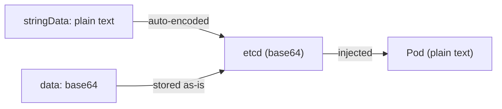

# What Is a Secret?

ConfigMaps are great for non-sensitive configuration. But what about database passwords, API keys, and TLS certificates? You wouldn't want those stored in plain text where anyone with cluster access can read them.

**Secrets** are Kubernetes objects designed for sensitive data. They work similarly to ConfigMaps but with additional safeguards for confidential information.

## How Secrets Differ from ConfigMaps

The core difference is **intent and handling**:

- **ConfigMaps** are for non-sensitive configuration — log levels, URLs, feature flags
- **Secrets** are for sensitive data — passwords, tokens, certificates, keys

Kubernetes treats them differently:
- Secret values are **base64-encoded** (not plain text)
- Secrets can be **encrypted at rest** in etcd (when configured)
- **RBAC** can restrict who reads Secrets, separately from ConfigMaps
- Values are not shown in `kubectl get` or `kubectl describe` output by default

:::warning
Base64 is **encoding**, not encryption. Anyone can decode base64 strings. The real protection comes from RBAC (controlling who can access Secrets) and encryption at rest (encrypting Secret data in etcd). For production clusters, enable both.
:::

## Secret Types

Kubernetes has several built-in Secret types, each with a specific structure:

| Type | Purpose |
|------|---------|
| `Opaque` | Default — generic key-value data |
| `kubernetes.io/tls` | TLS certificates and keys |
| `kubernetes.io/dockerconfigjson` | Container registry credentials |
| `kubernetes.io/service-account-token` | ServiceAccount tokens |

## Secret Structure

Secrets have two fields for values:
- `data` — Values must be **base64-encoded**
- `stringData` — Values in **plain text** (Kubernetes encodes automatically)

```yaml
apiVersion: v1
kind: Secret
metadata:
  name: db-credentials
type: Opaque
stringData:
  username: admin
  password: my-secure-password
```

Using `stringData` is more convenient — you write plain text, and Kubernetes handles the encoding. Both `data` and `stringData` end up the same way in storage.



:::info
Use `stringData` when writing manifests to avoid manual base64 encoding. It's cleaner and less error-prone. But **never commit real credentials** to version control — use placeholders or external secret managers.
:::

---

## Hands-On Practice

### Step 1: List Secrets

```bash
kubectl get secrets
```

You'll see built-in Secrets (like `default-token-*` from ServiceAccounts) and any custom ones. Values are never shown in the output — only names, types, and key counts.

### Step 2: Describe a Secret

```bash
kubectl describe secret <secret-name>
```

Replace `<secret-name>` with any name from Step 1 (e.g. `default-token-xxxxx`). The `describe` output shows keys but not values — Kubernetes protects sensitive data from casual inspection.

### Step 3: Inspect the base64 encoding

```bash
kubectl get secret <secret-name> -o yaml
```

Look at the `data` section — values are base64-encoded strings. Secrets store values in base64, not encryption. Anyone with API access can decode them; RBAC controls who gets that access.

## Wrapping Up

Secrets store sensitive data like passwords, tokens, and certificates. They work like ConfigMaps but with base64 encoding, optional encryption at rest, and separate RBAC controls. Use `stringData` for convenience, but never commit real credentials to version control. In the next lesson, you'll learn how to create Secrets — from manifests, literal values, and specialized types like TLS and docker-registry.
