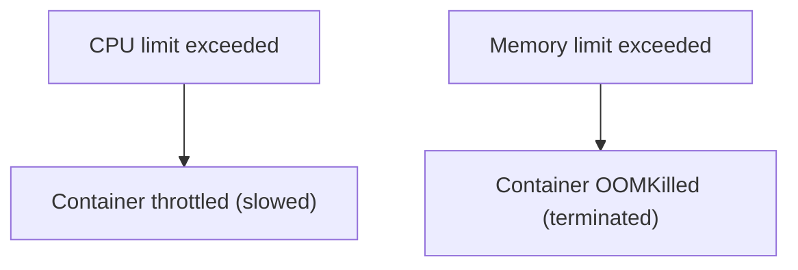

# Requests and Limits

In a shared cluster, multiple applications compete for CPU and memory. Without guardrails, one misbehaving container can consume all available resources and starve everything else. Kubernetes uses **requests** and **limits** to prevent this.

Think of it like sharing an office kitchen. Your **request** is the fridge shelf reserved for you — it's guaranteed. Your **limit** is the maximum you're allowed to use — if you try to take more, you'll be stopped.

## Requests — What You're Guaranteed

A **request** tells the scheduler "my container needs at least this much to function." The scheduler uses requests to decide which node has enough capacity to run the Pod:

```yaml
resources:
  requests:
    cpu: "250m"
    memory: "256Mi"
```

- `cpu: "250m"` — 250 millicores (0.25 of a CPU core)
- `memory: "256Mi"` — 256 mebibytes of RAM

The scheduler only places the Pod on a node that has enough **unrequested** capacity. If no node has 250m CPU and 256Mi memory available, the Pod stays in `Pending`.

## Limits — The Ceiling

A **limit** caps the maximum resources your container can use:

```yaml
resources:
  requests:
    cpu: "250m"
    memory: "256Mi"
  limits:
    cpu: "500m"
    memory: "512Mi"
```

What happens when limits are exceeded:
- **CPU**: The container is **throttled** — it slows down but keeps running
- **Memory**: The container is **OOMKilled** — Kubernetes terminates it



## CPU Units

CPU is measured in **cores** or **millicores**:
- `1` = 1 full CPU core
- `500m` = half a core
- `100m` = one-tenth of a core
- `0.1` and `100m` are equivalent

:::info
Prefer millicores (`250m`) over decimal notation (`0.25`) for consistency and clarity. This is the convention used throughout the Kubernetes ecosystem.
:::

## Memory Units

Memory uses standard binary prefixes:
- `256Mi` = 256 mebibytes (use this)
- `1Gi` = 1 gibibyte
- `256M` = 256 megabytes (decimal — slightly different)

Use `Mi` and `Gi` (binary) for consistency with how Kubernetes and Linux report memory.

## A Practical Example

A typical production container:

```yaml
containers:
  - name: api
    image: myapp:latest
    resources:
      requests:
        cpu: "100m"
        memory: "128Mi"
      limits:
        cpu: "500m"
        memory: "512Mi"
```

This says: "I need at least 100m CPU and 128Mi memory (reserve this for me), but I might burst up to 500m CPU and 512Mi memory."

## Monitoring Actual Usage

Once metrics-server is installed, you can use `kubectl top pod` and `kubectl top node` to see real CPU and memory consumption. Compare actual usage against requests and limits to find where you're over- or under-provisioned.

## Common Problems

**Pod stuck in Pending** — Requests exceed available node capacity. Either reduce requests or add more nodes.

**Container OOMKilled** — Memory usage exceeded the limit. Increase the memory limit or investigate memory leaks.

**Application feels slow** — CPU is being throttled because the limit is too low. Increase the CPU limit or check if requests match actual needs.

:::warning
Without requests, the scheduler can't make informed decisions — Pods might land on overloaded nodes. Without limits, a single container can consume all node resources. Always set both for production workloads.
:::

---

## Hands-On Practice

### Step 1: Create a Pod with requests and limits

```bash
nano resource-pod.yaml
```

```yaml
apiVersion: v1
kind: Pod
metadata:
  name: resource-pod
spec:
  containers:
    - name: app
      image: nginx
      resources:
        requests:
          memory: "64Mi"
          cpu: "100m"
        limits:
          memory: "128Mi"
          cpu: "250m"
```

```bash
kubectl apply -f resource-pod.yaml
```

### Step 2: Verify the resource allocation

```bash
kubectl describe pod resource-pod
```

Look for the **Requests** and **Limits** fields under the container section.

### Step 3: Check resource usage

```bash
kubectl top pod resource-pod
```

### Step 4: Clean up

```bash
kubectl delete pod resource-pod
```

## Wrapping Up

Requests guarantee minimum resources and drive scheduling. Limits cap maximum usage to protect the node. CPU throttling slows you down; memory overuse kills the container. Start with conservative estimates, monitor with `kubectl top`, and adjust based on real usage. In the next lesson, we'll explore QoS classes — how Kubernetes uses your request and limit settings to decide which Pods survive when a node runs low on resources.
