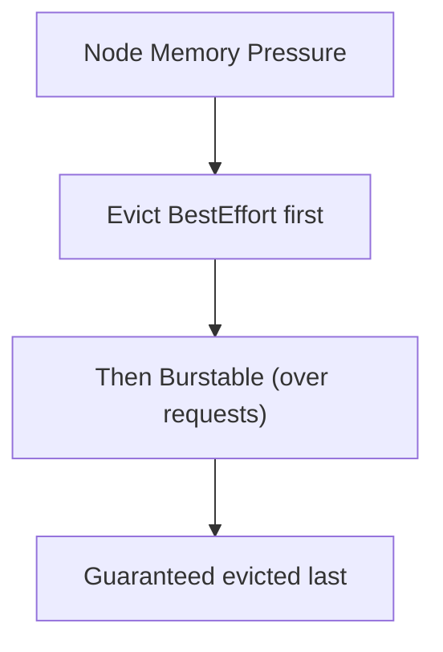

# QoS Classes

When a node runs low on memory, Kubernetes has to make a tough decision: which Pods to evict? It can't just pick randomly — your critical database shouldn't be killed before a batch processing job. **QoS (Quality of Service) classes** are how Kubernetes makes this decision.

Think of it as a triage system in a hospital. When resources are scarce, the most critical patients (Guaranteed Pods) get treated first, while less critical ones (BestEffort Pods) wait.

## The Three Classes

Kubernetes assigns each Pod one of three QoS classes based on its resource configuration:

| QoS Class | Criteria | Eviction Priority |
|-----------|----------|-------------------|
| **Guaranteed** | Every container has requests = limits (for both CPU and memory) | Last to be evicted |
| **Burstable** | At least one container has a request or limit, but doesn't qualify as Guaranteed | Middle |
| **BestEffort** | No container has any requests or limits | First to be evicted |

## Guaranteed — Maximum Protection

A Pod is Guaranteed when **every container** has both requests and limits set, and they're equal:

```yaml
resources:
  requests:
    cpu: "200m"
    memory: "256Mi"
  limits:
    cpu: "200m"
    memory: "256Mi"
```

Guaranteed Pods:
- Get the resources they asked for — no more, no less
- Are evicted **last** when the node is under pressure
- Have the most predictable performance

Use Guaranteed for critical workloads: databases, core APIs, system components.

## Burstable — The Middle Ground

A Pod is Burstable when at least one container has requests or limits, but doesn't meet the Guaranteed criteria:

```yaml
resources:
  requests:
    cpu: "100m"
    memory: "128Mi"
  limits:
    cpu: "500m"
    memory: "512Mi"
```

Burstable Pods can use more resources than requested (up to their limits) when capacity is available. Under pressure, those exceeding their requests are evicted before those staying within.

Most production workloads are Burstable — it balances predictability with efficiency.

## BestEffort — No Guarantees

A Pod with no requests or limits at all:

```yaml
resources: {}
```

BestEffort Pods can use whatever resources are available, but they're the **first to go** when the node needs to reclaim memory. Use this only for non-critical, disposable workloads.



## Checking QoS Class

```bash
# See QoS in describe output
kubectl describe pod my-pod | grep "QoS Class"

# List all Pods with their QoS class
kubectl get pods -o custom-columns=NAME:.metadata.name,QOS:.status.qosClass
```

:::info
If one container in a Pod has requests and limits and another doesn't, the whole Pod is Burstable — not Guaranteed. **Every** container must have matching requests and limits for the Pod to be Guaranteed.
:::

## Choosing the Right QoS

| Workload Type | Recommended QoS | Why |
|---------------|-----------------|-----|
| Databases, core APIs | Guaranteed | Must survive pressure |
| Web servers, microservices | Burstable | Balance performance and efficiency |
| Batch jobs, dev workloads | BestEffort or Burstable | Can be restarted if evicted |

:::warning
Guaranteed Pods with conservative settings (requests = limits) may underutilize resources. There's a tradeoff between predictability and efficiency. Use monitoring data to find the right balance.
:::

---

## Hands-On Practice

### Step 1: Create three Pods with different QoS profiles

Create `qos-pods.yaml`:

```yaml
apiVersion: v1
kind: Pod
metadata:
  name: guaranteed
spec:
  containers:
    - name: app
      image: nginx
      resources:
        requests:
          cpu: "100m"
          memory: "128Mi"
        limits:
          cpu: "100m"
          memory: "128Mi"
---
apiVersion: v1
kind: Pod
metadata:
  name: burstable
spec:
  containers:
    - name: app
      image: nginx
      resources:
        requests:
          cpu: "100m"
          memory: "128Mi"
        limits:
          cpu: "200m"
          memory: "256Mi"
---
apiVersion: v1
kind: Pod
metadata:
  name: besteffort
spec:
  containers:
    - name: app
      image: nginx
```

Apply it:

```bash
kubectl apply -f qos-pods.yaml
```

### Step 2: Check each Pod's QoS class

```bash
kubectl get pod guaranteed -o jsonpath='{.status.qosClass}'; echo
kubectl get pod burstable -o jsonpath='{.status.qosClass}'; echo
kubectl get pod besteffort -o jsonpath='{.status.qosClass}'; echo
```

You should see `Guaranteed`, `Burstable`, and `BestEffort` respectively. Kubernetes assigns the class automatically based on your resource settings.

### Step 3: Clean up

```bash
kubectl delete -f qos-pods.yaml
```

## Wrapping Up

QoS classes determine eviction priority: Guaranteed Pods are evicted last, BestEffort first, and Burstable falls in between. The class is determined automatically by how you set requests and limits. For critical workloads, set requests equal to limits. For everything else, at least set requests to avoid being BestEffort. Next up: probes — how Kubernetes knows whether your application is actually healthy and ready to serve traffic.
