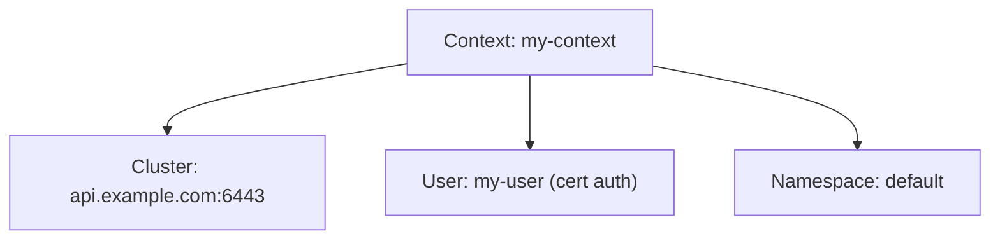

# What Is kubeconfig?

Every time you run `kubectl get pods`, kubectl needs to know two things: **where** is the cluster, and **who are you**? The answers live in a file called **kubeconfig**.

Think of kubeconfig as your phone's contact list for Kubernetes clusters. Each entry has an address (the cluster), credentials (your identity), and a label (the context name). When you make a call (run a kubectl command), your phone uses the selected contact.

## Where kubeconfig Lives

By default, kubectl looks for kubeconfig at:

```
~/.kube/config
```

You can override this with:
- The `KUBECONFIG` environment variable: `export KUBECONFIG=/path/to/my-config`
- The `--kubeconfig` flag: `kubectl --kubeconfig=/path/to/config get pods`

You can even merge multiple files by setting `KUBECONFIG` to a colon-separated list:

```bash
export KUBECONFIG=~/.kube/config:~/.kube/staging-config
```

kubectl merges them and uses the first match for the current context.

## The Three Sections

A kubeconfig file has three main sections:

```yaml
apiVersion: v1
kind: Config
clusters:
  - name: my-cluster
    cluster:
      server: https://api.example.com:6443
      certificate-authority-data: <base64-ca-cert>
users:
  - name: my-user
    user:
      client-certificate-data: <base64-cert>
      client-key-data: <base64-key>
contexts:
  - name: my-context
    context:
      cluster: my-cluster
      user: my-user
      namespace: default
current-context: my-context
```

**Clusters** — Where to connect. Each entry has the API server address and the CA certificate to verify the server's identity.

**Users** — How to authenticate. Credentials can be client certificates, bearer tokens, or exec commands that fetch tokens at runtime.

**Contexts** — The combination. Each context links a cluster with a user and optionally sets a default namespace.

**current-context** — Which context kubectl uses right now.



:::info
When you run any kubectl command, it reads the current context, finds the associated cluster and user, and makes the API request with those credentials. Change the context, and all your commands target a different cluster or identity.
:::

## Verifying Your Configuration

```bash
# See the current configuration (credentials redacted)
kubectl config view

# Which context is active?
kubectl config current-context

# Test the connection
kubectl cluster-info
```

If `cluster-info` succeeds, your kubeconfig is working. If you get "connection refused" or "unauthorized," check the server URL and credentials.

:::warning
kubeconfig files contain sensitive credentials — certificates, tokens, or references to credential helpers. Never commit them to version control. Restrict file permissions: `chmod 600 ~/.kube/config`.
:::

## Wrapping Up

kubeconfig tells kubectl where to connect and how to authenticate. It stores clusters (addresses), users (credentials), and contexts (the combination). By default it lives at `~/.kube/config`, but you can override it with environment variables or flags. In the next lesson, we'll explore contexts — how to switch between multiple clusters safely.
