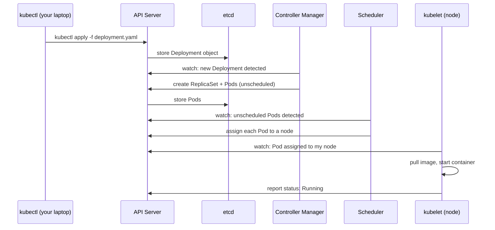

# Cluster Architecture

A Kubernetes cluster is not a single machine - it's a coordinated group of machines, each with a specific role. Understanding that structure matters because it shapes how failures behave, where you look when something goes wrong, and why `kubectl` commands work the way they do. The cluster is split into two layers: the **control plane**, which manages state and makes decisions, and the **worker nodes**, which actually run your application containers.

:::info
The control plane is the brain of the cluster. Worker nodes are the hands. You interact with both through a single entry point: the API server.
:::

## The Control Plane

The control plane is a set of processes that run together, usually on dedicated machines separate from your workloads. You never deploy your applications here. Its job is to store the desired state of the cluster, watch the actual state, and drive the two toward each other.

### The API Server

The API server is the only component that anything talks to directly. When you run `kubectl apply`, you're sending an HTTP request to the API server. When a controller needs to update the status of a Pod, it talks to the API server. When the kubelet on a worker node reports that a container crashed, it reports to the API server. Every piece of cluster information flows through it, and it validates every request before storing or acting on it.

### etcd

etcd is the cluster's persistent storage. It's a distributed key-value store that holds the entire state of the cluster: every object you've created, every status update, every configuration change. The API server reads from and writes to etcd. If etcd is lost without a backup, the cluster's state is gone. You can rebuild the control plane processes, but you cannot reconstruct what was in etcd without a backup. This is why etcd backup is one of the most critical operational concerns in any real cluster.

### The Scheduler

When a new Pod is created, it initially exists without a node assignment. The scheduler's job is to find a suitable node and record that assignment. It looks at each node's available CPU and memory, compares them against the Pod's resource requests, checks for any constraints you've declared (like requiring a specific label on the node, or avoiding nodes with a certain taint), and picks the best fit. The scheduler does not start the Pod - it only decides where it goes. The actual start happens on the node.

### The Controller Manager

This component bundles together many small control loops, each responsible for a specific type of resource. The Deployment controller watches Deployment objects and creates ReplicaSets. The ReplicaSet controller watches ReplicaSets and creates or deletes Pods to keep the actual count matching the desired count. The Node controller monitors nodes and reacts when they go offline. Each of these loops runs the same basic cycle: read current state from the API server, compare it to desired state, and take the smallest action needed to close the gap.

## Worker Nodes

Worker nodes are the machines that run your Pods. Each node needs three things to participate in the cluster.

### kubelet

The kubelet is an agent that runs on every worker node and is the only component that can actually start or stop containers. It watches the API server for Pods that have been scheduled to its node, and takes responsibility for making those Pods run. It pulls the container image if needed, starts the container via the container runtime, and continuously checks whether the container is still alive. If the container crashes, the kubelet restarts it according to the Pod's restart policy. It also reports the current status of every Pod back to the API server, which is why `kubectl get pods` is able to show you whether a container is `Running`, `Pending`, or `CrashLoopBackOff`.

### kube-proxy

kube-proxy maintains the networking rules on each node that make Services work. When you create a Service, kube-proxy programs the node's kernel so that traffic sent to the Service's virtual IP address gets forwarded to one of the backing Pods. This happens entirely at the network level, transparently to your application.

### The Container Runtime

This is the component that actually interfaces with the operating system to create and destroy containers. Kubernetes supports any runtime that implements the Container Runtime Interface. `containerd` is the most common choice today.

## How a Request Flows Through the Cluster



Every step in this chain is independent and event-driven. The API server stores state. The controllers and the scheduler react to changes in that state. The kubelet reacts to assignments. If any component is temporarily unavailable, the others continue working and catch up when it returns.

## Hands-On Practice

**1. List the nodes and their details:**

```bash
kubectl get nodes -o wide
```

The `-o wide` flag adds columns for internal IP, OS image, kernel version, and container runtime. You can see exactly which runtime is in use on each node.

**2. Describe a node to see its full status:**

```bash
kubectl get nodes
# copy a NAME from the output, then:
kubectl describe node <NODE-NAME>
```

Scroll through the output. The `Capacity` and `Allocatable` sections show the total and schedulable CPU and memory. The `Conditions` section lists things like `MemoryPressure` and `DiskPressure`. The `Allocated resources` table at the bottom shows how much CPU and memory is currently claimed by the Pods running on this node - this is exactly what the scheduler looks at before placing a new Pod here.

**3. Explore the control plane Pods:**

```bash
kubectl get pods -n kube-system -o wide
```

These are the components you just read about, running as ordinary Pods. Notice which node they're scheduled on - in most configurations, the control plane components run on a dedicated node that doesn't accept user workloads.

**4. Check the API server and client versions:**

```bash
kubectl version
```

`Server Version` is the Kubernetes version running on the API server. `Client Version` is the version of the `kubectl` binary on your machine. These don't need to match exactly, but should be within one minor version of each other.
