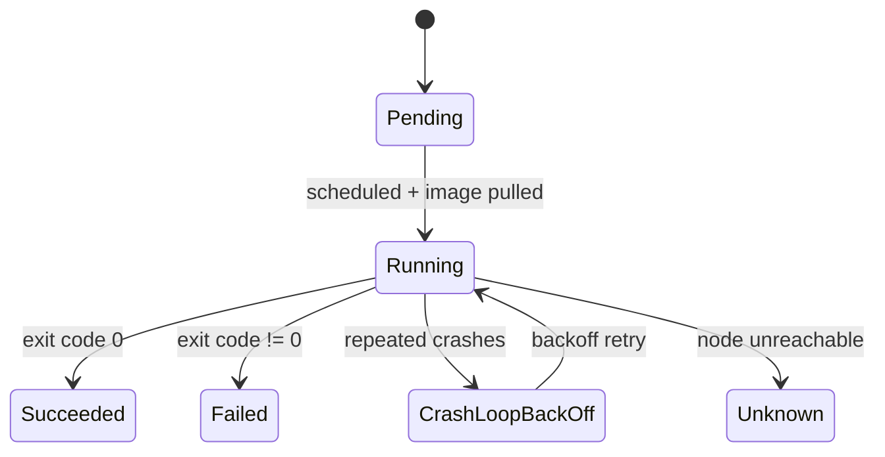

# Your First Pod

A Pod is the smallest deployable unit in Kubernetes. Not a container - a Pod. This distinction matters because a Pod can hold more than one container, and all containers in the same Pod share a network namespace and can share storage volumes. In practice, most Pods run a single container, but the abstraction exists so that Kubernetes has a consistent, atomic unit to schedule, start, stop, and monitor. You never tell Kubernetes "run this container on that node." You tell it "run this Pod," and it handles the rest.

:::info
A Pod wraps one or more containers and gives them a shared identity: a single IP address, a hostname, and access to shared volumes. All containers in a Pod always run on the same node and are started and stopped together.
:::

## Writing a Pod Manifest

Every Kubernetes resource is described as a YAML document with four required top-level fields. `apiVersion` tells Kubernetes which API version handles this resource. `kind` says what type of resource it is. `metadata` carries identification information like the name, namespace, and labels. `spec` describes the desired state - what you actually want to run.

For a Pod, the minimum you need to write is a name and a container image:

```yaml
apiVersion: v1
kind: Pod
metadata:
  name: my-pod
spec:
  containers:
    - name: web
      image: nginx:1.28
```

That's a complete, valid Pod manifest. Kubernetes will schedule it, pull the image, start the container, and watch it. If the container crashes, Kubernetes restarts it. You've expressed the outcome - a running nginx container - and the cluster takes care of making it real.

In practice you'll always add a few more fields. Labels help you identify and filter the Pod later. Resource `requests` and `limits` tell the scheduler how much CPU and memory this container needs, and cap what it's allowed to consume. Without requests, the scheduler has no information to make good placement decisions. Without limits, a misbehaving container can consume all available resources on a node and starve the other workloads running there.

```yaml
apiVersion: v1
kind: Pod
metadata:
  name: my-pod
  labels:
    app: web
spec:
  containers:
    - name: web
      image: nginx:1.28
      ports:
        - containerPort: 80
      resources:
        requests:
          cpu: '100m'
          memory: '64Mi'
        limits:
          cpu: '200m'
          memory: '128Mi'
```

The `ports` field is mostly documentation - it doesn't open or expose any network ports. The real networking is configured at the Service level. But declaring it makes the manifest easier to read and some tools use this information automatically.

## The Pod Lifecycle

When you apply this manifest, the Pod moves through a predictable sequence of phases. It starts as `Pending`: the API server has accepted the object and stored it in etcd, but it hasn't been scheduled to a node yet. Once the scheduler assigns it to a node, the kubelet on that node takes over: it pulls the container image, creates the container, and starts it. At that point the Pod transitions to `Running`. If the container exits cleanly with code 0, the Pod becomes `Succeeded`. If it exits with an error, it becomes `Failed`. If the kubelet on the node stops reporting to the API server, the Pod may enter `Unknown`.



The phase you'll see most often in a healthy cluster is `Running`. The one you'll need to debug most often is `CrashLoopBackOff`, which isn't actually a phase but a status message indicating that the container keeps crashing and Kubernetes is restarting it with an exponentially increasing delay between attempts.

## Inspecting a Running Pod

Once a Pod exists, three commands cover the vast majority of what you need to know. `kubectl get pod` gives you the quick overview: name, ready count, status, restart count, and age. `kubectl describe pod` gives you the full picture - all fields, all status conditions, and most importantly the `Events` section at the bottom, which is a timestamped log of every action Kubernetes has taken on this resource. When a Pod fails to start, the events are where you find the actual reason.

```bash
kubectl get pod my-pod
kubectl describe pod my-pod
```

`kubectl logs` streams the stdout and stderr of a container. This is equivalent to `docker logs` for a local container. You can follow logs live with `-f`, or retrieve the logs from the previous container instance (useful after a crash) with `--previous`.

```bash
kubectl logs my-pod
kubectl logs my-pod -f
kubectl logs my-pod --previous
```

## Hands-On Practice

**1. Save the following manifest as `first-pod.yaml`:**

```bash
nano first-pod.yaml
```

```yaml
#first-pod.yaml
apiVersion: v1
kind: Pod
metadata:
  name: first-pod
  labels:
    app: web
    lesson: foundations
spec:
  containers:
    - name: web
      image: nginx:1.28
      ports:
        - containerPort: 80
      resources:
        requests:
          cpu: '100m'
          memory: '64Mi'
        limits:
          cpu: '200m'
          memory: '128Mi'
```

**2. Apply it and watch it start:**

```bash
kubectl apply -f first-pod.yaml
kubectl get pod first-pod --watch
```

Press Ctrl+C once the status shows `Running`. Notice that the Pod spends a moment in `Pending` while it's being scheduled and the image is being pulled.

**3. Describe the Pod:**

```bash
kubectl describe pod first-pod
```

Look through the output for these specific pieces of information: the `Node` field shows which machine it was scheduled on; the `IP` field shows the Pod's internal cluster IP address; the `Containers` section shows the image and the resource requests and limits you declared; and the `Events` section at the bottom shows the full startup sequence from scheduling through to the container being started.

**4. Read the container logs:**

```bash
kubectl logs first-pod
```

You should see nginx's startup messages. This is the process's stdout, just as it would appear if you ran the container locally.

**5. Run a command inside the running container:**

```bash
kubectl exec first-pod -- env
```

`kubectl exec` runs a single command in a running container, without needing a shell. For an interactive session, pass `-it` and specify `bash` or `sh`:

```bash
kubectl exec -it first-pod -- bash
```

Type `exit` to leave the shell.

**6. Delete the Pod:**

```bash
kubectl delete pod first-pod
kubectl get pods
```

The Pod is gone. It will not come back - bare Pods are not replaced when deleted. That single limitation is why, in almost every real deployment, you don't create Pods directly. You use a Deployment, which wraps the Pod in a controller that keeps the desired count running at all times. That's exactly what the next module covers.
