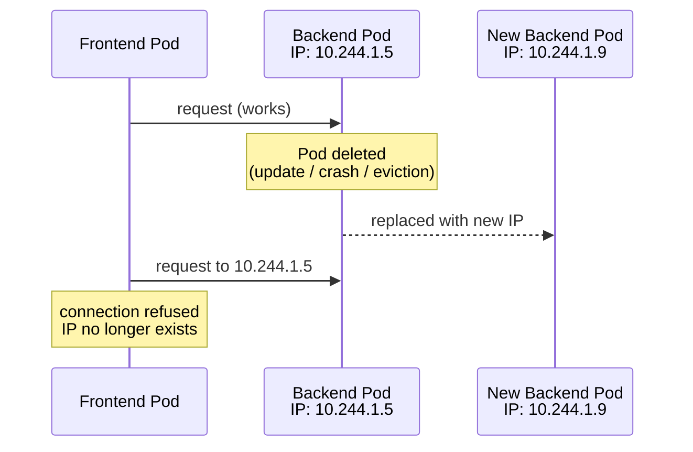

# The Problem with Pod IPs

You have a frontend Deployment and a backend Deployment. The frontend needs to call the backend API. The obvious first thought is to find the backend Pod's IP address and point the frontend at it. You can get the IP with `kubectl get pod -o wide`. It works. The first request goes through cleanly.

Then the backend Pod gets replaced - because of a rolling update, a node restart, a failed liveness probe, anything - and the new Pod gets a completely different IP address. Your frontend is still configured with the old one. The old address doesn't exist anymore. Requests fail silently, or worse, reach a completely unrelated workload that happened to reuse the IP.

This is the fundamental problem that Services solve, and it's worth understanding before we look at the solution.

:::info
Every Pod in Kubernetes gets a unique IP address, but that IP is ephemeral. It changes every time the Pod is replaced. Building any part of your system around a specific Pod IP is inherently fragile.
:::

## Why Pod IPs Are Ephemeral

Pod IPs come from a pool of addresses managed by the cluster's network plugin. When a Pod is deleted - for any reason - its IP is released back to the pool. When a replacement Pod starts, it draws a new IP from wherever in the pool happens to be available. There is no reservation, no forwarding from the old address, no grace period. The old IP is just gone.

In a Deployment with three replicas, this problem compounds. You have three IPs, all of which can change independently at any time, and your clients need to reach all three for load balancing. Even if you somehow tracked the current IPs and kept a configuration file up to date, the window between a Pod being replaced and your configuration being updated would be a window of failures.



This isn't an accident or an oversight - it's a consequence of how Kubernetes works. Pods are meant to be ephemeral. They can be created, destroyed, and replaced at any time, and they're supposed to be. The system is designed around this assumption, and the right answer isn't to fight it by trying to track IPs manually. The right answer is a Service.

A Service gives you a stable address that never changes, regardless of how many times the Pods behind it are replaced. It does this by maintaining a continuously updated list of healthy Pod IPs - the **Endpoints** object - and routing traffic to whichever ones are currently ready. The Service's own address remains constant for its entire lifetime.

## Hands-On Practice

This exercise makes the problem concrete before you introduce the solution.

**1. Create a backend Deployment:**

```bash
nano backend.yaml
```

```yaml
# backend.yaml
apiVersion: apps/v1
kind: Deployment
metadata:
  name: backend
spec:
  replicas: 2
  selector:
    matchLabels:
      app: backend
  template:
    metadata:
      labels:
        app: backend
    spec:
      containers:
        - name: backend
          image: nginx:1.28
```

```bash
kubectl apply -f backend.yaml
kubectl rollout status deployment/backend
```

**2. Record the current Pod IPs:**

```bash
kubectl get pods -l app=backend -o wide
```

Note the IP addresses in the `IP` column. These are the addresses any client would need to use to reach these Pods directly.

**3. Delete one of the Pods:**

```bash
# Copy one pod NAME from the previous command, then:
kubectl delete pod <POD-NAME>
```

**4. Wait for the replacement and compare IPs:**

```bash
kubectl get pods -l app=backend -o wide
```

The replacement Pod has appeared, but its IP address is different from the one you deleted. If anything in your system had been sending requests to the old address, those requests would now be failing.

**5. Clean up:**

```bash
kubectl delete deployment backend
```

In the next lesson, you'll create a Service in front of this Deployment and see how it provides a stable address that survives exactly this kind of Pod replacement.
