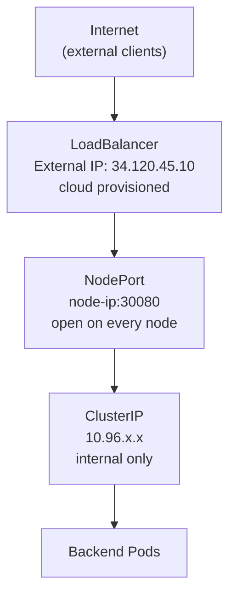

# NodePort and LoadBalancer: Exposing Apps Externally

ClusterIP Services are invisible from outside the cluster. A ClusterIP address is only reachable from within the cluster network - other Pods, other Services, nothing else. That's by design: most inter-service communication should stay internal, and exposing everything externally creates unnecessary attack surface. But at some point, at least one part of your system needs to be reachable from the outside world. That's where NodePort and LoadBalancer come in.

:::info
**NodePort** opens a specific port on every node in the cluster. **LoadBalancer** provisions an external load balancer in front of the cluster - typically through the cloud provider. Both give external traffic a way in.
:::

## NodePort

A NodePort Service extends ClusterIP. It does everything a ClusterIP Service does - provides a stable internal virtual IP, maintains Endpoints, does load balancing - and additionally opens a port on every node's external IP. Any traffic arriving at `<node-IP>:<nodePort>` is forwarded through the Service to one of the backend Pods.

```yaml
apiVersion: v1
kind: Service
metadata:
  name: web-service
spec:
  selector:
    app: web
  type: NodePort
  ports:
    - port: 80 # internal ClusterIP port
      targetPort: 80 # port on the Pod
      nodePort: 30080 # port on every node (30000-32767)
```

If you leave out the `nodePort` field, Kubernetes picks an available port from the range 30000-32767 automatically. The range limitation means you can't use standard HTTP (80) or HTTPS (443) ports directly, which is a real constraint. You also need to know the IP of one of your nodes, which is fine in development but becomes fragile in production as nodes are added or replaced.

NodePort is the right choice for bare-metal clusters without a cloud load balancer, and for development environments where you need external access without the overhead of a full load balancer setup.

## LoadBalancer

A LoadBalancer Service extends NodePort further. In addition to the NodePort, it requests that the underlying cloud provider provision an external load balancer that sits in front of all the nodes and forwards traffic to the NodePort. The cloud integration is handled by a controller that runs inside the cluster and communicates with the cloud provider's API.

```yaml
apiVersion: v1
kind: Service
metadata:
  name: web-service
spec:
  selector:
    app: web
  type: LoadBalancer
  ports:
    - port: 80
      targetPort: 80
```

After a short wait, the Service's `EXTERNAL-IP` field is populated with the IP or hostname of the cloud load balancer. Traffic sent to that address on port 80 is forwarded by the cloud load balancer to the NodePort on each node, which then routes it to one of the backend Pods.

```bash
kubectl get service web-service
# NAME          TYPE           CLUSTER-IP      EXTERNAL-IP     PORT(S)        AGE
# web-service   LoadBalancer   10.96.55.201    34.120.45.10    80:32080/TCP   45s
```

The `PORT(S)` column tells you both the external port (80) and the NodePort that was automatically allocated (32080).

:::info
In this simulated cluster, the `EXTERNAL-IP` will remain `<pending>` because there is no real cloud provider to provision a load balancer. That is expected - the Service mechanics are identical. Only the IP provisioning step is cloud-specific.
:::

For production HTTP and HTTPS traffic, most teams combine a LoadBalancer Service with an **Ingress controller**. The LoadBalancer exposes the Ingress controller to the outside world, and the Ingress controller handles routing decisions - directing traffic to different Services based on the hostname or path. This is the standard pattern for exposing multiple applications through a single external IP.

## Choosing the Right Type

ClusterIP, NodePort, and LoadBalancer form a hierarchy - each type is a superset of the previous.



Every Service starts as a ClusterIP internally, whether or not you asked for it. Understanding which type to use comes down to who needs to reach the Service and what infrastructure is available.

For any communication that stays inside the cluster - your frontend calling your backend, your app querying a database - use ClusterIP. For development or bare-metal external access, NodePort works. For production workloads on cloud providers, use LoadBalancer, and combine it with Ingress if you have multiple services to expose.

## Hands-On Practice

**1. Create a Deployment:**

```yaml
# web.yaml
apiVersion: apps/v1
kind: Deployment
metadata:
  name: web
spec:
  replicas: 2
  selector:
    matchLabels:
      app: web
  template:
    metadata:
      labels:
        app: web
    spec:
      containers:
        - name: web
          image: nginx:1.28
          ports:
            - containerPort: 80
```

```bash
kubectl apply -f web.yaml
kubectl rollout status deployment/web
```

**2. Create a NodePort Service:**

```yaml
# web-nodeport.yaml
apiVersion: v1
kind: Service
metadata:
  name: web-nodeport
spec:
  selector:
    app: web
  type: NodePort
  ports:
    - port: 80
      targetPort: 80
      nodePort: 30080
```

```bash
kubectl apply -f web-nodeport.yaml
kubectl get service web-nodeport
```

Notice the `PORT(S)` column shows `80:30080/TCP`. The internal ClusterIP port is 80; the NodePort open on every node is 30080.

**3. Create a LoadBalancer Service for comparison:**

```yaml
# web-lb.yaml
apiVersion: v1
kind: Service
metadata:
  name: web-lb
spec:
  selector:
    app: web
  type: LoadBalancer
  ports:
    - port: 80
      targetPort: 80
```

```bash
kubectl apply -f web-lb.yaml
kubectl get service web-lb
```

The `EXTERNAL-IP` shows `<pending>` in this environment, which is expected. Both Services route to the same backend Pods.

**4. List all Services and compare their types:**

```bash
kubectl get services
```

You'll see the built-in `kubernetes` Service (ClusterIP), `web-nodeport` (NodePort), and `web-lb` (LoadBalancer). The Endpoints behind all of them are the same two backend Pods.

**5. Clean up:**

```bash
kubectl delete deployment web
kubectl delete service web-nodeport web-lb
```
