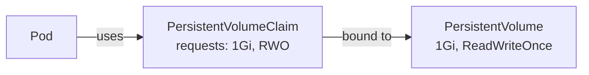

# PersistentVolumes and PVCs

All the volume types covered so far - `emptyDir`, ConfigMap and Secret volumes - are tied to the Pod's lifetime. When the Pod is deleted, those volumes disappear. That's fine for scratch space, shared buffers, and configuration files, because those don't need to outlive the workload. But for a database, a file storage system, or any application that accumulates state over time, you need storage that persists independently of any Pod.

Kubernetes handles this with two separate objects: the **PersistentVolume** represents a piece of durable storage - a cloud disk, an NFS share, a storage appliance. The **PersistentVolumeClaim** is a request for some of that storage. The separation of the two exists deliberately: the cluster administrator provisions and manages PersistentVolumes, while application developers create PersistentVolumeClaims to consume storage without needing to know where it comes from.

:::info
A **PersistentVolume (PV)** represents real durable storage in the cluster. A **PersistentVolumeClaim (PVC)** is a request for that storage. Pods use PVCs, not PVs directly - this separation keeps infrastructure concerns out of application manifests.
:::

## How Binding Works

When you create a PVC, Kubernetes searches for an available PV that satisfies the request. It looks for a PV with at least the requested capacity and with compatible access modes. If a match exists, the PVC is **bound** to it - the two objects are linked, and no other PVC can use that PV until it's released. If no matching PV exists, the PVC stays in a `Pending` state until one becomes available.



## Access Modes

Access modes describe how the volume can be mounted across nodes. `ReadWriteOnce` (RWO) means the volume can be mounted read-write by a single node at a time. This is the most common mode and matches what most cloud block storage (AWS EBS, GCP Persistent Disk, Azure Disk) supports. `ReadOnlyMany` (ROX) allows the volume to be mounted read-only by many nodes simultaneously. `ReadWriteMany` (RWX) allows read-write access from multiple nodes at once, which requires a network file system like NFS or a cloud-native file storage service.

The PVC must request an access mode that the PV supports. If you request `ReadWriteMany` from a PV that only supports `ReadWriteOnce`, the binding will fail.

## Creating a PV and PVC

In a static provisioning setup - where an administrator creates PVs manually - the manifest for a PV describes what the backing storage actually is:

```yaml
apiVersion: v1
kind: PersistentVolume
metadata:
  name: my-pv
spec:
  capacity:
    storage: 1Gi
  accessModes:
    - ReadWriteOnce
  hostPath:
    path: /data/my-pv # uses a path on the node; fine for single-node learning clusters
```

The PVC then requests storage without specifying which PV it should bind to:

```yaml
apiVersion: v1
kind: PersistentVolumeClaim
metadata:
  name: my-pvc
spec:
  accessModes:
    - ReadWriteOnce
  resources:
    requests:
      storage: 1Gi
```

Kubernetes matches the PVC to the PV based on capacity and access modes and sets the status of both to `Bound`. From that point, the PVC is the handle your Pod uses to access the storage.

## Using a PVC in a Pod

A Pod mounts a PVC exactly like any other volume type - it references the PVC by name in `spec.volumes`, then mounts it into a container with `volumeMounts`:

```yaml
spec:
  volumes:
    - name: data
      persistentVolumeClaim:
        claimName: my-pvc
  containers:
    - name: db
      image: my-db:1.0
      volumeMounts:
        - name: data
          mountPath: /var/lib/data
```

The application writes to `/var/lib/data`. That data is stored on the PV. If the Pod is deleted and a new Pod is created - a new deployment, a rollout, a reschedule after a node failure - the new Pod can mount the same PVC and find all the data that was written before.

## Hands-On Practice

**1. Create a PV and PVC:**

```yaml
# storage.yaml
apiVersion: v1
kind: PersistentVolume
metadata:
  name: crash-pv
spec:
  capacity:
    storage: 256Mi
  accessModes:
    - ReadWriteOnce
  hostPath:
    path: /data/crash-pv
---
apiVersion: v1
kind: PersistentVolumeClaim
metadata:
  name: crash-pvc
spec:
  accessModes:
    - ReadWriteOnce
  resources:
    requests:
      storage: 256Mi
```

```bash
kubectl apply -f storage.yaml
kubectl get pv
kubectl get pvc
```

Wait for the PVC `STATUS` to show `Bound`. The PV status should also show `Bound`, and the `CLAIM` column should reference `crash-pvc`.

**2. Create a Pod that writes data to the PVC:**

```yaml
# pvc-writer.yaml
apiVersion: v1
kind: Pod
metadata:
  name: pvc-writer
spec:
  volumes:
    - name: data
      persistentVolumeClaim:
        claimName: crash-pvc
  containers:
    - name: writer
      image: busybox:1.36
      command:
        [
          'sh',
          '-c',
          'echo "Persisted at $(date)" > /data/record.txt && cat /data/record.txt && sleep 3600'
        ]
      volumeMounts:
        - name: data
          mountPath: /data
```

```bash
kubectl apply -f pvc-writer.yaml
kubectl logs pvc-writer
```

The Pod wrote a timestamped message to the PVC.

**3. Delete the Pod:**

```bash
kubectl delete pod pvc-writer
```

The Pod is gone, but the PVC and PV still exist - and still hold the data.

**4. Create a new Pod that reads the same data:**

```yaml
# pvc-reader.yaml
apiVersion: v1
kind: Pod
metadata:
  name: pvc-reader
spec:
  volumes:
    - name: data
      persistentVolumeClaim:
        claimName: crash-pvc
  containers:
    - name: reader
      image: busybox:1.36
      command: ['sh', '-c', 'cat /data/record.txt && sleep 3600']
      volumeMounts:
        - name: data
          mountPath: /data
```

```bash
kubectl apply -f pvc-reader.yaml
kubectl logs pvc-reader
```

The message written by the deleted Pod is still there. The data survived the Pod deletion because it was stored on the PV, not on the container's filesystem.

**5. Clean up:**

```bash
kubectl delete pod pvc-reader
kubectl delete pvc crash-pvc
kubectl delete pv crash-pv
```
