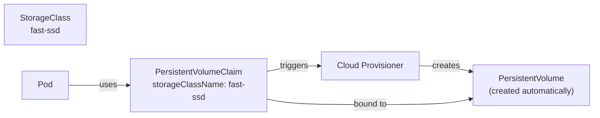

# Storage Classes and Dynamic Provisioning

In the previous lesson, you created a PersistentVolume manually before creating a PVC. That works, but in practice it creates a problem: someone has to create PVs ahead of time, predict what sizes and access modes applications will need, and manage a pool of pre-provisioned storage. In a cloud environment, where storage can be provisioned programmatically on demand, this manual approach is unnecessary overhead.

**StorageClasses** enable **dynamic provisioning**: instead of requiring a pre-existing PV, a StorageClass tells Kubernetes how to create a PV automatically when a PVC is submitted. The developer creates a PVC referencing a StorageClass, Kubernetes calls the provisioner defined in that class, and a PV is created and bound to the PVC without any administrator intervention.

:::info
A **StorageClass** defines a type of storage and a provisioner that knows how to create it on demand. When a PVC references a StorageClass, the PV is created automatically at the time the PVC is submitted.
:::

## How Dynamic Provisioning Works

The difference from static provisioning is in who creates the PV and when. In static provisioning, an administrator creates PVs before any application needs them. In dynamic provisioning, the provisioner creates the PV at the moment a PVC requests it. The developer never writes a PV manifest and never needs to know what physical storage backs the claim.



## A StorageClass Manifest

```yaml
apiVersion: storage.k8s.io/v1
kind: StorageClass
metadata:
  name: fast-ssd
provisioner: kubernetes.io/no-provisioner
volumeBindingMode: WaitForFirstConsumer
reclaimPolicy: Delete
```

The `provisioner` field is where the integration point lives. On AWS, it would be `ebs.csi.aws.com`. On GCP, `pd.csi.storage.gke.io`. On Azure, `disk.csi.azure.com`. The provisioner is a controller that runs inside the cluster and knows how to communicate with the cloud provider's storage API to create and delete volumes.

`reclaimPolicy` controls what happens to the PV when the PVC that bound to it is deleted. `Delete` means the PV and the underlying cloud disk are both deleted - the data is gone. `Retain` means the PV is kept after the PVC is deleted, marked as `Released`, and must be manually cleaned up by an administrator before it can be reused. For production databases, `Retain` is usually the safer choice: accidental deletion of a PVC shouldn't mean permanent data loss.

## Referencing a StorageClass in a PVC

Adding `storageClassName` to a PVC tells Kubernetes which StorageClass to use for dynamic provisioning:

```yaml
apiVersion: v1
kind: PersistentVolumeClaim
metadata:
  name: my-dynamic-pvc
spec:
  storageClassName: fast-ssd
  accessModes:
    - ReadWriteOnce
  resources:
    requests:
      storage: 10Gi
```

Kubernetes passes this request to the `fast-ssd` provisioner, which creates a 10Gi SSD volume in the cloud, wraps it in a PV object, and binds the PVC to it. No PV manifest was ever written.

## The Default StorageClass

Most clusters have a default StorageClass. When a PVC doesn't specify `storageClassName` at all, Kubernetes uses the default. This is convenient: for most workloads, developers don't need to know about StorageClasses unless they have specific requirements. They just request storage and get it.

You can identify the default StorageClass from its annotation:

```bash
kubectl get storageclass
# NAME                PROVISIONER           RECLAIMPOLICY   VOLUMEBINDINGMODE
# standard (default)  kubernetes.io/...     Delete          Immediate
```

The `(default)` annotation means any PVC without an explicit `storageClassName` will use this class.

## Hands-On Practice

**1. List the available StorageClasses:**

```bash
kubectl get storageclass
```

Note which one is marked `(default)`.

**2. Describe it to see the provisioner and policies:**

```bash
kubectl describe storageclass <NAME>
```

Look at the `Provisioner`, `ReclaimPolicy`, and `VolumeBindingMode` fields.

**3. Create a PVC without specifying a StorageClass:**

```yaml
# dynamic-pvc.yaml
apiVersion: v1
kind: PersistentVolumeClaim
metadata:
  name: dynamic-pvc
spec:
  accessModes:
    - ReadWriteOnce
  resources:
    requests:
      storage: 100Mi
```

```bash
kubectl apply -f dynamic-pvc.yaml
kubectl get pvc dynamic-pvc
```

Check the `STORAGECLASS` column - the default StorageClass was applied automatically even though you didn't specify it. Check `STATUS` - it should show `Bound`. Then look at the automatically created PV:

```bash
kubectl get pv
```

A PV exists that you never created. The provisioner created it in response to your PVC.

**4. Mount the dynamically provisioned storage in a Pod:**

```yaml
# dynamic-pod.yaml
apiVersion: v1
kind: Pod
metadata:
  name: dynamic-storage-demo
spec:
  volumes:
    - name: storage
      persistentVolumeClaim:
        claimName: dynamic-pvc
  containers:
    - name: app
      image: busybox:1.36
      command:
        - sh
        - -c
        - |
          echo "dynamic provisioning works" > /data/test.txt
          cat /data/test.txt
          sleep 3600
      volumeMounts:
        - name: storage
          mountPath: /data
```

```bash
kubectl apply -f dynamic-pod.yaml
kubectl logs dynamic-storage-demo
```

**5. Clean up:**

```bash
kubectl delete pod dynamic-storage-demo
kubectl delete pvc dynamic-pvc
```

Deleting the PVC triggers the reclaim policy. Since the default is usually `Delete`, the automatically provisioned PV is also deleted. Confirm with `kubectl get pv`.
