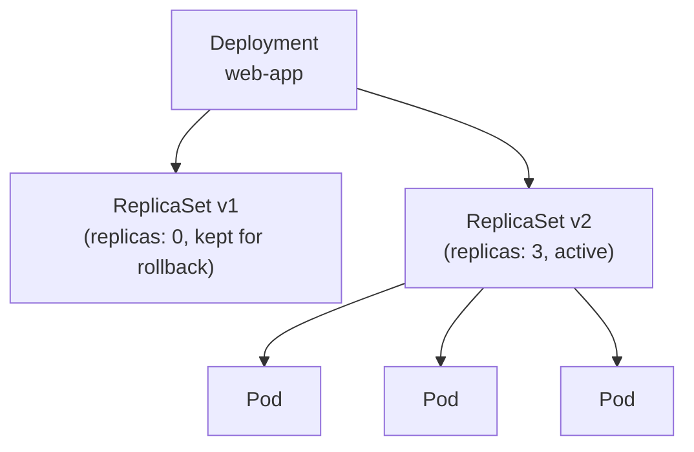

# Deployments

In the previous module you created a bare Pod and noticed what happens when you delete it: it stays deleted. There's no controller watching it, no process that notices it's gone and starts a replacement. If the node it ran on goes offline, the Pod is lost with it. Bare Pods are useful for exploration, but they're not how you run real applications in Kubernetes.

A Deployment solves this. It's a controller that continuously watches a group of Pods and makes sure the actual count matches the count you declared. If a Pod crashes, the Deployment replaces it. If you scale up, it creates more. If you scale down, it removes the excess. The entire lifecycle of your application's Pods is managed for you, automatically, as long as the Deployment exists.

:::info
A **Deployment** manages a set of identical Pods. You declare how many you want, what image they should run, and how they should be configured - the Deployment controller keeps that state true indefinitely.
:::

## The Three-Tier Hierarchy

Deployments don't create Pods directly. They manage **ReplicaSets**, and ReplicaSets manage Pods. This extra layer is what enables zero-downtime updates: when you change the Pod template in a Deployment, a new ReplicaSet is created for the new version, and the old ReplicaSet is scaled down gradually. The old ReplicaSet is kept around at zero replicas so that rolling back is trivial - it's just a matter of scaling the old ReplicaSet back up.



In day-to-day work, you almost never interact with ReplicaSets directly. You work with the Deployment, and the controller chain beneath it handles everything else. But knowing the hierarchy exists is important because it explains the naming pattern you'll see: Pod names end in two hashes, the first identifying which ReplicaSet owns the Pod, the second unique to the Pod itself.

## The Manifest

A Deployment manifest has a few fields that don't appear in a bare Pod spec. `spec.replicas` declares how many Pods you want. `spec.selector` tells the Deployment which Pods it owns - it uses label selectors, the same mechanism you learned about in the previous module. `spec.template` is the Pod blueprint, and everything inside it is a standard Pod spec.

```yaml
apiVersion: apps/v1
kind: Deployment
metadata:
  name: web-app
spec:
  replicas: 3
  selector:
    matchLabels:
      app: web
  template:
    metadata:
      labels:
        app: web
    spec:
      containers:
        - name: web
          image: nginx:1.28
          ports:
            - containerPort: 80
```

The `selector.matchLabels` and the labels in `spec.template.metadata.labels` must match exactly. If they don't, Kubernetes will reject the Deployment. This selector is also what you use with `-l` to query the Pods owned by this Deployment - they all carry the label `app: web`, so `kubectl get pods -l app=web` will always show you this Deployment's Pods.

## What Happens When You Apply It

When you run `kubectl apply` on this manifest, the API server stores the Deployment object. The Deployment controller, running inside `kube-controller-manager`, notices the new Deployment and creates a ReplicaSet for it. The ReplicaSet controller notices the new ReplicaSet and creates three Pods. The scheduler assigns each Pod to a node. The kubelet on each node starts the containers. This entire chain completes within seconds, with no further input from you.

From that point on, the Deployment controller watches its Pods. If one dies - for any reason - the controller creates a replacement immediately. It doesn't matter whether the container crashed, the node was rebooted, or you manually deleted the Pod. The controller's only concern is keeping the count at three.

## Hands-On Practice

**1. Save the following manifest as `web-deployment.yaml`:**

```yaml
apiVersion: apps/v1
kind: Deployment
metadata:
  name: web-app
spec:
  replicas: 3
  selector:
    matchLabels:
      app: web
  template:
    metadata:
      labels:
        app: web
    spec:
      containers:
        - name: web
          image: nginx:1.28
          ports:
            - containerPort: 80
          resources:
            requests:
              cpu: '100m'
              memory: '64Mi'
            limits:
              cpu: '200m'
              memory: '128Mi'
```

**2. Apply it and wait for the rollout:**

```bash
kubectl apply -f web-deployment.yaml
kubectl rollout status deployment/web-app
```

The `rollout status` command blocks until the Deployment has reached its desired state. You'll see a message for each replica as it becomes available.

**3. Inspect the full hierarchy:**

```bash
kubectl get deployment web-app
kubectl get replicaset -l app=web
kubectl get pods -l app=web
```

Notice the naming pattern: the ReplicaSet name is the Deployment name plus a hash, and each Pod name is the ReplicaSet name plus another hash.

**4. Prove self-healing:**

```bash
# Copy one pod NAME from the previous command, then delete it:
kubectl delete pod <POD-NAME>

# Immediately watch the replacement appear:
kubectl get pods -l app=web --watch
```

Press Ctrl+C once the count is back to three. The deleted Pod disappears and a new one starts within seconds. The Deployment controller saw the count drop from 3 to 2 and immediately created a replacement.

**5. Describe the Deployment:**

```bash
kubectl describe deployment web-app
```

Look for the `Replicas` line, which should show `3 desired / 3 updated / 3 total / 3 available`. Also notice the `Events` section at the bottom, which shows the ReplicaSet that was created when you applied the manifest.

**6. Clean up:**

```bash
kubectl delete deployment web-app
```

This single command deletes the Deployment, the ReplicaSet it owns, and all three Pods - the entire hierarchy in one operation.
