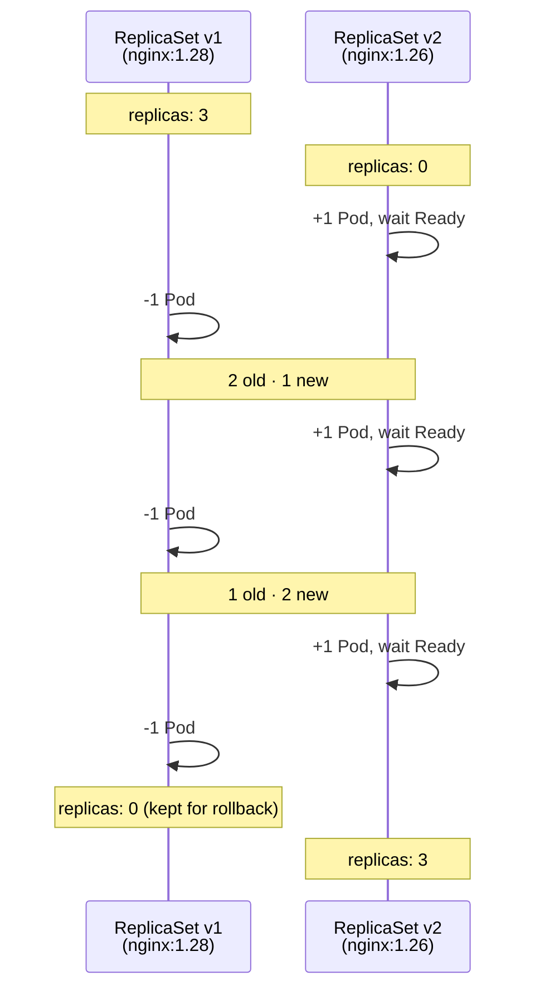

# Scaling and Rolling Updates

Once you have a Deployment running, two of the most common operations you'll perform are adjusting the number of replicas and releasing a new version of your application. Kubernetes makes both of these safe and predictable, and understanding how they work under the hood will help you debug them when something goes wrong.

:::info
Scaling changes the number of Pod replicas a Deployment maintains. A rolling update replaces old Pods with new ones gradually, keeping your application available throughout the transition.
:::

## Scaling

Changing the replica count is straightforward. The fastest way is `kubectl scale`:

```bash
kubectl scale deployment web-app --replicas=5
```

This sends a patch to the API server updating `spec.replicas`. The Deployment controller notices the change and immediately tells the ReplicaSet to create two more Pods. Within seconds, you have five Pods running where you had three.

Scaling down works the same way. If you set replicas to one, the ReplicaSet controller terminates two of the three Pods. The one that survives is chosen randomly - there's no concept of a "primary" Pod in a Deployment.

In practice, you'll often prefer to edit the manifest file and re-apply it rather than using `kubectl scale`. This keeps your file as the source of truth for the current desired state. If you scale imperatively with `kubectl scale` and then later re-apply the manifest, the replica count in the file will overwrite what you set, which can be surprising.

## Rolling Updates

Deploying a new version of your application is triggered by changing the Pod template in the Deployment. The most common change is updating the container image:

```bash
kubectl set image deployment/web-app web=nginx:1.26
```

You can also make the change in your manifest file and re-apply it, which is the recommended approach for production because it keeps your files in sync with what's actually running.

Instead of replacing all Pods at once - which would cause a brief outage - Kubernetes uses a rolling strategy. It creates a new ReplicaSet for the new version of the Pod, then gradually scales up the new ReplicaSet while scaling down the old one. At each step, it waits for the new Pods to become `Ready` before terminating old ones. This means users always have healthy Pods available to serve them, even during a deployment.

The pace of this rollout is controlled by two parameters you can configure in `spec.strategy.rollingUpdate`. `maxUnavailable` defines how many Pods are allowed to be unavailable (not `Ready`) at once during the update. `maxSurge` defines how many extra Pods are allowed to exist above the desired replica count during the update. Both can be absolute numbers or percentages, and both default to 25%.

```yaml
spec:
  strategy:
    type: RollingUpdate
    rollingUpdate:
      maxUnavailable: 1
      maxSurge: 1
```

With this configuration and three replicas, the update proceeds like this: one new Pod starts and Kubernetes waits for it to become Ready. Once it is, one old Pod is terminated. This repeats until all three Pods are running the new version. At no point are fewer than two Pods available.



## Monitoring and Rolling Back

`kubectl rollout status` gives you a live view of an update in progress. It blocks and prints progress messages until the rollout either succeeds or fails.

```bash
kubectl rollout status deployment/web-app
```

If something goes wrong - a bad image that keeps crashing, a new version that fails its readiness probe - the rollout stalls. Kubernetes won't continue terminating old Pods once the new ones fail to become Ready. Your old version keeps serving traffic while the new version sits in a broken state. You can then either fix the issue and push another update, or roll back:

```bash
kubectl rollout undo deployment/web-app
```

Rolling back works because the old ReplicaSet was never deleted. When you pushed the update, Kubernetes created a new ReplicaSet for the new version and kept the old one at zero replicas. Rolling back simply reverses the scale: the old ReplicaSet scales up, the new one scales down, using the same rolling strategy. You can see the history of rollouts and roll back to any specific revision:

```bash
kubectl rollout history deployment/web-app
kubectl rollout undo deployment/web-app --to-revision=1
```

## Hands-On Practice

**1. Create a Deployment:**

```yaml
# web-deployment.yaml
apiVersion: apps/v1
kind: Deployment
metadata:
  name: web-app
spec:
  replicas: 2
  selector:
    matchLabels:
      app: web
  template:
    metadata:
      labels:
        app: web
    spec:
      containers:
        - name: web
          image: nginx:1.28
```

```bash
kubectl apply -f web-deployment.yaml
kubectl rollout status deployment/web-app
```

**2. Scale up to four replicas:**

```bash
kubectl scale deployment web-app --replicas=4
kubectl get pods -l app=web
```

You should see four Pods, all running.

**3. Trigger a rolling update by changing the image:**

```bash
kubectl set image deployment/web-app web=nginx:1.26
kubectl rollout status deployment/web-app
```

Watch the progress messages as replicas are replaced one or two at a time.

**4. Inspect the ReplicaSets after the update:**

```bash
kubectl get replicasets -l app=web
```

You'll see two ReplicaSets: the original one for `nginx:1.28` now at zero replicas, and the new one for `nginx:1.26` with all four. The old one is being kept for rollback.

**5. Confirm all Pods are on the new image:**

```bash
kubectl get pods -l app=web -o jsonpath='{range .items[*]}{.metadata.name}: {.spec.containers[0].image}{"\n"}{end}'
```

All four should show `nginx:1.26`.

**6. Roll back to the previous version:**

```bash
kubectl rollout undo deployment/web-app
kubectl rollout status deployment/web-app
```

Run the jsonpath command again. All Pods are back on `nginx:1.28`, and the ReplicaSet counts have simply been swapped.

**7. Clean up:**

```bash
kubectl delete deployment web-app
```
