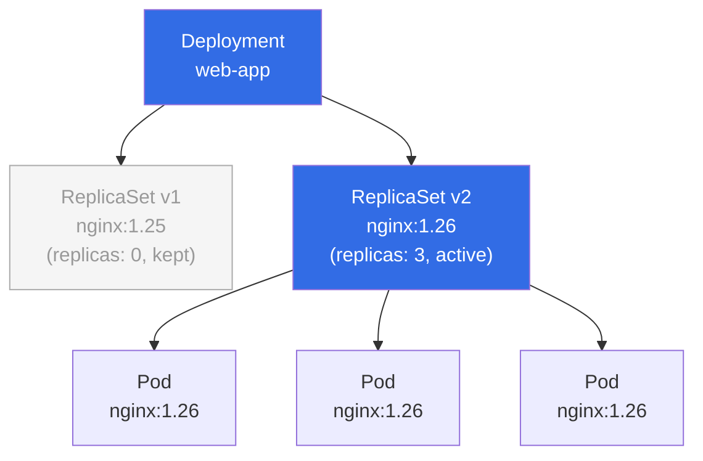
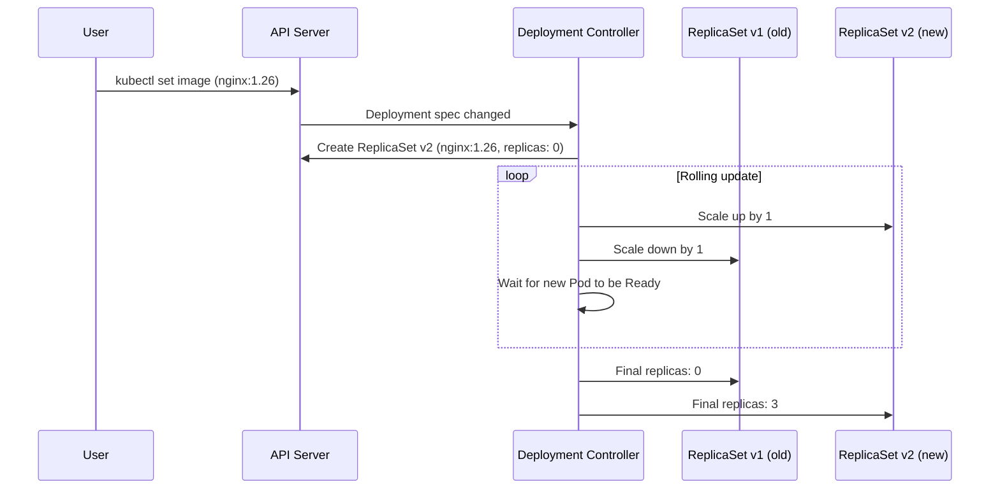

# What is a Deployment?

In the previous module you learned about ReplicaSets , and you also saw their biggest limitation: they are excellent at keeping a fixed number of Pods alive, but they have no idea how to update those Pods safely when you change your application. That gap is precisely where Deployments come in.

A Deployment is a higher-level Kubernetes controller that manages ReplicaSets on your behalf. Rather than creating and managing Pods directly, a Deployment creates ReplicaSets, and those ReplicaSets create the Pods. This extra layer of indirection is what enables all the powerful update and rollback capabilities that make Deployments the standard way to run stateless workloads in Kubernetes.

## The Gap ReplicaSets Leave

To appreciate what Deployments add, it helps to remember what ReplicaSets cannot do. A ReplicaSet watches a set of Pods by label selector and ensures the correct count is always running. That's it. If you update the Pod template inside a ReplicaSet , say, changing the container image from `nginx:1.25` to `nginx:1.26` , the already-running Pods are completely unaffected. The ReplicaSet controller counts Pods by label, sees that the desired count is met, and does nothing. Your fleet silently continues running the old version.

To actually update those Pods with a plain ReplicaSet, you'd have to take matters into your own hands: either scale to zero (causing full downtime) or delete each Pod individually and hope the replacements come up healthy before anyone notices. There's no built-in way to pause midway through if something looks wrong, and there's certainly no built-in rollback. If your new image has a fatal startup bug, you're in trouble.

This is the gap Deployments were designed to fill: **declarative, automated, zero-downtime updates with instant rollback**.

## A Deployment is the HR Department

A useful analogy: think of your Pods as individual workers on a factory floor. A ReplicaSet is the floor manager , responsible for making sure there are always enough workers present. If someone calls in sick, the floor manager immediately finds a replacement. The floor manager is very good at headcount.

But what happens when the company wants to retrain all workers on a new procedure, or issue everyone new equipment? That's not a floor-management problem , that's an HR problem. HR plans the transition carefully: it doesn't retrain everyone at once (the factory would grind to a halt). Instead, it brings workers up to speed in small batches, confirms each batch is performing correctly before moving on, and can reverse the entire process if the new procedure turns out to be flawed.

A Deployment is the HR department of your application fleet. It orchestrates the transition between one version of your application and the next, while ensuring that the factory floor , your running service , never goes completely dark.

## The Three-Tier Hierarchy

Understanding the relationship between these three objects is fundamental to everything else in this module:



The **Deployment** holds your declared intent , the desired image, replica count, and update strategy. It is the object you create and interact with.

The **ReplicaSets** are created by the Deployment controller, one per distinct Pod template. You rarely interact with them directly, but understanding their role is essential when you need to debug a stuck rollout.

The **Pods** are where your containers actually run. They are owned by ReplicaSets, which are owned by the Deployment.

When you run `kubectl get rs` in a namespace that uses Deployments, you'll see ReplicaSets with auto-generated names like `web-app-7d9f4b6c8`. Each one represents a snapshot of the Pod template at a point in time. The active one has the desired replica count; older ones are kept at zero replicas, ready to be scaled back up if you need to roll back.

## What a Deployment Brings to the Table

A Deployment adds four capabilities that a bare ReplicaSet lacks:

**Declarative updates.** You describe the desired state , a new image tag, a new environment variable , and the Deployment controller figures out how to get there. You don't specify *how* to replace Pods; you specify *what* you want, and Kubernetes makes it happen.

**Rolling update strategy.** By default, Kubernetes replaces Pods gradually: a few new ones come up, a few old ones go down, repeat. The ratio is configurable. At no point does your replica count drop to zero, so users never experience an outage during a routine update.

**Rollback via revision history.** Every time the Deployment's Pod template changes, Kubernetes keeps the old ReplicaSet around (at zero replicas). Rolling back to a previous version is a single command. The revision history acts like a git log for your running workload.

**Pause and resume.** You can pause a rollout mid-way , useful when you want to canary-test a new image on a few Pods before committing to the full update , and resume it when you're satisfied.

## How the Deployment Controller Works

The Deployment controller is a control loop running inside `kube-controller-manager`. Its job is straightforward: compare the current state of the cluster to the desired state declared in the Deployment spec, and take actions to reconcile any differences.

When you update the Deployment's Pod template (for example, bumping the image tag), the controller detects the change, creates a brand-new ReplicaSet with the updated template, and begins scaling it up. Simultaneously, it scales the old ReplicaSet down. It coordinates these two operations carefully , governed by `maxUnavailable` and `maxSurge` parameters you'll learn about in the Rolling Updates lesson , so that the total number of healthy Pods never drops below an acceptable threshold.



Throughout this process, the old ReplicaSet is never deleted , only scaled to zero. This is what makes rollback instant: if something goes wrong, the controller can reverse the process by scaling the old ReplicaSet back up and scaling the new one back down.

:::info
You can see the full ownership chain with `kubectl get pods -o yaml` and look for the `ownerReferences` field. Each Pod lists the ReplicaSet that owns it. Each ReplicaSet lists the Deployment that owns it. This chain determines what gets deleted when you `kubectl delete deployment` , Kubernetes cascades the deletion through the entire hierarchy.
:::

## Why You Should Always Use a Deployment

For any stateless application , a web server, an API service, a worker process , a Deployment should be your default choice. The overhead is minimal (it's just one extra object wrapping the ReplicaSet), and the benefits are enormous.

Bare ReplicaSets are useful as primitives for other controllers (some custom operators manage them directly) or for very simple educational purposes. In production, you will almost never create one yourself.

:::warning
If you see documentation or blog posts suggesting you create a ReplicaSet directly to deploy a web service, treat that as a red flag. In almost every production scenario, the correct object is a Deployment. The Kubernetes documentation itself explicitly recommends Deployments over raw ReplicaSets for user-facing workloads.
:::

## Hands-On Practice

Let's create our first Deployment, observe the three-tier hierarchy it creates, and watch what happens when we trigger an update.

**1. Create a simple Deployment**

```bash
kubectl apply -f - <<EOF
apiVersion: apps/v1
kind: Deployment
metadata:
  name: web-app
  labels:
    app: web
spec:
  replicas: 3
  selector:
    matchLabels:
      app: web
  template:
    metadata:
      labels:
        app: web
    spec:
      containers:
        - name: web
          image: nginx:1.25
          ports:
            - containerPort: 80
EOF
```

**2. Watch the rollout complete**

```bash
kubectl rollout status deployment/web-app
# Waiting for deployment "web-app" rollout to finish: 0 of 3 updated replicas are available...
# deployment "web-app" successfully rolled out
```

**3. Inspect the full hierarchy**

```bash
# The Deployment itself
kubectl get deployment web-app

# The ReplicaSet the Deployment created (notice the hash suffix)
kubectl get rs -l app=web

# The three Pods the ReplicaSet created
kubectl get pods -l app=web
```

**4. Examine the ownership chain**

```bash
# Pick any Pod name from the previous command
POD=$(kubectl get pods -l app=web -o name | head -1)

# See its ownerReference , it points to a ReplicaSet
kubectl get $POD -o jsonpath='{.metadata.ownerReferences[0].name}'
echo ""

# See the ReplicaSet's ownerReference , it points to the Deployment
RS=$(kubectl get rs -l app=web -o name | head -1)
kubectl get $RS -o jsonpath='{.metadata.ownerReferences[0].name}'
echo ""
```

Expected output: the Pod owner will be a ReplicaSet name (something like `web-app-6d4b9c7f8`), and the ReplicaSet owner will be `web-app`.

**5. Trigger an update and observe the new ReplicaSet created**

```bash
kubectl set image deployment/web-app web=nginx:1.26
kubectl rollout status deployment/web-app

# Now look at the ReplicaSets , you'll see TWO
kubectl get rs -l app=web
# NAME                      DESIRED   CURRENT   READY   AGE
# web-app-6d4b9c7f8         0         0         0       2m   ← old, kept for rollback
# web-app-7e5c0d9a1         3         3         3       15s  ← new, active
```

**6. Clean up**

```bash
kubectl delete deployment web-app
```

Open the cluster visualizer now (telescope icon in the right panel) after step 2. You should see the Deployment node at the top of the hierarchy, connected down to a ReplicaSet, which fans out to three Pod nodes. After step 5, you'll see a second ReplicaSet appear, and you can watch the replica counts shift in real time as the rolling update progresses.
