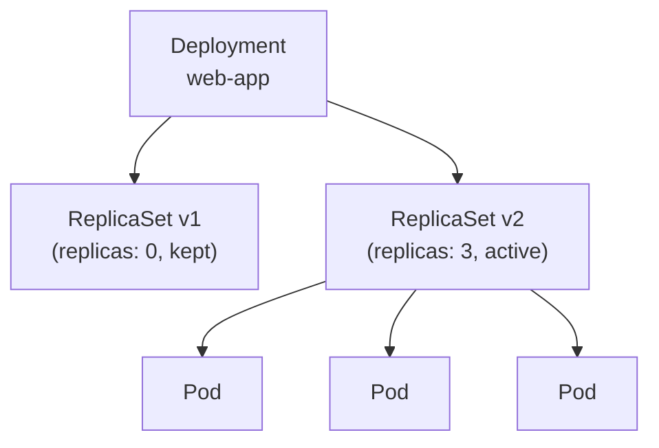

# What is a Deployment?

In the previous module you learned about ReplicaSets, and you also saw their biggest limitation: they keep a fixed number of Pods alive but have no built-in way to update those Pods safely when you change your application. That gap is precisely where Deployments come in.

A Deployment is a higher-level controller that **manages ReplicaSets** on your behalf. It doesn't create Pods directly; it creates ReplicaSets, and those ReplicaSets create the Pods. This extra layer is what enables declarative, zero-downtime updates and instant rollback. Deployments are the standard way to run stateless workloads in Kubernetes.

:::info
You interact with the Deployment; the controller chain handles ReplicaSets and Pods beneath it automatically.
:::

## Why ReplicaSets Aren't Enough

A ReplicaSet watches Pods by label selector and ensures the correct count is running. If you change the Pod template (e.g. the image from `nginx:1.28` to `nginx:1.26`), the existing Pods are unaffected: the controller sees the desired count and does nothing. To update with a plain ReplicaSet you'd have to scale to zero (downtime) or delete Pods by hand, with no built-in rollback. Deployments were designed to fill that gap.

Think of Pods as workers on a factory floor. A ReplicaSet is the floor manager: it keeps headcount. Retraining everyone on a new procedure or issuing new equipment isn't a floor problem, it's an HR problem. HR plans the transition in batches, checks each batch before continuing, and can reverse if the new procedure fails. A Deployment is that HR layer for your application fleet: it orchestrates the transition between versions while keeping the service up.

## The Three-Tier Hierarchy

Deployment → ReplicaSet(s) → Pods. You declare intent on the Deployment; the controller creates one ReplicaSet per distinct Pod template (you'll see how the naming works when you create one in the next lesson). ReplicaSets create and own the Pods. You interact with the Deployment; the ReplicaSets are mostly visible when you debug or roll back.

## What a Deployment Adds

Four things a bare ReplicaSet doesn't give you:

- **Declarative updates:** You change the desired state (image, env, etc.); the controller figures out how to get there.
- **Rolling updates:** Pods are replaced gradually; replica count never goes to zero during a routine update.
- **Rollback:** Old ReplicaSets are kept at zero replicas; rolling back is a single command.
- **Pause and resume:** You can pause a rollout to canary-test a few Pods before committing.

The next lessons cover how to create a Deployment, how to inspect the hierarchy, and how to tune the rolling strategy.

## How the Controller Works (in Short)

The Deployment controller runs in `kube-controller-manager` and continuously reconciles the cluster state against the Deployment spec. When you change the Pod template, it creates a new ReplicaSet and scales it up while scaling the old one down, at a pace controlled by `spec.strategy` parameters you'll see in the next lessons. Old ReplicaSets are kept at zero replicas so rollback is always instant.

## Why Use a Deployment (Not a Raw ReplicaSet)

For any stateless app (web server, API, worker), use a Deployment by default. The cost is one extra object; the benefit is updates and rollback. Bare ReplicaSets are for other controllers or learning; in production you almost never create one yourself.

:::warning
If documentation suggests creating a ReplicaSet directly for a user-facing service, treat it as outdated. The right object is a Deployment.
:::
