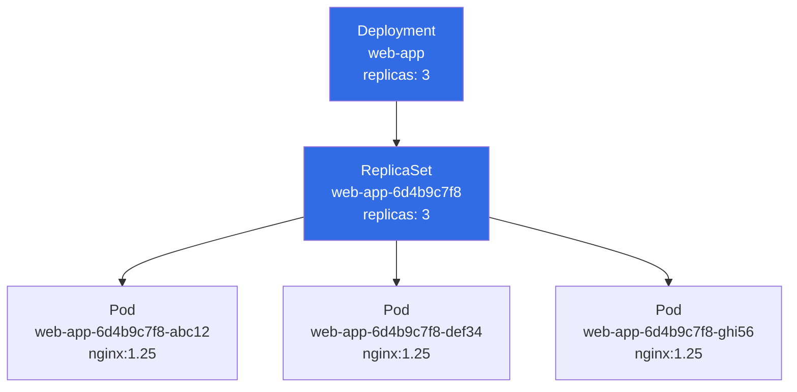

# Creating a Deployment

Now that you understand what a Deployment is and why it exists, it's time to create one. In this lesson you'll write a complete Deployment manifest, apply it to the cluster, and explore the objects it creates at each level of the hierarchy. You'll also learn the imperative shortcut for when you need to spin something up quickly.

## Anatomy of a Deployment Manifest

A Deployment manifest looks very similar to a ReplicaSet manifest — and that's intentional. A Deployment is a thin but powerful wrapper around a ReplicaSet. Here's a complete example:

```yaml
apiVersion: apps/v1
kind: Deployment
metadata:
  name: web-app
  labels:
    app: web
spec:
  replicas: 3
  selector:
    matchLabels:
      app: web
  template:
    metadata:
      labels:
        app: web
    spec:
      containers:
        - name: web
          image: nginx:1.25
          ports:
            - containerPort: 80
```

Let's walk through each section carefully.

**`apiVersion: apps/v1`** — Deployments belong to the `apps` API group, introduced as a stable (`v1`) API in Kubernetes 1.9. This is the only version you'll use today; the older `extensions/v1beta1` path was removed years ago.

**`kind: Deployment`** — Tells Kubernetes what type of object you're creating.

**`metadata.name`** — The name of the Deployment object itself. This name also becomes the prefix for the ReplicaSets and Pods that the Deployment creates. For example, a Deployment named `web-app` will create ReplicaSets like `web-app-6d4b9c7f8` and Pods like `web-app-6d4b9c7f8-x2pkz`.

**`spec.replicas`** — The desired number of Pod replicas. The Deployment passes this down to its active ReplicaSet.

**`spec.selector`** — The label selector the Deployment uses to identify the Pods it owns. This must match the labels in `spec.template.metadata.labels`. If they don't match, the API server will reject the manifest.

**`spec.template`** — The Pod template. Everything under this key describes the Pods that will be created. It has the same structure as a standalone Pod manifest, minus the top-level `apiVersion`, `kind`, and the name (Pods get auto-generated names).

:::info
The `spec.selector` in a Deployment is immutable after creation. If you ever need to change the label selector, you must delete and recreate the Deployment. Plan your label strategy carefully before you go to production.
:::

## The `spec.strategy` Field (and Its Defaults)

You'll notice the manifest above doesn't include a `spec.strategy` section. When omitted, Kubernetes uses sensible defaults:

- **type**: `RollingUpdate`
- **maxUnavailable**: `25%`
- **maxSurge**: `25%`

This means during an update, at most 25% of your Pods can be unavailable at any time, and at most 25% extra Pods above the desired count can be created. For a 3-replica Deployment that works out to approximately one Pod unavailable and one Pod extra at any given moment during the rollout. You'll tune these values in a later lesson.

## Applying the Manifest

Save the YAML above to a file called `deployment.yaml` and apply it:

```bash
kubectl apply -f deployment.yaml
# deployment.apps/web-app created
```

The `apply` subcommand is declarative — it creates the object if it doesn't exist, or updates it if it does. This is different from `kubectl create`, which fails if the object already exists. Using `apply` consistently means you can re-run the same command idempotently as you iterate on your manifest.

## Inspecting the Hierarchy

One of the most satisfying things about creating a Deployment for the first time is watching the full hierarchy materialize. Run these three commands in sequence:

```bash
kubectl get deployment web-app
# NAME      READY   UP-TO-DATE   AVAILABLE   AGE
# web-app   3/3     3            3           20s

kubectl get rs -l app=web
# NAME                  DESIRED   CURRENT   READY   AGE
# web-app-6d4b9c7f8    3         3         3       20s

kubectl get pods -l app=web
# NAME                        READY   STATUS    RESTARTS   AGE
# web-app-6d4b9c7f8-abc12     1/1     Running   0          20s
# web-app-6d4b9c7f8-def34     1/1     Running   0          20s
# web-app-6d4b9c7f8-ghi56     1/1     Running   0          20s
```



Notice that the ReplicaSet's name is the Deployment's name with a hash appended. That hash is computed from the Pod template contents — it changes whenever the template changes, which is how Kubernetes distinguishes between ReplicaSets representing different versions of your application.

## Describing the Deployment

For a more detailed view, `kubectl describe` is invaluable:

```bash
kubectl describe deployment web-app
```

The output includes several useful sections:

- **Replicas** — current counts across ready, available, and up-to-date
- **StrategyType** — `RollingUpdate` (and the maxUnavailable/maxSurge values)
- **Pod Template** — the full pod spec that this Deployment is managing
- **Conditions** — health conditions like `Available` and `Progressing`; a stuck rollout will show a `False` condition here
- **Events** — a chronological log of what the Deployment controller has done (scaled up ReplicaSets, etc.)

The Events section is particularly useful for debugging. If a rollout is stuck, the events will usually tell you why: image pull failures, insufficient cluster resources, failing readiness probes.

## The Imperative Alternative

If you need to create a Deployment quickly — for example, during the CKA exam or when prototyping — you can use the imperative form:

```bash
kubectl create deployment web-app --image=nginx:1.25 --replicas=3
```

This is fast, but it has limitations: you can't set ports, environment variables, resource requests, volume mounts, or anything else complex through the command line alone. For anything beyond a quick test, always use a YAML manifest.

A useful hybrid approach: generate a manifest from the imperative command and then edit it:

```bash
kubectl create deployment web-app --image=nginx:1.25 --replicas=3 \
  --dry-run=client -o yaml > deployment.yaml
```

The `--dry-run=client -o yaml` flags tell kubectl to generate the YAML without sending anything to the API server. You get a ready-to-edit manifest in seconds, rather than writing it from scratch.

:::info
The `--dry-run=client -o yaml` pattern is extremely valuable during the CKA exam where time is limited. Use it to generate skeleton manifests for Deployments, Services, ConfigMaps, and more, then edit as needed and apply.
:::

## Checking Deployment Status

After applying a Deployment, it's good practice to wait for the rollout to complete before proceeding:

```bash
kubectl rollout status deployment/web-app
# Waiting for deployment "web-app" rollout to finish: 0 of 3 updated replicas are available...
# Waiting for deployment "web-app" rollout to finish: 1 of 3 updated replicas are available...
# Waiting for deployment "web-app" rollout to finish: 2 of 3 updated replicas are available...
# deployment "web-app" successfully rolled out
```

This command blocks until the rollout is complete (or exits with a non-zero code if it fails or times out). In CI/CD pipelines, this command is often used immediately after `kubectl apply` to ensure the new version is fully up before continuing.

## Hands-On Practice

Let's build and inspect a Deployment step by step.

**1. Write the manifest to a file**

```bash
cat <<EOF > deployment.yaml
apiVersion: apps/v1
kind: Deployment
metadata:
  name: web-app
  labels:
    app: web
spec:
  replicas: 3
  selector:
    matchLabels:
      app: web
  template:
    metadata:
      labels:
        app: web
    spec:
      containers:
        - name: web
          image: nginx:1.25
          ports:
            - containerPort: 80
EOF
```

**2. Apply it and wait for the rollout**

```bash
kubectl apply -f deployment.yaml
kubectl rollout status deployment/web-app
```

**3. Inspect all three levels of the hierarchy**

```bash
kubectl get deployment web-app
kubectl get rs -l app=web
kubectl get pods -l app=web
```

**4. Explore the full describe output**

```bash
kubectl describe deployment web-app
```

Read through the Events section at the bottom. You should see something like:
```
Events:
  Type    Reason             Age   From                   Message
  ----    ------             ----  ----                   -------
  Normal  ScalingReplicaSet  30s   deployment-controller  Scaled up replica set web-app-6d4b9c7f8 to 3
```

**5. Use dry-run to see the full generated YAML**

```bash
kubectl create deployment demo --image=nginx --replicas=2 --dry-run=client -o yaml
```

Compare what Kubernetes generates with what you wrote by hand. Notice the additional fields Kubernetes fills in automatically (like `strategy` and default values in metadata).

**6. Scale the Deployment up and observe the ReplicaSet**

```bash
kubectl scale deployment web-app --replicas=5
kubectl get pods -l app=web
# You should now see 5 Pods, all created by the same ReplicaSet
kubectl get rs -l app=web
# DESIRED is now 5
```

**7. Scale back down**

```bash
kubectl scale deployment web-app --replicas=3
kubectl get pods -l app=web
# Back to 3 Pods; the extras are terminated
```

**8. Clean up**

```bash
kubectl delete deployment web-app
kubectl delete -f deployment.yaml  # if needed
```

Open the cluster visualizer (telescope icon) after step 2. Expand the Deployment node to see the ReplicaSet and then the three Pod nodes beneath it. Repeat after step 6 to see two more Pods appear under the same ReplicaSet.
