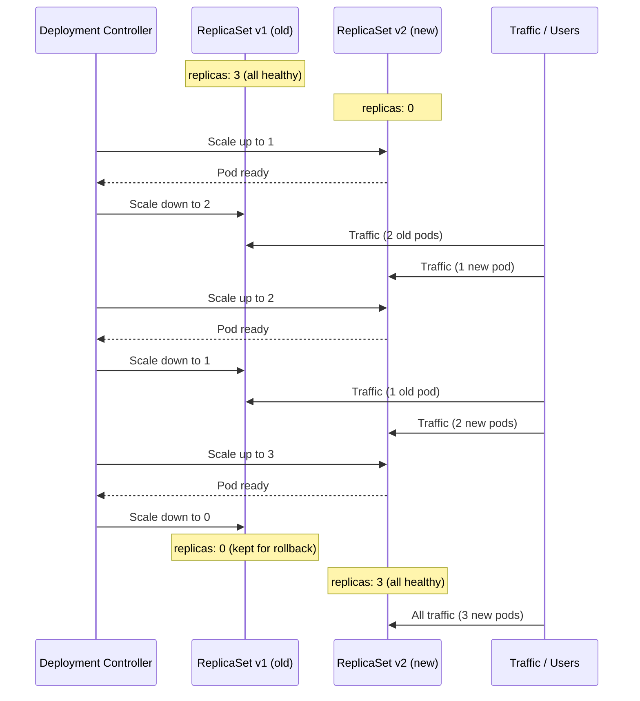

# Rolling Updates

Releasing a new version of software is inherently risky. No matter how thoroughly you test in staging, production environments have a way of surfacing surprises. The rolling update strategy is Kubernetes' answer to this challenge: it replaces your application's Pods gradually, a few at a time, ensuring that healthy Pods are always serving traffic throughout the transition. If something goes wrong, you can pause or roll back before the damage is widespread.

:::info
A rolling update is triggered automatically whenever you change the Deployment's Pod template, for example by updating the container image. The Deployment controller handles the rest.
:::

## What a Rolling Update Actually Does

Imagine you have three Pods running `nginx:1.25` and you want to upgrade to `nginx:1.26`. A naive approach would be to terminate all three Pods and then start three new ones, but during that gap, your service is completely down. A rolling update avoids this entirely.

Instead, Kubernetes follows a carefully coordinated sequence:

1. Create a brand-new ReplicaSet for the new version (`nginx:1.26`), initially at zero replicas.
2. Scale the new ReplicaSet up by one (or a small batch). A new Pod starts, gets its image pulled, and goes through the normal startup sequence.
3. Wait until the new Pod passes its readiness probe, confirming it can actually serve traffic.
4. Scale the old ReplicaSet down by one. One old Pod is terminated gracefully.
5. Repeat until the new ReplicaSet has the full desired count and the old ReplicaSet is at zero.

At no point during this process does the total number of healthy, ready Pods drop to zero. Your users keep getting served the whole time, some from old Pods, some from new ones, depending on where they land during the transition.

## How to Trigger a Rolling Update

There are two common ways to initiate an update.

**Option 1: `kubectl set image`:**  The fastest approach when you just want to change the container image:

```bash
kubectl set image deployment/web-app web=nginx:1.26
```

The format is `deployment/<name> <container-name>=<new-image>`. The container name matches what's in `spec.template.spec.containers[].name` in your manifest.

**Option 2: Edit the manifest and re-apply:**  The better approach for production, because it keeps your manifest file in sync with reality:

```bash
# Edit deployment.yaml, change nginx:1.25 to nginx:1.26
kubectl apply -f deployment.yaml
```

Either method causes the Deployment controller to detect a change in the Pod template and kick off a new rollout.

## The Two Key Parameters

The rolling update strategy has two configurable parameters that control the pace of the update. You set them under `spec.strategy.rollingUpdate`:

```yaml
spec:
  strategy:
    type: RollingUpdate
    rollingUpdate:
      maxUnavailable: 1
      maxSurge: 1
```

**`maxUnavailable`** defines the maximum number of Pods that can be unavailable (not Ready) during the update. It can be an absolute number (`1`) or a percentage of the desired replica count (`25%`). The default is `25%`.

**`maxSurge`** defines the maximum number of Pods that can exist *above* the desired replica count during the update. If you have 3 replicas and `maxSurge: 1`, Kubernetes can temporarily run 4 Pods while swapping old for new. This is what enables the "create before destroy" behaviour. The default is also `25%`.

These two values interact to determine the rhythm of the rollout. Consider a 4-replica Deployment with `maxUnavailable: 1, maxSurge: 1`:

- The cluster can temporarily have 5 Pods (4 desired + 1 surge).
- At most 1 Pod can be unavailable at any time.
- So in each cycle: spin up 1 new Pod → wait for it to be Ready → terminate 1 old Pod → repeat.

If you increase `maxSurge` and `maxUnavailable`, the rollout goes faster but uses more resources and accepts more risk. If you set both to very small values, the rollout is cautious but slow.

:::info
Setting `maxUnavailable: 0` and `maxSurge: 1` (or higher) gives you the safest possible rolling update: new Pods must be Ready before any old Pods are removed. This costs extra capacity during the rollout but guarantees that your replica count never drops below the desired value.
:::

## Watching the Update in Real Time

The best way to understand rolling updates is to watch one happen. The `kubectl rollout status` command gives you a live progress stream:

```bash
kubectl set image deployment/web-app web=nginx:1.26
kubectl rollout status deployment/web-app
# Waiting for deployment "web-app" rollout to finish: 1 out of 3 new replicas have been updated...
# Waiting for deployment "web-app" rollout to finish: 2 out of 3 new replicas have been updated...
# Waiting for deployment "web-app" rollout to finish: 1 old replicas are pending termination...
# deployment "web-app" successfully rolled out
```

You can also watch the ReplicaSets and Pods simultaneously:

```bash
kubectl get rs -l app=web -w
# (live-updating table showing old RS scaling down and new RS scaling up)
```



## Pausing and Resuming a Rollout

Sometimes you want to roll out an update gradually, update a subset of Pods, verify the new version is healthy, then continue. Kubernetes supports this with pause and resume:

```bash
# Trigger the update and immediately pause it
kubectl set image deployment/web-app web=nginx:1.26
kubectl rollout pause deployment/web-app
```

While paused, the Deployment controller stops making further changes. New Pods that were already started will remain running, old Pods will remain running. This lets you inspect the new version in production with limited blast radius, you've updated maybe one Pod out of three, and only a fraction of traffic is hitting the new version.

When you're satisfied:

```bash
kubectl rollout resume deployment/web-app
kubectl rollout status deployment/web-app
```

:::warning
Don't leave a Deployment in a paused state for long periods unintentionally. A paused rollout means your Deployment is in a partially-updated state. Document your canary procedures carefully, and always remember to resume or abort.
:::

## What Happens If the Update Fails?

If new Pods fail to become Ready (due to a bad image, a crashing container, or failed health checks), the Deployment controller stops the rollout, it won't continue scaling up the broken new ReplicaSet. The old Pods remain running, so your service stays up at reduced capacity.

By default, Kubernetes retries starting failed Pods with exponential backoff. If you want to stop immediately, roll back (covered in the next lesson) or fix the underlying issue and re-apply the manifest.

You can configure how long Kubernetes waits before declaring a rollout "stuck" using `spec.progressDeadlineSeconds` (default: 600 seconds):

```yaml
spec:
  progressDeadlineSeconds: 120
```

After this deadline, the Deployment's `Progressing` condition is set to `False` with reason `ProgressDeadlineExceeded`, which is a clear signal for monitoring systems to alert.

## Hands-On Practice

**1. Create the Deployment**

```bash
kubectl apply -f - <<EOF
apiVersion: apps/v1
kind: Deployment
metadata:
  name: web-app
spec:
  replicas: 3
  selector:
    matchLabels:
      app: web
  strategy:
    type: RollingUpdate
    rollingUpdate:
      maxUnavailable: 1
      maxSurge: 1
  template:
    metadata:
      labels:
        app: web
    spec:
      containers:
        - name: web
          image: nginx:1.25
          ports:
            - containerPort: 80
EOF
kubectl rollout status deployment/web-app
```

**2. In a second terminal, watch the ReplicaSets live**

```bash
kubectl get rs -l app=web -w
```

**3. In your primary terminal, trigger the update**

```bash
kubectl set image deployment/web-app web=nginx:1.26
```

Switch to the second terminal and watch the `DESIRED` / `CURRENT` / `READY` columns on the two ReplicaSets shift as the rollout progresses.

**4. Confirm all Pods are now on the new image**

```bash
kubectl get pods -l app=web \
  -o jsonpath='{range .items[*]}{.metadata.name}: {.spec.containers[0].image}{"\n"}{end}'
# web-app-7e5c0d9a1-xxxxx: nginx:1.26
# web-app-7e5c0d9a1-yyyyy: nginx:1.26
# web-app-7e5c0d9a1-zzzzz: nginx:1.26
```

**5. Try a fast (but risky) update by increasing surge and unavailability**

```bash
kubectl patch deployment web-app -p \
  '{"spec":{"strategy":{"rollingUpdate":{"maxSurge":3,"maxUnavailable":3}}}}'

kubectl set image deployment/web-app web=nginx:1.27

# This update will be much faster, nearly instantaneous for 3 replicas
kubectl rollout status deployment/web-app
```

**6. Practice pausing a rollout**

```bash
# First reset back to 1.25 to have something to update
kubectl set image deployment/web-app web=nginx:1.25
kubectl rollout status deployment/web-app

# Now update to 1.26 and immediately pause
kubectl set image deployment/web-app web=nginx:1.26
kubectl rollout pause deployment/web-app

# Check the mixed state
kubectl get rs -l app=web
kubectl get pods -l app=web \
  -o jsonpath='{range .items[*]}{.metadata.name}: {.spec.containers[0].image}{"\n"}{end}'

# Resume
kubectl rollout resume deployment/web-app
kubectl rollout status deployment/web-app
```

**7. Clean up**

```bash
kubectl delete deployment web-app
```

Throughout this exercise, watch the cluster visualizer (telescope icon). During the rolling update you'll see old and new ReplicaSets coexisting under the Deployment node, with Pod counts shifting between them in real time.
