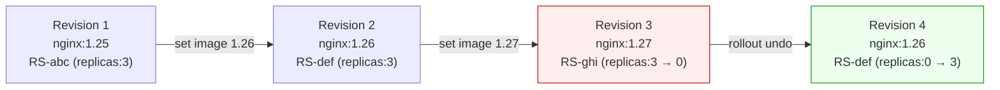

# Rollback and Revision History

No update goes perfectly every time. A new container image might have a subtle bug that only surfaces under real production load, or a configuration change might cause startup failures. Whatever the reason, Kubernetes makes rollback straightforward.

:::info
Rollback is not a restore-from-backup operation. Because Kubernetes keeps old ReplicaSets around after every change, rolling back simply reverses the scaling of two already-existing objects, nearly instant, no re-pulling images needed.
:::

## How Kubernetes Preserves History

Every time you change a Deployment's Pod template, whether you update the image, add an environment variable, or change resource limits, the Deployment controller creates a brand-new ReplicaSet. After the rollout completes, the old ReplicaSet is scaled to zero replicas but is *not deleted*. It stays in the cluster indefinitely (up to the limit set by `revisionHistoryLimit`, which defaults to 10).

Rollback is therefore instantaneous: Kubernetes reverses the scaling, scale the old ReplicaSet back up, scale the current one back down, using objects that are already there.

## Viewing Revision History

To see the list of revisions for a Deployment:

```bash
kubectl rollout history deployment/web-app
# REVISION  CHANGE-CAUSE
# 1         <none>
# 2         <none>
# 3         <none>
```

By default, the `CHANGE-CAUSE` column is empty, Kubernetes tracks the technical diff (which ReplicaSet corresponds to which revision) but doesn't record a human-readable description automatically. You'll learn how to fix that shortly.

To see the full details of a specific revision, the exact Pod template that was in use at that point:

```bash
kubectl rollout history deployment/web-app --revision=2
# deployment.apps/web-app with revision #2
# Pod Template:
#   Labels:       app=web
#                 pod-template-hash=7e5c0d9a1
#   Containers:
#    web:
#     Image:      nginx:1.26
#     ...
```

This tells you exactly what image and configuration was running at revision 2, invaluable when you're trying to understand what changed between a healthy state and a broken one.

## Rolling Back to the Previous Revision

The simplest rollback operation goes back one step, to whatever was running before the most recent update:

```bash
kubectl rollout undo deployment/web-app
# deployment.apps/web-app rolled back
```

Kubernetes immediately begins a new rolling update, but in reverse: the previously-active (now scaled-to-zero) ReplicaSet scales back up, and the currently-active ReplicaSet scales back down. Watch it happen:

```bash
kubectl rollout status deployment/web-app
# Waiting for deployment "web-app" rollout to finish: 2 out of 3 new replicas have been updated...
# deployment "web-app" successfully rolled out
```

After the rollback completes, the revision numbers advance rather than going backwards. Rolling back is itself recorded as a new revision. So if you were at revision 3 and you rolled back to revision 2's configuration, you're now at revision 4, which contains the same Pod template as revision 2.

## Rolling Back to a Specific Revision

If you need to skip back further in history, use `--to-revision`:

```bash
kubectl rollout undo deployment/web-app --to-revision=1
```

This is particularly useful in multi-step debugging scenarios: you've tried several updates looking for the right fix, and now you want to return to a known-good state from several revisions ago.



Notice in the diagram above that "undo" doesn't rewind the revision counter, it creates a forward revision that reuses an old ReplicaSet. This is important to understand when you're reading `rollout history` after a rollback.

## Controlling How Much History is Kept

The `spec.revisionHistoryLimit` field controls how many old (scaled-to-zero) ReplicaSets Kubernetes retains:

```yaml
spec:
  revisionHistoryLimit: 5
```

When the number of retained ReplicaSets exceeds this limit, Kubernetes deletes the oldest ones. The default of 10 is generous for most use cases. Setting it to a very low number (like 0 or 1) conserves cluster resources but eliminates your ability to roll back more than one step.

:::warning
Setting `revisionHistoryLimit: 0` deletes old ReplicaSets immediately after a rollout completes. This means `kubectl rollout undo` will have nothing to roll back to. Only do this if you have a very strong reason and an alternative rollback mechanism.
:::

## Making History Readable with Change-Cause Annotations

Out of the box, the `CHANGE-CAUSE` column in `rollout history` is always empty unless you annotate your Deployment. You can add a human-readable description of what changed and why using the `kubernetes.io/change-cause` annotation:

```bash
kubectl annotate deployment/web-app kubernetes.io/change-cause="Update to nginx 1.26 for CVE-2024-12345 fix"
```

Run this annotation command *after* applying the change that created the new revision. From then on, `rollout history` is much more useful:

```bash
kubectl rollout history deployment/web-app
# REVISION  CHANGE-CAUSE
# 1         Initial deployment with nginx 1.25
# 2         Update to nginx 1.26 for CVE-2024-12345 fix
# 3         Update to nginx 1.27 for performance improvements
```

Alternatively, you can bake the annotation directly into the manifest and update it with each change:

```yaml
metadata:
  name: web-app
  annotations:
    kubernetes.io/change-cause: "Update to nginx 1.26 for CVE-2024-12345 fix"
```

:::info
In GitOps workflows, the change-cause annotation is often set automatically by your CD pipeline to include the Git commit hash and PR number. This creates a direct link between a Kubernetes revision and the code change that caused it, making audits and incident investigations much faster.
:::

## Hands-On Practice

**1. Create the Deployment at revision 1**

```bash
kubectl apply -f - <<EOF
apiVersion: apps/v1
kind: Deployment
metadata:
  name: web-app
  annotations:
    kubernetes.io/change-cause: "Initial deployment: nginx 1.25"
spec:
  replicas: 3
  revisionHistoryLimit: 10
  selector:
    matchLabels:
      app: web
  template:
    metadata:
      labels:
        app: web
    spec:
      containers:
        - name: web
          image: nginx:1.25
EOF
kubectl rollout status deployment/web-app
```

**2. Update to revision 2**

```bash
kubectl set image deployment/web-app web=nginx:1.26
kubectl annotate deployment/web-app kubernetes.io/change-cause="Upgrade to nginx 1.26" --overwrite
kubectl rollout status deployment/web-app
```

**3. Update to revision 3 (simulate a bad update)**

```bash
# Use a deliberately broken image tag
kubectl set image deployment/web-app web=nginx:this-tag-does-not-exist
kubectl annotate deployment/web-app kubernetes.io/change-cause="Upgrade to nginx (broken)" --overwrite
```

**4. Watch the broken rollout get stuck**

```bash
kubectl rollout status deployment/web-app --timeout=30s
# error: deployment "web-app" exceeded its progress deadline  (or you'll see it waiting)

kubectl get pods -l app=web
# You'll see some pods in ImagePullBackOff or ErrImagePull
```

**5. View the revision history**

```bash
kubectl rollout history deployment/web-app
# REVISION  CHANGE-CAUSE
# 1         Initial deployment: nginx 1.25
# 2         Upgrade to nginx 1.26
# 3         Upgrade to nginx (broken)
```

**6. Inspect a specific revision**

```bash
kubectl rollout history deployment/web-app --revision=2
# You'll see the nginx:1.26 image in the Pod template
```

**7. Roll back to the previous revision (revision 2)**

```bash
kubectl rollout undo deployment/web-app
kubectl rollout status deployment/web-app
# deployment "web-app" successfully rolled out
```

**8. Confirm the active image**

```bash
kubectl get pods -l app=web \
  -o jsonpath='{range .items[*]}{.metadata.name}: {.spec.containers[0].image}{"\n"}{end}'
# All pods should show nginx:1.26
```

**9. Check the revision history again, notice revision 4**

```bash
kubectl rollout history deployment/web-app
# REVISION  CHANGE-CAUSE
# 1         Initial deployment: nginx 1.25
# 2         Upgrade to nginx (broken)       ← this was revision 3, now renumbered
# 3         Upgrade to nginx 1.26           ← the undo, same config as old revision 2
# Wait, actually history advances: rollback = new revision
```

**10. Roll back all the way to revision 1**

```bash
kubectl rollout undo deployment/web-app --to-revision=1
kubectl rollout status deployment/web-app
kubectl get pods -l app=web \
  -o jsonpath='{range .items[*]}{.metadata.name}: {.spec.containers[0].image}{"\n"}{end}'
# All pods should show nginx:1.25
```

**11. Clean up**

```bash
kubectl delete deployment web-app
```

Open the cluster visualizer during step 4 to see the partially-updated state: you'll have two ReplicaSets visible under the Deployment, one with healthy Pods (the old version) and one whose new Pods are failing. After step 7, the healthy ReplicaSet regains its replica count and the broken one drops to zero.
