# Update Strategies, RollingUpdate vs Recreate

A Deployment update does not pick how Pods are replaced for you: you choose the strategy. Kubernetes ships two built-ins, each for a different class of application. The wrong choice means either avoidable downtime or subtle, painful data consistency problems.

:::info
For most stateless applications, `RollingUpdate` is the right default. `Recreate` is reserved for applications that cannot safely run two versions simultaneously.
:::

## The Two Strategies

### RollingUpdate (Default)

This is the default you have been using in this module. Pods are replaced in waves: new Pods come up, old Pods go down, repeat until every Pod runs the new revision. The number of healthy Pods never drops to zero.

Use it for stateless apps where two versions may run at once. Example: a web server where one HTTP request hits a Pod on 1.25 and the next hits 1.26. For a solid stateless API that is acceptable: requests are independent, and both versions stay compatible enough during the short overlap.

### Recreate

`Recreate` matches its name: it terminates _all_ running Pods first, waits until they are gone, then creates the new Pods. You get a deliberate downtime gap between those phases.

For most apps this is worse than `RollingUpdate`, but a real set of workloads need `Recreate`, not merely tolerate it.

## When Recreate Is the Right Choice

Some workloads cannot safely run two versions at the same time:

- An app that holds an **exclusive lock** on a resource, for example a database engine that memory-maps a data file.
- A **single-instance service** (e.g. a legacy message queue) that does not support concurrent instances.
- An app with **backward-incompatible database migrations** the old version cannot read.

`RollingUpdate` would overlap versions and invite lock fights, schema clashes, or corruption. `Recreate` forces a clean cut: the old version is gone before the new one starts. You accept downtime, but it is bounded and predictable instead of a race.

:::warning
If your application uses a database schema migration that is not backward-compatible with the previous application version, use `Recreate`. Using `RollingUpdate` in this scenario means your old Pods will be trying to read data written in a schema they don't understand. This can cause cascading failures that are difficult to diagnose.
:::

## Setting the Strategy in Your Manifest

Configure the strategy under `spec.strategy`:

```yaml
# Recreate, no additional parameters needed
spec:
  strategy:
    type: Recreate
```

```yaml
# RollingUpdate, with explicit tuning
spec:
  strategy:
    type: RollingUpdate
    rollingUpdate:
      maxUnavailable: 1
      maxSurge: 1
```

`rollingUpdate` fields (`maxUnavailable`, `maxSurge`) apply only when `type: RollingUpdate`. Pairing them with `type: Recreate` makes the API server reject the manifest.

## Tuning RollingUpdate: Percentages vs Absolute Numbers

`maxUnavailable` and `maxSurge` each accept an absolute count or a percentage of desired replicas.

**Absolute numbers** stay easy to read: `maxUnavailable: 1` always allows at most one unavailable Pod, whatever the replica total. Handy for smaller Deployments (roughly 3 to 10 replicas) when you want tight control.

**Percentages** track fleet size: `maxUnavailable: 25%` lets one quarter of Pods be unavailable and scales as replicas grow from 10 to 100 to 1000. Kubernetes rounds **down** for `maxUnavailable` (to avoid dipping below capacity) and **up** for `maxSurge` (so the rollout can always move forward).

Reference combinations:

| Configuration                        | Effect                                                       |
| ------------------------------------ | ------------------------------------------------------------ |
| `maxUnavailable: 0, maxSurge: 1`     | Zero-downtime; always at or above desired capacity. Slowest. |
| `maxUnavailable: 1, maxSurge: 1`     | Balanced: one new, one old at a time. The default feel.      |
| `maxUnavailable: 50%, maxSurge: 50%` | Fast; half the fleet updates simultaneously.                 |
| `maxUnavailable: 100%, maxSurge: 0`  | Essentially Recreate-like behaviour via RollingUpdate.       |

:::info
For critical production services, starting with `maxUnavailable: 0` (zero-downtime mode) and gradually increasing `maxSurge` is the safest approach. It costs extra temporary capacity but guarantees your service never operates below its desired replica count during an update.
:::

## Visual Comparison: The Two Timelines

Timeline for a 3-replica Deployment:

```mermaid
---
config:
  theme: base
  themeVariables:
    textColor: "#f1f5f9"
    titleColor: "#ffffff"
    gridColor: "#475569"
    sectionBkgColor: "#020617"
    sectionBkgColor2: "#0b1220"
    altSectionBkgColor: "#111827"
    taskBkgColor: "#475569"
    taskBorderColor: "#cbd5e1"
    taskTextColor: "#ffffff"
    taskTextDarkColor: "#ffffff"
    taskTextOutsideColor: "#e2e8f0"
    activeTaskBkgColor: "#2563eb"
    activeTaskBorderColor: "#93c5fd"
    doneTaskBkgColor: "#334155"
    doneTaskBorderColor: "#cbd5e1"
    critBkgColor: "#dc2626"
    critBorderColor: "#fca5a5"
    todayLineColor: "#f59e0b"
  gantt:
    fontSize: 15
    sectionFontSize: 15
    barHeight: 24
    barGap: 8
---
gantt
    title RollingUpdate vs Recreate, 3 replicas
    dateFormat HH:mm:ss
    axisFormat %M:%S

    section RollingUpdate
    Old pod 1 running  :done,   ro1, 00:00:00, 00:00:20
    Old pod 2 running  :done,   ro2, 00:00:00, 00:00:30
    Old pod 3 running  :done,   ro3, 00:00:00, 00:00:40
    New pod 1 starting :active, rn1, 00:00:10, 00:00:35
    New pod 2 starting :active, rn2, 00:00:20, 00:00:45
    New pod 3 starting :active, rn3, 00:00:30, 00:00:55

    section Recreate
    Old pod 1 running  :done,   rc1, 00:00:00, 00:00:12
    Old pod 2 running  :done,   rc2, 00:00:00, 00:00:12
    Old pod 3 running  :done,   rc3, 00:00:00, 00:00:12
    Downtime           :crit,   rcd, 00:00:12, 00:00:24
    New pod 1 starting :active, rcn1, 00:00:24, 00:00:44
    New pod 2 starting :active, rcn2, 00:00:24, 00:00:44
    New pod 3 starting :active, rcn3, 00:00:24, 00:00:44
```



Under `RollingUpdate`, old and new Pods overlap; healthy count never hits zero. Under `Recreate`, old Pods finish terminating before any new Pods start, so you see a gap.

## Thinking Through Your Application's Needs

Before you commit, sanity-check the workload:

**Can two versions run at once?** If yes, default to `RollingUpdate`. If no, because of exclusive resource locking, incompatible schema versions, or licensing constraints, pick `Recreate`.

**Can the app handle connections dropped mid-request?** `Recreate` terminates Pods abruptly (within the configurable grace period). Long-running connections (WebSockets, streaming APIs) are dropped. `RollingUpdate` can drain traffic gradually when tuned.

**Is a short outage allowed?** If the SLA targets 99.9%+ uptime and the app serves more than a handful of requests per second, `Recreate` is often a bad fit. Prefer `RollingUpdate` with `maxUnavailable: 0`.

**How fast must the rollout finish?** Conservative `RollingUpdate` settings feel slow on big fleets. `Recreate` is always "all at once" and can finish sooner when the cluster has spare capacity.

## Hands-On Practice

**1. Create a Deployment with the Recreate strategy**

```yaml
# legacy-app-deployment.yaml
apiVersion: apps/v1
kind: Deployment
metadata:
  name: legacy-app
spec:
  replicas: 3
  strategy:
    type: Recreate
  selector:
    matchLabels:
      app: legacy
  template:
    metadata:
      labels:
        app: legacy
    spec:
      containers:
        - name: app
          image: nginx:1.28
```

```bash
kubectl apply -f legacy-app-deployment.yaml
kubectl rollout status deployment/legacy-app
```

**2. Watch the Recreate behaviour during an update**

Trigger the update:

```bash
kubectl set image deployment/legacy-app app=nginx:1.26
```

Watch the cluster visualizer: all three Pods will terminate first (status `Terminating`), then a brief gap with zero Pods, then three new Pods start up (`ContainerCreating` -> `Running`).

**3. Compare with RollingUpdate**

```bash
kubectl delete deployment legacy-app
```

```yaml
# rolling-app-deployment.yaml
apiVersion: apps/v1
kind: Deployment
metadata:
  name: rolling-app
spec:
  replicas: 3
  strategy:
    type: RollingUpdate
    rollingUpdate:
      maxUnavailable: 0
      maxSurge: 1
  selector:
    matchLabels:
      app: rolling
  template:
    metadata:
      labels:
        app: rolling
    spec:
      containers:
        - name: app
          image: nginx:1.28
```

```bash
kubectl apply -f rolling-app-deployment.yaml
kubectl rollout status deployment/rolling-app
```

Trigger the update:

```bash
kubectl set image deployment/rolling-app app=nginx:1.26
```

This time you'll see a fourth Pod appear before any old one terminates, that's `maxSurge: 1` at work. The old Pods terminate one-by-one only after new ones are Ready. The total count never drops below 3.

**4. Try the zero-downtime configuration explicitly**

```bash
kubectl patch deployment rolling-app -p '{"spec":{"strategy":{"rollingUpdate":{"maxUnavailable":0,"maxSurge":2}}}}'

kubectl set image deployment/rolling-app app=nginx:1.27
kubectl get pods -l app=rolling -w
```

With `maxSurge: 2`, Kubernetes will spin up two new Pods first, wait for both to be Ready, then terminate two old Pods, completing the rollout in roughly two cycles instead of three.

**5. Clean up**

```bash
kubectl delete deployment legacy-app rolling-app 2>/dev/null; true
```
