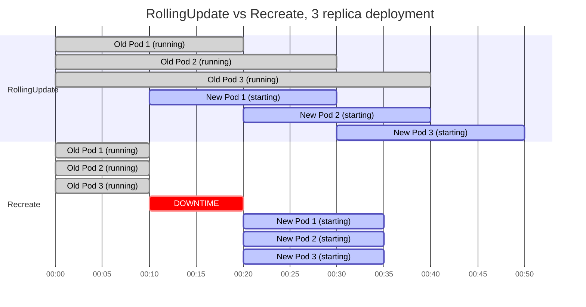

# Update Strategies, RollingUpdate vs Recreate

When you update a Deployment, Kubernetes doesn't just decide on its own how to replace the Pods. You get to choose the strategy. Kubernetes offers two built-in update strategies, each suited to a different class of application. Choosing the wrong one can either cause unnecessary downtime or create subtle and painful data consistency problems.

:::info
For most stateless applications, `RollingUpdate` is the right default. `Recreate` is reserved for applications that cannot safely run two versions simultaneously.
:::

## The Two Strategies

### RollingUpdate (Default)

The `RollingUpdate` strategy is what you've been working with throughout this module. It replaces Pods incrementally: a few new Pods come up, a few old Pods go down, then the cycle repeats until all Pods are running the new version. At no point does the total number of healthy Pods drop to zero.

This strategy is designed for stateless applications that can safely run multiple versions simultaneously. Think of a web server: a user's HTTP request might be handled by a Pod running version 1.25, and their next request might hit a Pod running version 1.26. For a well-designed stateless API, this is perfectly fine, each request is independent and the two versions are compatible enough to serve them interchangeably during the brief transition window.

### Recreate

The `Recreate` strategy does exactly what its name suggests. First, it terminates _all_ currently running Pods. Then, once all the old Pods are gone, it starts creating the new Pods. There is a deliberate downtime window between the two phases.

This might sound strictly worse than `RollingUpdate`, and for most applications it is. But there's a significant class of workloads for which `Recreate` is not just acceptable, it's _required_.

## When Recreate Is the Right Choice

Some workloads cannot safely run two versions simultaneously:

- An application that holds an **exclusive lock** on a resource, such as a database engine that memory-maps a data file.
- A **single-instance service** (e.g. a legacy message queue) that doesn't support concurrent instances.
- An application with **backward-incompatible database migrations** that the old version can't understand.

Using `RollingUpdate` in these cases would briefly run both versions at once, risking lock contention, schema conflicts, or corrupted data. `Recreate` ensures a clean break: the old version is completely gone before the new version ever starts. Yes, there's downtime, but it's a controlled, predictable window, not a race condition.

:::warning
If your application uses a database schema migration that is not backward-compatible with the previous application version, use `Recreate`. Using `RollingUpdate` in this scenario means your old Pods will be trying to read data written in a schema they don't understand. This can cause cascading failures that are difficult to diagnose.
:::

## Setting the Strategy in Your Manifest

The strategy is configured under `spec.strategy`:

```yaml
# Recreate, no additional parameters needed
spec:
  strategy:
    type: Recreate
```

```yaml
# RollingUpdate, with explicit tuning
spec:
  strategy:
    type: RollingUpdate
    rollingUpdate:
      maxUnavailable: 1
      maxSurge: 1
```

Note that `rollingUpdate` sub-fields (`maxUnavailable`, `maxSurge`) are only valid when `type: RollingUpdate`. If you specify them alongside `type: Recreate`, the API server will reject the manifest.

## Tuning RollingUpdate: Percentages vs Absolute Numbers

Both `maxUnavailable` and `maxSurge` accept either absolute numbers or percentages of the desired replica count. Each has its place.

**Absolute numbers** are predictable and easy to reason about. `maxUnavailable: 1` means exactly one Pod can be unavailable at any time, regardless of how many total replicas you have. This is good for small Deployments (3–10 replicas) where you want fine-grained control.

**Percentages** scale with your replica count. `maxUnavailable: 25%` means one quarter of your Pods can be unavailable at any time, automatically scaling as you grow from 10 to 100 to 1000 replicas. Kubernetes always rounds down for `maxUnavailable` (to avoid going below capacity) and rounds up for `maxSurge` (to ensure progress is always possible).

Some useful configurations to know:

| Configuration                        | Effect                                                       |
| ------------------------------------ | ------------------------------------------------------------ |
| `maxUnavailable: 0, maxSurge: 1`     | Zero-downtime; always at or above desired capacity. Slowest. |
| `maxUnavailable: 1, maxSurge: 1`     | Balanced: one new, one old at a time. The default feel.      |
| `maxUnavailable: 50%, maxSurge: 50%` | Fast; half the fleet updates simultaneously.                 |
| `maxUnavailable: 100%, maxSurge: 0`  | Essentially Recreate-like behaviour via RollingUpdate.       |

:::info
For critical production services, starting with `maxUnavailable: 0` (zero-downtime mode) and gradually increasing `maxSurge` is the safest approach. It costs extra temporary capacity but guarantees your service never operates below its desired replica count during an update.
:::

## Visual Comparison: The Two Timelines

To make the difference concrete, here's how the two strategies behave over time for a 3-replica Deployment:



With `RollingUpdate`, old and new Pods overlap. There is never a moment with zero healthy Pods. With `Recreate`, there's a gap, all old Pods terminate before any new ones start.

## Thinking Through Your Application's Needs

Before choosing a strategy, ask these questions:

**Can two versions of my application run simultaneously?** If yes, `RollingUpdate` is almost certainly the right choice. If no, due to exclusive resource locking, incompatible schema versions, or licensing constraints, use `Recreate`.

**Can my application handle connections being dropped mid-request?** `Recreate` terminates Pods abruptly (with a configurable graceful period). Long-running connections (WebSockets, streaming APIs) will be dropped. `RollingUpdate` gives you time to drain connections gradually with the right configuration.

**Is brief downtime acceptable?** If your SLA requires 99.9%+ uptime and your application handles more than a handful of requests per second, `Recreate` may not be acceptable. `RollingUpdate` with `maxUnavailable: 0` is your answer.

**How quickly do I need to complete the update?** `RollingUpdate` can be slow for large fleets with conservative settings. `Recreate` is always "all at once," which may actually be faster if you have enough cluster capacity.

## Hands-On Practice

**1. Create a Deployment with the Recreate strategy**

```yaml
# legacy-app-deployment.yaml
apiVersion: apps/v1
kind: Deployment
metadata:
  name: legacy-app
spec:
  replicas: 3
  strategy:
    type: Recreate
  selector:
    matchLabels:
      app: legacy
  template:
    metadata:
      labels:
        app: legacy
    spec:
      containers:
        - name: app
          image: nginx:1.28
```

```bash
kubectl apply -f legacy-app-deployment.yaml
kubectl rollout status deployment/legacy-app
```

**2. Watch the Recreate behaviour during an update**

Open a second terminal and continuously watch the Pods:

```bash
kubectl get pods -l app=legacy -w
```

In your primary terminal, trigger the update:

```bash
kubectl set image deployment/legacy-app app=nginx:1.26
```

In the second terminal, observe: all three Pods will terminate first (status `Terminating`), then a brief gap with zero Pods, then three new Pods start up (`ContainerCreating` → `Running`).

**3. Compare with RollingUpdate**

```bash
kubectl delete deployment legacy-app
```

```yaml
# rolling-app-deployment.yaml
apiVersion: apps/v1
kind: Deployment
metadata:
  name: rolling-app
spec:
  replicas: 3
  strategy:
    type: RollingUpdate
    rollingUpdate:
      maxUnavailable: 0
      maxSurge: 1
  selector:
    matchLabels:
      app: rolling
  template:
    metadata:
      labels:
        app: rolling
    spec:
      containers:
        - name: app
          image: nginx:1.28
```

```bash
kubectl apply -f rolling-app-deployment.yaml
kubectl rollout status deployment/rolling-app
```

Again watch the Pods in a second terminal:

```bash
kubectl get pods -l app=rolling -w
```

Then trigger the update:

```bash
kubectl set image deployment/rolling-app app=nginx:1.26
```

This time you'll see a fourth Pod appear before any old one terminates, that's `maxSurge: 1` at work. The old Pods terminate one-by-one only after new ones are Ready. The total count never drops below 3.

**4. Try the zero-downtime configuration explicitly**

```bash
kubectl patch deployment rolling-app -p \
  '{"spec":{"strategy":{"rollingUpdate":{"maxUnavailable":0,"maxSurge":2}}}}'

kubectl set image deployment/rolling-app app=nginx:1.27
kubectl get pods -l app=rolling -w
```

With `maxSurge: 2`, Kubernetes will spin up two new Pods first, wait for both to be Ready, then terminate two old Pods, completing the rollout in roughly two cycles instead of three.

**5. Clean up**

```bash
kubectl delete deployment legacy-app rolling-app 2>/dev/null; true
```
