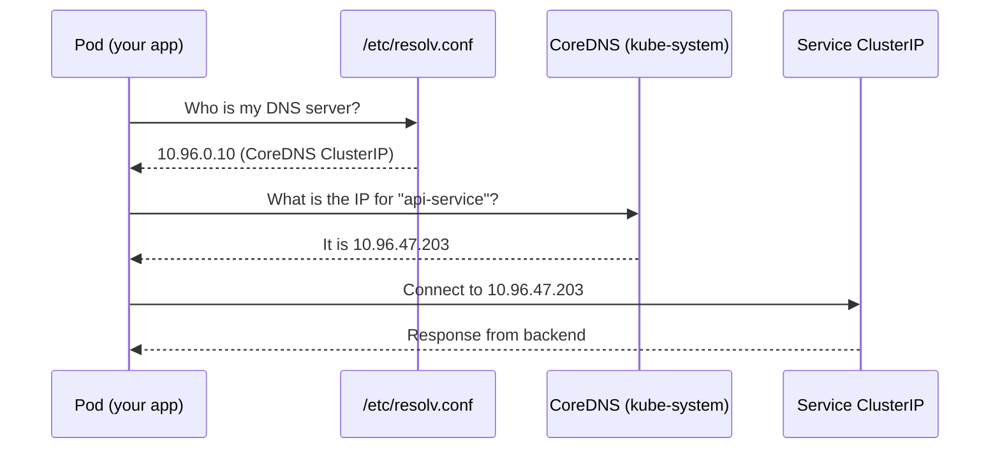

# DNS in Kubernetes

Every application eventually needs to talk to another application. A web frontend needs to reach an API server. An API server needs to reach a database. In traditional infrastructure, you might hardcode IP addresses, write them into configuration files, or rely on an external DNS server managed by your operations team. In Kubernetes, there is a much more elegant solution built right into every cluster: an internal DNS system that lets your Pods find each other by name, regardless of where they are running or what IP address they happen to have at any given moment.

## The Problem with Hardcoded IPs

Imagine you have a Pod running your frontend application, and it needs to talk to your backend API. The backend is exposed via a Kubernetes Service, which has a ClusterIP — a stable virtual IP address assigned by the cluster. You could technically hardcode that IP into your frontend configuration. But this creates serious problems.

First, that IP address is specific to one cluster. When you deploy to a staging environment, the IP will be different. When you deploy to production, it will be different again. Second, while Service IPs are relatively stable within a cluster, they are not permanent — if you delete and recreate a Service, it gets a new IP. Third, hardcoded IPs are invisible: when someone reads your code, they see a number like `10.96.47.203` and have no idea what it refers to. A name like `api-service` is immediately understandable.

The solution is DNS: a system that maps human-readable names to IP addresses, so your application can use a name like `api-service` and let the infrastructure figure out which IP that corresponds to right now.

## CoreDNS: The Cluster Phone Book

Kubernetes solves this with a built-in DNS server called **CoreDNS**. Think of CoreDNS as the phone book of your cluster. Just as a phone book maps people's names to their phone numbers, CoreDNS maps Service names to their ClusterIP addresses. When your Pod wants to talk to `api-service`, it asks CoreDNS "what is the IP for api-service?" and CoreDNS looks it up and replies instantly.

CoreDNS runs as a regular Kubernetes Deployment inside the `kube-system` namespace. It is exposed via its own Service, also named `kube-dns` (for historical reasons), which has a stable ClusterIP that the cluster assigns at creation time. Because it is a Service, it gets its own stable IP — and that IP is what every Pod is configured to use as its DNS resolver.



## How Every Pod Gets DNS Configured

When Kubernetes creates a new Pod, it automatically configures DNS for it by writing a `/etc/resolv.conf` file inside the container. You do not have to do anything — this happens transparently, every time, for every Pod. The file looks something like this:

```
nameserver 10.96.0.10
search default.svc.cluster.local svc.cluster.local cluster.local
options ndots:5
```

Let's break this down line by line.

The `nameserver` line points to the CoreDNS Service IP. This is the DNS server your Pod will query. The `search` line is where the magic of short names happens, and we will look at it in detail next. The `options ndots:5` setting tells the DNS resolver that if a name contains fewer than five dots, it should first try to resolve it as a relative name using the search domains before trying it as an absolute name.

## Search Domains and Why Short Names Work

The `search` line in `/etc/resolv.conf` contains a list of DNS search domains. When your application tries to resolve a name, the resolver does not just look up the name as-is. Instead, it appends each search domain in turn until it finds a match.

Suppose your Pod is in the `default` namespace and you try to connect to `api-service`. Here is what actually happens behind the scenes:

1. Try `api-service.default.svc.cluster.local` → found! Return this IP.
2. (If not found) Try `api-service.svc.cluster.local`
3. (If not found) Try `api-service.cluster.local`
4. (If not found) Try `api-service` as a global DNS lookup

Because the search domains include `<namespace>.svc.cluster.local`, a simple name like `api-service` automatically resolves to the full DNS name for Services in the same namespace. This is why you can write `http://api-service` in your code and it just works — the DNS resolver silently expands it to `api-service.default.svc.cluster.local` for you.

When you want to reach a Service in a different namespace, you need to be a bit more explicit. A name like `api-service.production` will be expanded to `api-service.production.svc.cluster.local`, which is the full record for the `api-service` Service in the `production` namespace. You will learn more about this in the next lesson on Service DNS records.

## The Cluster Domain

The suffix `cluster.local` you keep seeing is called the **cluster domain**. It is the root domain for all DNS records inside your Kubernetes cluster. Every Service, every Pod DNS record — they all live under this domain.

The cluster domain is configurable. Some organizations use a custom domain like `my-company.internal` or `k8s.corp.local`. However, `cluster.local` is the overwhelming default, and you will see it in virtually every cluster you encounter. The cluster domain is set at cluster creation time in the CoreDNS configuration and in the kubelet configuration.

:::info
You can verify the cluster domain by inspecting the `search` line in any Pod's `/etc/resolv.conf`. The third entry in the search list (after `<namespace>.svc.cluster.local` and `svc.cluster.local`) is the cluster domain itself.
:::

## The Full DNS Resolution Flow

Let's walk through the complete journey of a DNS lookup from start to finish.

Your application code calls `http://backend-service/users`. The HTTP library resolves `backend-service` to an IP address before making the connection. It calls the system resolver, which reads `/etc/resolv.conf` and discovers that the nameserver is the CoreDNS ClusterIP at `10.96.0.10`. The resolver sends a UDP query to that IP on port 53, asking for the A record of `backend-service.default.svc.cluster.local` (after applying the first search domain).

CoreDNS receives the query. It looks in its internal records, which it maintains by watching the Kubernetes API for Services. It finds that `backend-service` in the `default` namespace has a ClusterIP of `10.96.100.50`. It sends back a DNS response with that IP and a short TTL (typically 30 seconds).

Your application receives the IP address and opens a TCP connection to port 80 on `10.96.100.50`. That ClusterIP is a virtual address handled by `kube-proxy`, which load-balances the connection to one of the healthy Pods backing the Service. The response comes back, and your application works perfectly — all without ever knowing any IP address.

:::info
CoreDNS is not just a passive phone book. It actively watches the Kubernetes API server and updates its records in real time as Services are created, updated, and deleted. This means DNS records are always fresh, and your applications will automatically start resolving to new IPs within seconds of a Service change.
:::

## Hands-On Practice

Let's explore DNS in your cluster directly.

**Step 1: Verify that CoreDNS is running**

```bash
kubectl get pods -n kube-system -l k8s-app=kube-dns
```

Expected output:
```
NAME                       READY   STATUS    RESTARTS   AGE
coredns-7db6d8ff4d-4vk9p   1/1     Running   0          2d
coredns-7db6d8ff4d-9xrmf   1/1     Running   0          2d
```

**Step 2: Look at the CoreDNS Service**

```bash
kubectl get svc kube-dns -n kube-system
```

Expected output:
```
NAME       TYPE        CLUSTER-IP   EXTERNAL-IP   PORT(S)                  AGE
kube-dns   ClusterIP   10.96.0.10   <none>        53/UDP,53/TCP,9153/TCP   2d
```

Note the ClusterIP — this is the address that appears in every Pod's `/etc/resolv.conf`.

**Step 3: Inspect the resolv.conf inside a running Pod**

```bash
kubectl run dns-demo --image=busybox --rm -it --restart=Never -- cat /etc/resolv.conf
```

Expected output:
```
nameserver 10.96.0.10
search default.svc.cluster.local svc.cluster.local cluster.local
options ndots:5
```

**Step 4: Do a live DNS lookup from inside a Pod**

```bash
kubectl run dns-demo --image=busybox --rm -it --restart=Never -- nslookup kubernetes
```

Expected output:
```
Server:    10.96.0.10
Address 1: 10.96.0.10 kube-dns.kube-system.svc.cluster.local

Name:      kubernetes
Address 1: 10.96.0.1 kubernetes.default.svc.cluster.local
```

This lookup resolves the built-in `kubernetes` Service in the `default` namespace — the Service that represents the Kubernetes API server itself. Notice how the short name `kubernetes` was automatically expanded to `kubernetes.default.svc.cluster.local`. This is the search domain mechanism in action.

**Step 5: Create a Service and verify its DNS record**

```bash
kubectl create deployment hello --image=nginx
kubectl expose deployment hello --port=80
kubectl run dns-demo --image=busybox --rm -it --restart=Never -- nslookup hello
```

Expected output:
```
Server:    10.96.0.10
Address 1: 10.96.0.10 kube-dns.kube-system.svc.cluster.local

Name:      hello
Address 1: 10.96.xxx.xxx hello.default.svc.cluster.local
```

You can also look up the full FQDN explicitly:

```bash
kubectl run dns-demo --image=busybox --rm -it --restart=Never -- nslookup hello.default.svc.cluster.local
```

Both should return the same ClusterIP assigned to your `hello` Service. Clean up when done:

```bash
kubectl delete deployment hello
kubectl delete service hello
```
