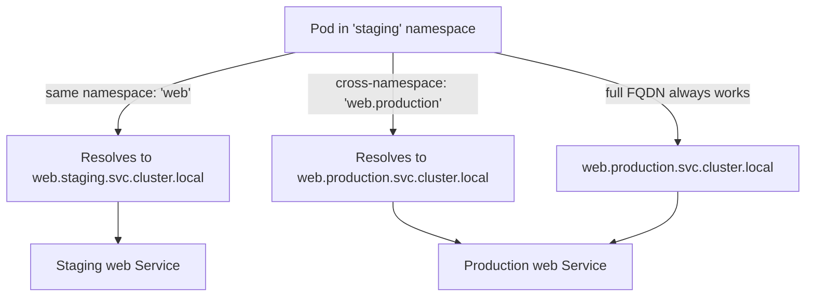
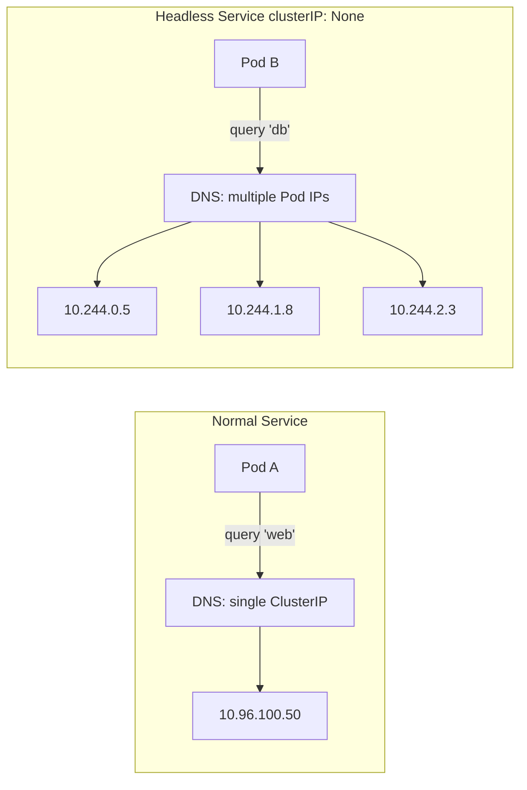

# Service DNS Records

In the previous lesson you learned how CoreDNS acts as the cluster's internal phone book, and how every Pod is automatically configured to use it. Now let's dig deeper into the actual DNS records that Kubernetes creates for Services, the full record format, the shortcuts that make your life easier, and the special cases for headless Services and external names.

## The Standard A Record Format

Every Kubernetes Service that has a ClusterIP gets a DNS A record automatically. You never have to create it manually, the moment a Service is created, CoreDNS picks it up from the Kubernetes API and makes it resolvable. The format follows a strict convention:

```
<service-name>.<namespace>.svc.cluster.local
```

Each segment has a specific role:

- `<service-name>` the `metadata.name` of your Service object, the same name you use in `kubectl get svc`.
- `<namespace>` the namespace the Service lives in.
- `svc` a fixed label that distinguishes Service records from Pod records (which use `pod` instead).
- `cluster.local` the cluster domain.

As a concrete example: if you have a Service named `web` in the `production` namespace, its full DNS name is `web.production.svc.cluster.local`. Any Pod in any namespace in the cluster can resolve that name and reach the Service.

## Short Names and the Search Domain Shortcut

You rarely need to type the full DNS name. Kubernetes sets up the search domain list in each Pod's `/etc/resolv.conf` so that short names resolve automatically.

If your Pod is in the same namespace as the Service, the shortest possible name just works. A Pod in the `production` namespace can reach `web.production.svc.cluster.local` simply by using the name `web`, the resolver tries `web.production.svc.cluster.local` first, finds it, and returns the IP.

If your Pod is in a different namespace, the short name alone is not enough. A Pod in the `staging` namespace trying to connect to `web` would resolve to `web.staging.svc.cluster.local`, a different Service, or a non-existent one. To cross namespace boundaries, include at least the namespace: `web.production`. The resolver expands this to `web.production.svc.cluster.local` and finds the right Service.



:::info
A best practice in production environments is to always use the full `<service>.<namespace>` form when calling Services in other namespaces, even if you could get away with a shorter name. This makes the namespace boundary explicit in your code and configuration, which improves readability and prevents bugs when Services move between namespaces.
:::

## ExternalName Services: CNAME Records

Not every Service in Kubernetes points to Pods inside the cluster. An **ExternalName** Service maps a Kubernetes Service name to an external DNS name. Instead of creating an A record pointing to a ClusterIP, Kubernetes creates a CNAME record pointing to the external hostname.

For example, suppose you have a managed database at `mydb.us-east-1.rds.amazonaws.com`. You can create an ExternalName Service:

```yaml
apiVersion: v1
kind: Service
metadata:
  name: database
  namespace: production
spec:
  type: ExternalName
  externalName: mydb.us-east-1.rds.amazonaws.com
```

Now any Pod in the cluster can connect to `database.production.svc.cluster.local` (or just `database` from within the `production` namespace), and DNS will return a CNAME pointing to `mydb.us-east-1.rds.amazonaws.com`. The beauty of this pattern is that you can change the underlying external endpoint without updating any application configuration, just update the ExternalName Service.

:::warning
ExternalName Services do not provide any proxy or load balancing. They are purely a DNS alias. Features like session affinity, connection tracking, and cluster-level health checking do not apply. ExternalName Services also do not support port remapping.
:::

## Headless Services: Multiple A Records

A **headless Service** is created by setting `spec.clusterIP: None`. This tells Kubernetes not to assign a virtual ClusterIP. Instead of a single stable IP, DNS returns multiple A records, one for each Pod IP that matches the Service's selector.

This is fundamentally different from a normal Service. With a normal Service, DNS returns one IP (the ClusterIP) and `kube-proxy` handles load balancing transparently. With a headless Service, DNS returns all the Pod IPs directly, and the client is responsible for choosing which one to connect to. Use cases include:

- **Stateful applications** where each Pod is distinct (e.g. a database cluster where you always write to Pod 0).
- **Client-side load balancing** where the application manages its own connection pool.
- **Service discovery** systems that need to know about all backing instances, not just a single virtual endpoint.



## SRV Records for Named Ports

Beyond A records, Kubernetes also creates **SRV records** for Services that have named ports. An SRV record carries both the hostname and the port number, which is useful for service discovery protocols that need to know not just where a service lives but also which port to use.

The format for an SRV record is:

```
_<port-name>._<protocol>.<service-name>.<namespace>.svc.cluster.local
```

For example, if you have a Service named `api` in the `default` namespace with a named port `http` over TCP, the SRV record would be:

```
_http._tcp.api.default.svc.cluster.local
```

Querying this record returns both the target hostname and the port number. Most application code does not query SRV records directly, but gRPC clients, some service mesh implementations, and DNS-based service discovery tools use them extensively.

## Hands-On Practice

Let's observe Service DNS records in action using your cluster.

**Step 1: Create Services in two different namespaces**

```bash
kubectl create namespace blue
kubectl create namespace green

kubectl create deployment nginx-blue --image=nginx -n blue
kubectl expose deployment nginx-blue --port=80 --name=web -n blue

kubectl create deployment nginx-green --image=nginx -n green
kubectl expose deployment nginx-green --port=80 --name=web -n green
```

**Step 2: Verify the Services exist**

```bash
kubectl get svc -n blue
kubectl get svc -n green
```

Expected output (for each):

```
NAME   TYPE        CLUSTER-IP      EXTERNAL-IP   PORT(S)   AGE
web    ClusterIP   10.96.xxx.xxx   <none>        80/TCP    10s
```

**Step 3: Resolve the full FQDN from a Pod in the blue namespace**

```bash
kubectl run test --image=busybox --rm -it --restart=Never -n blue -- nslookup web.blue.svc.cluster.local
```

Expected output:

```
Server:    10.96.0.10
Address 1: 10.96.0.10 kube-dns.kube-system.svc.cluster.local

Name:      web.blue.svc.cluster.local
Address 1: 10.96.xxx.xxx web.blue.svc.cluster.local
```

**Step 4: Use a short name for same-namespace resolution**

```bash
kubectl run test --image=busybox --rm -it --restart=Never -n blue -- nslookup web
```

This should resolve to the `blue` namespace's `web` Service, the short name works because the search domain `blue.svc.cluster.local` is tried first.

**Step 5: Reach the green namespace from the blue namespace**

```bash
kubectl run test --image=busybox --rm -it --restart=Never -n blue -- nslookup web.green
```

Expected output:

```
Name:      web.green
Address 1: 10.96.yyy.yyy web.green.svc.cluster.local
```

Notice that `web.green` resolves to a different IP than `web`, it's the Service in the `green` namespace.

**Step 6: Create and inspect a headless Service**

```bash
kubectl create deployment mydb --image=nginx
kubectl expose deployment mydb --port=80 --cluster-ip=None --name=mydb-headless
kubectl run test --image=busybox --rm -it --restart=Never -- nslookup mydb-headless
```

With a headless Service, instead of a single ClusterIP you will see one or more Pod IP addresses returned directly.

**Step 7: Clean up**

```bash
kubectl delete namespace blue
kubectl delete namespace green
kubectl delete deployment mydb
kubectl delete service mydb-headless
```
