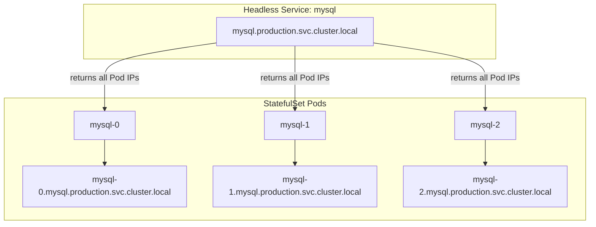

# Pod DNS Records

You have seen how Services get clean, predictable DNS names that your applications can rely on. Pods also participate in the DNS system, but in a more nuanced way. Pod DNS records exist and can be very powerful, but they work differently from Service records and serve specific use cases, most notably giving stateful applications like databases a stable, addressable identity for each individual instance.

:::info
For most workloads, you reach Pods through Services. Pod DNS records become essential when you need to address individual Pod instances directly, typically in StatefulSets.
:::

## The Default Pod DNS Record Format

Every Pod in a Kubernetes cluster can be reached via DNS using a record based on its IP address. The format is:

```
<pod-ip-with-dashes>.<namespace>.pod.cluster.local
```

The Pod's IP address is taken and every dot is replaced with a dash. So a Pod with IP `10.244.1.5` running in the `default` namespace would have the DNS name `10-244-1-5.default.pod.cluster.local`. This record is automatically created and maintained by CoreDNS, you do not configure it yourself.

However, this format is awkward and almost never used directly in practice. If your application hardcodes `10-244-1-5.default.pod.cluster.local`, it is essentially encoding the Pod's current IP address. Pods are ephemeral, they get recreated with new IPs all the time, making that name invalid as soon as the Pod is replaced. Services are almost always the right tool for reaching Pods via DNS. But Pod DNS records do have a critical use case, as we are about to see.

## Custom Hostnames: `spec.hostname` and `spec.subdomain`

Kubernetes allows you to give a Pod a custom hostname by setting `spec.hostname` in the Pod manifest. This changes what the Pod sees as its own hostname inside the container, but on its own it does not affect external DNS resolution.

The real power comes when you combine `spec.hostname` with `spec.subdomain`. When you set `spec.subdomain` on a Pod to the name of an existing **headless** Service in the same namespace, Kubernetes creates a stable, human-readable DNS record for that Pod:

```
<hostname>.<subdomain>.<namespace>.svc.cluster.local
```

Notice the record is under `.svc.cluster.local`, not `.pod.cluster.local`. This is because the stable record is created through the interaction with the headless Service.

For example, a Pod with `hostname: mysql-0` and `subdomain: mysql` in the `production` namespace, backed by a headless Service named `mysql`, would be reachable at:

```
mysql-0.mysql.production.svc.cluster.local
```

This is a stable name that does not change when the Pod is replaced, as long as the replacement Pod also gets the same hostname and subdomain. This is precisely the mechanism that StatefulSets use under the hood.

## StatefulSets and Stable Pod Identity

StatefulSets are Kubernetes workloads designed for stateful applications, databases, message queues, distributed stores. Unlike Deployments, StatefulSets give each Pod a stable, ordered identity: Pod 0 is always Pod 0, Pod 1 is always Pod 1. When a Pod is deleted and recreated, it comes back with the same name.

StatefulSets automatically set `spec.hostname` and `spec.subdomain` for each Pod they manage:

- `hostname` is set to the Pod name (e.g., `mysql-0`, `mysql-1`, `mysql-2`).
- `subdomain` is set to the name of the headless Service defined in the StatefulSet's `spec.serviceName` field.



With this setup, a client that always needs to write to the primary database node can hardcode `mysql-0.mysql.production.svc.cluster.local` and be confident it will always reach Pod 0 of the `mysql` StatefulSet, regardless of how many times it has been restarted or rescheduled.

:::info
StatefulSet Pod DNS names are stable across restarts, but only if the StatefulSet's headless Service exists. If you delete the headless Service, the DNS records disappear. The StatefulSet also needs to use the same `serviceName` for the records to be created correctly.
:::

## `/etc/hosts` Inside a Pod

Every Pod has an `/etc/hosts` file, just like any Linux system. Kubernetes automatically populates this file when the Pod starts:

```
127.0.0.1       localhost
::1             localhost ip6-localhost ip6-loopback
fe00::0         ip6-localnet
10.244.1.5      mypod mypod.default.svc.cluster.local
```

The entry for the Pod itself maps the Pod's own hostname to its IP address, letting the container resolve its own name without a network call to CoreDNS.

You can add custom entries using `spec.hostAliases`. This is useful when you need to map a hostname to a specific IP inside the Pod's network namespace, for example, to override an external DNS name for testing, or to point a legacy application at a service using a hostname it already knows:

```yaml
spec:
  hostAliases:
    - ip: '192.168.1.100'
      hostnames:
        - 'legacy-db.corp.local'
        - 'db'
```

:::warning
Do not edit `/etc/hosts` directly inside a running container. Kubernetes regenerates this file under certain circumstances (such as when the container restarts), and your manual changes will be lost. Always use `spec.hostAliases` in the Pod spec if you need custom host entries.
:::

## DNS Policy for Pods

Pods have a `spec.dnsPolicy` field that controls how DNS is configured for them. The default is `ClusterFirst`, which means queries are sent to CoreDNS first. If CoreDNS cannot resolve the name, the query is forwarded to the upstream DNS configured in CoreDNS (typically the node's DNS resolver, which can reach the public internet).

Other DNS policies for specialized use cases:

- `Default` uses the node's DNS configuration directly, bypassing CoreDNS entirely. Despite the name, this is not the default.
- `None` lets you fully customize DNS settings via `spec.dnsConfig`, specifying your own nameservers and search domains manually.
- `ClusterFirstWithHostNet` used for Pods that run with `hostNetwork: true` but still need cluster DNS.

For the vast majority of workloads, `ClusterFirst` (the actual default) is the right choice and you never need to specify it explicitly.

## Hands-On Practice

Let's explore Pod DNS records and custom hostnames hands-on.

**Step 1: Create a Pod and inspect its network identity**

```bash
kubectl run mypod --image=busybox --restart=Never -- sleep 3600
kubectl get pod mypod -o wide
```

If the Pod is still starting, wait until it becomes `Running`, you can also watch it in the workload visualizer.

Expected output:

```
NAME    READY   STATUS    RESTARTS   AGE   IP            NODE                 NOMINATED NODE   READINESS GATES
mypod   1/1     Running   0          5s    10.244.x.x    <node-name>          <none>           <none>
```

**Step 2: Resolve the default Pod DNS record**

Resolve the Pod DNS name from another Pod, replace `<pod-ip-with-dashes>` with the IP from step 1 where dots are replaced by dashes:

```bash
kubectl run resolver --image=busybox --rm -it --restart=Never -- nslookup <pod-ip-with-dashes>.default.pod.cluster.local
```

Expected output:

```
Server:         10.96.0.10
Address:        10.96.0.10:53

Name:   <pod-ip-with-dashes>.default.pod.cluster.local
Address: <pod-ip>

pod "resolver" deleted from default namespace
```

**Step 3: Deploy a StatefulSet and observe stable DNS**

```yaml
# db-service.yaml
apiVersion: v1
kind: Service
metadata:
  name: db
  labels:
    app: db
spec:
  clusterIP: None
  selector:
    app: db
  ports:
    - port: 5432
apiVersion: apps/v1
kind: StatefulSet
metadata:
  name: db
spec:
  serviceName: "db"
  replicas: 1
  selector:
    matchLabels:
      app: db
  template:
    metadata:
      labels:
        app: db
    spec:
      containers:
        - name: db
          image: nginx
          ports:
            - containerPort: 80
```

```bash
kubectl apply -f db-service.yaml
```

Wait until Pod `db-0` is `Running`, you can check this in the workload visualizer or with `kubectl get pods -l app=db`.

**Step 4: Resolve each StatefulSet Pod by its stable DNS name**

```bash
kubectl run resolver --image=busybox --rm -it --restart=Never -- nslookup db-0.db.default.svc.cluster.local
```

The command should return the IP of the StatefulSet Pod. Delete Pod `db-0` and watch it come back, the DNS name `db-0.db.default.svc.cluster.local` will resolve to the new Pod's IP automatically.

```bash
kubectl delete pod db-0
kubectl get pods -l app=db -w
kubectl run resolver --image=busybox --rm -it --restart=Never -- nslookup db-0.db.default.svc.cluster.local
```

The name resolves again, now pointing to the replacement Pod.

**Step 5: Clean up**

```bash
kubectl delete statefulset db
kubectl delete service db
kubectl delete pod mypod
```
