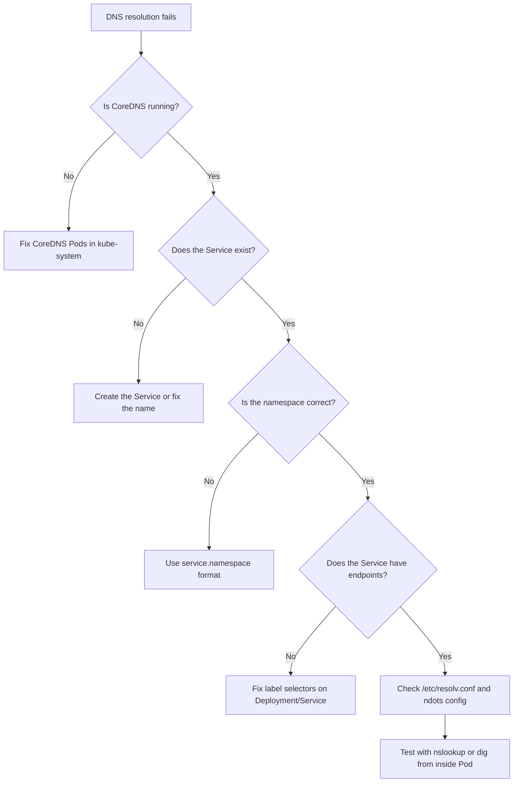

# Debugging DNS Issues in Kubernetes

DNS problems are some of the most common networking issues you will encounter in Kubernetes, and they can be frustrating because the symptoms, "cannot connect to service X", look exactly like the symptoms of many other problems. The good news is that DNS issues follow predictable patterns, and there is a systematic debugging process that will get you to the root cause quickly every time.

## Common Causes of DNS Failures

Before reaching for debugging tools, it helps to know the most frequent culprits. DNS resolution failures in Kubernetes almost always fall into one of these categories:

- **Typo in the Service name or namespace** DNS is case-sensitive and exact. `apiservice` and `api-service` are different names. The same applies to namespace names.
- **Wrong namespace** A Pod in `staging` querying `database` looks for `database.staging.svc.cluster.local`. If the Service only exists in `production`, the query fails.
- **Service does not exist** It may have been deleted, never created in that namespace, or the wrong manifest was applied. Always confirm the Service exists before debugging DNS.
- **CoreDNS is unhealthy** If the CoreDNS Pods are crashing or not ready, every DNS query in the cluster fails simultaneously, which is immediately obvious because everything stops working at once.
- **Label selector mismatch** The Service exists and resolves via DNS, but connections time out because there are no Pods backing it.



## Step 1: Verify CoreDNS Is Running

The very first thing to check when DNS is broken is whether CoreDNS itself is healthy. Since CoreDNS runs as Pods in `kube-system`, you can inspect them with:

```bash
kubectl get pods -n kube-system -l k8s-app=kube-dns
```

You should see two CoreDNS Pods in `Running` state with `1/1` readiness. If they are in `CrashLoopBackOff`, `Pending`, or `Error`, that is your root cause. Check their logs:

```bash
kubectl logs -n kube-system -l k8s-app=kube-dns
```

Also check that the `kube-dns` Service is healthy and has its ClusterIP assigned:

```bash
kubectl get svc kube-dns -n kube-system
```

## Step 2: Verify the Service Exists and Has Endpoints

Once you know CoreDNS is healthy, confirm that the Service you are trying to reach actually exists:

```bash
kubectl get svc <service-name> -n <namespace>
```

Then check that the Service has backing Pods (endpoints):

```bash
kubectl get endpoints <service-name> -n <namespace>
```

If the `ENDPOINTS` column shows `<none>`, the Service exists in DNS and will resolve, but connections will fail because there are no Pods to route traffic to. This is a label selector mismatch, fix the `selector` on your Service or the `labels` on your Pods.

:::warning
A Service with no endpoints is a very common trap. DNS resolution succeeds (the name resolves to the ClusterIP), but TCP connections time out immediately. Always check `kubectl get endpoints` before concluding the issue is DNS-related.
:::

## Step 3: Test DNS Resolution from Inside a Pod

The most reliable way to test DNS is from inside the cluster, in a Pod that is in the same network and has the same DNS configuration as your application. The fastest way to do this is with a temporary `busybox` Pod:

```bash
kubectl run dns-test --image=busybox --rm -it --restart=Never -- nslookup <service-name>
```

If you need richer DNS tools like `dig` and `host`, use the `dnsutils` image maintained by the Kubernetes project:

```bash
kubectl run dnsutils \
  --image=registry.k8s.io/e2e-test-images/jessie-dnsutils:1.3 \
  --rm -it --restart=Never -- bash
```

Once inside, you can run:

```bash
# Basic lookup
nslookup api-service

# Full FQDN lookup
nslookup api-service.production.svc.cluster.local

# Verbose dig query showing the full DNS chain
dig api-service.production.svc.cluster.local

# Check which DNS server is being used
dig +short api-service.production.svc.cluster.local @10.96.0.10
```

If you want to test DNS from the namespace of your broken application, add `-n <namespace>` to the `kubectl run` command:

```bash
kubectl run dns-test --image=busybox --rm -it --restart=Never -n production -- nslookup api-service
```

## Step 4: Check `/etc/resolv.conf` Inside the Pod

If DNS resolution is misbehaving, for example, short names are not expanding correctly or lookups are timing out, inspect the DNS configuration the Pod actually received:

```bash
kubectl exec <pod-name> -- cat /etc/resolv.conf
```

You should see something like:

```
nameserver 10.96.0.10
search default.svc.cluster.local svc.cluster.local cluster.local
options ndots:5
```

- If the `nameserver` line is missing or points to a wrong IP, the Pod was misconfigured at creation time.
- If the `search` domains are wrong or missing, short names will not expand correctly. This can happen when a Pod uses a non-default `dnsPolicy` or when `dnsConfig` is set incorrectly.
- `ndots:5` means any name with fewer than 5 dots will be tried with all search domains before being tried as a global name. For external names with few dots, this can cause unexpected latency as each search domain is tried first.

## Step 5: Read the CoreDNS ConfigMap

CoreDNS is configured via a ConfigMap in the `kube-system` namespace called `coredns`. This ConfigMap contains the **Corefile**, which is CoreDNS's configuration language. Reading it can reveal custom forwarding rules, plugin configurations, or misconfigurations:

```bash
kubectl get configmap coredns -n kube-system -o yaml
```

The default Corefile looks like this:

```
.:53 {
    errors
    health {
       lameduck 5s
    }
    ready
    kubernetes cluster.local in-addr.arpa ip6.arpa {
       pods insecure
       fallthrough in-addr.arpa ip6.arpa
       ttl 30
    }
    prometheus :9153
    forward . /etc/resolv.conf {
       max_concurrent 1000
    }
    cache 30
    loop
    reload
    loadbalance
}
```

The `kubernetes` block tells CoreDNS to handle queries for `cluster.local` by looking up Kubernetes Services and Pods. The `forward` block forwards everything else to the upstream DNS defined in the node's `/etc/resolv.conf`. If someone has accidentally removed the `kubernetes` block or changed the domain, cluster-internal DNS will break.

:::info
If you make changes to the CoreDNS ConfigMap, CoreDNS picks them up automatically (thanks to the `reload` plugin) within about 30 seconds, no need to restart the CoreDNS Pods. However, a bad Corefile syntax can cause CoreDNS to crash entirely, so test changes carefully.
:::

## Common Error Messages and What They Mean

When `nslookup` fails, you will see one of these errors:

| Error | Meaning |
|---|---|
| `nslookup: can't resolve '<name>'` | The name does not exist in DNS. Wrong Service name, wrong namespace, or typo. Start at Step 2. |
| `server can't find <name>: NXDOMAIN` | Same as above, the DNS server explicitly returned "non-existent domain." |
| `connection timed out; no servers could be reached` | The DNS server is not responding. CoreDNS may be down, or the Pod cannot reach the CoreDNS ClusterIP (network policy issue). Start at Step 1. |
| `Temporary failure in name resolution` | The resolver tried and received no response. Network connectivity issue between the Pod and CoreDNS. Check network policies. |

## Hands-On Practice

Let's walk through a simulated DNS debugging session.

**Step 1: Confirm CoreDNS is healthy**

```bash
kubectl get pods -n kube-system -l k8s-app=kube-dns
kubectl get svc kube-dns -n kube-system
```

**Step 2: Create a Service to test against**

```bash
kubectl create deployment backend --image=nginx
kubectl expose deployment backend --port=80
```

**Step 3: Test successful DNS resolution**

```bash
kubectl run dns-test --image=busybox --rm -it --restart=Never -- nslookup backend
```

Expected output:
```
Server:    10.96.0.10
Address 1: 10.96.0.10 kube-dns.kube-system.svc.cluster.local

Name:      backend
Address 1: 10.96.xxx.xxx backend.default.svc.cluster.local
```

**Step 4: Simulate a cross-namespace failure**

```bash
kubectl create namespace other
kubectl run dns-test --image=busybox --rm -it --restart=Never -n other -- nslookup backend
```

Expected output (failure):
```
Server:    10.96.0.10
Address 1: 10.96.0.10

nslookup: can't resolve 'backend'
```

The Service `backend` is in `default`, but we are querying from `other`. Fix it:

```bash
kubectl run dns-test --image=busybox --rm -it --restart=Never -n other -- nslookup backend.default
```

This should succeed, demonstrating the cross-namespace resolution requirement.

**Step 5: Inspect the CoreDNS Corefile**

```bash
kubectl get configmap coredns -n kube-system -o yaml
```

Read through the Corefile section and identify the `kubernetes cluster.local` block and the `forward` directive pointing to upstream DNS.

**Step 6: Check resolv.conf in your test Pod**

```bash
kubectl run dns-test --image=busybox --rm -it --restart=Never -- cat /etc/resolv.conf
```

**Step 7: Use dnsutils for a full dig query**

```bash
kubectl run dnsutils \
  --image=registry.k8s.io/e2e-test-images/jessie-dnsutils:1.3 \
  --rm -it --restart=Never -- dig backend.default.svc.cluster.local
```

Look for the `ANSWER SECTION` in the output, it should contain the A record for your Service.

**Step 8: Clean up**

```bash
kubectl delete deployment backend
kubectl delete service backend
kubectl delete namespace other
```
