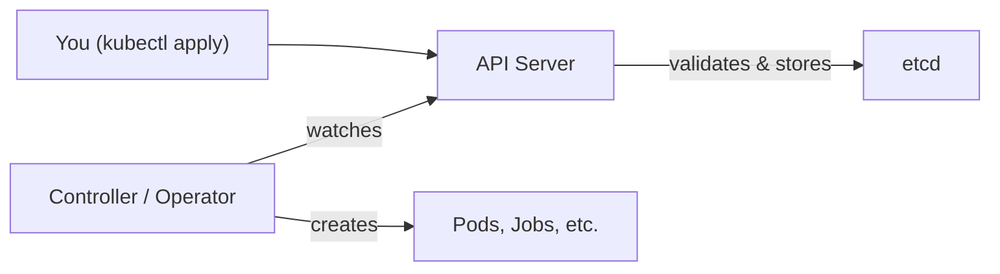

# Creating Custom Resources

So you have a Custom Resource Definition (CRD) installed in your cluster — great. Now what? It's time to create actual instances of that custom resource. If the CRD is the blueprint, each custom resource you create is a house built from that blueprint.

The good news is that creating custom resources works exactly like creating any other Kubernetes object. You write a YAML manifest, run `kubectl apply`, and the API server takes care of the rest. It validates your manifest against the CRD's schema, and if everything checks out, your resource is stored in etcd — just like a Pod or a Deployment would be.

## From Blueprint to Instance

Let's make this concrete. Imagine you've defined a CRD for a custom `BackupJob` resource. The CRD describes the shape of the data: what fields exist, their types, and what's required. When you create an instance, you're filling in that shape with actual values.

The `apiVersion` in your manifest combines the API group and version — for example, `stable.example.com/v1`. The `kind` must match exactly what the CRD defines. Think of it like filling out a form: the CRD defines the fields on the form, and your manifest fills them in.

```yaml
apiVersion: stable.example.com/v1
kind: BackupJob
metadata:
  name: nightly-backup
  namespace: default
spec:
  schedule: "0 2 * * *"
  target: my-database
  retention: 7
```

This manifest says "I want a nightly backup of my database, keeping the last 7 copies." The API server validates it against the CRD's `openAPIV3Schema`. If a field is missing or has the wrong type, you'll get a clear error message right away.

:::info
Custom resources behave like first-class Kubernetes objects: they show up in `kubectl get`, support watch operations, and work with RBAC. From the outside, they feel just like built-in resources.
:::

## CRDs Store Data — Controllers Do the Work

Here's something important to understand early: a CRD only stores data. By itself, it doesn't *do* anything. Your `BackupJob` resource will sit quietly in etcd, waiting. For something to actually happen — for a backup to run — you need a **controller** (or Operator) watching those resources and taking action.

Think of it like a to-do list app. The CRD lets you write items on the list. But without someone (the controller) checking the list and doing the work, nothing gets done.



## Applying and Inspecting Your Resources

Once you've written your manifest, apply it with `kubectl apply -f` like any other Kubernetes object. The API server validates against the CRD schema. If valid, the object is stored. If not, you'll see a clear error explaining what went wrong.

To list all instances of your custom resource, use the plural name and API group:

```bash
kubectl get backupjobs.stable.example.com
```

To see the full object with all its details:

```bash
kubectl get backupjob.stable.example.com nightly-backup -o yaml
```

You can also explore the schema itself, which is very helpful when writing manifests:

```bash
kubectl explain backupjob.stable.example.com --recursive
```

:::info
You can add **short names** and **printer columns** to your CRD definition. This gives you shortcuts like `kubectl get bj` instead of the full name, and custom columns in the output — making the `kubectl get` experience much smoother.
:::

## Verifying Everything is in Place

Before creating instances, it's always a good idea to confirm the CRD is installed by running `kubectl get crd` and filtering for your API group. If the CRD isn't there, your `kubectl apply` will fail with a "no matches for kind" error. Install the CRD first, then create your resources.

## Common Pitfalls

**"Schema validation failed"** — Your manifest doesn't match what the CRD expects. Maybe a field has the wrong type, a required field is missing, or you added a field that isn't in the schema. Check the CRD's `openAPIV3Schema` and fix the manifest.

**"NotFound" or "no matches for kind"** — The `apiVersion` or `kind` in your manifest doesn't match the CRD exactly. Kubernetes is case-sensitive here — `backupjob` and `BackupJob` are different. Double-check both values.

**Nothing happens after creation** — Remember, CRDs only store data. If no controller is watching your custom resources, nothing will react. You need a controller or Operator to bring your resources to life.

:::warning
Changing a CRD's schema in incompatible ways (removing fields, changing types) can break existing instances. Plan schema migrations carefully, especially in production. Consider versioning your CRD (v1, v2) to introduce breaking changes safely.
:::

---

## Hands-On Practice

### Step 1: Create a CRD Manifest

Create `crd.yaml` with a minimal CRD:

```bash
cat <<'EOF' > crd.yaml
apiVersion: apiextensions.k8s.io/v1
kind: CustomResourceDefinition
metadata:
  name: backupjobs.stable.example.com
spec:
  group: stable.example.com
  names:
    kind: BackupJob
    listKind: BackupJobList
    plural: backupjobs
    singular: backupjob
  scope: Namespaced
  versions:
    - name: v1
      served: true
      storage: true
      schema:
        openAPIV3Schema:
          type: object
          required: [metadata, spec]
          properties:
            metadata:
              type: object
            spec:
              type: object
              properties:
                schedule:
                  type: string
EOF
```

### Step 2: Apply the CRD and Verify

```bash
kubectl apply -f crd.yaml
kubectl get crds | grep backupjobs
```

### Step 3: Create a Custom Resource Instance

```bash
kubectl apply -f - <<EOF
apiVersion: stable.example.com/v1
kind: BackupJob
metadata:
  name: test-backup
  namespace: default
spec:
  schedule: "0 2 * * *"
EOF
```

### Step 4: List Custom Resources

```bash
kubectl get backupjobs.stable.example.com
kubectl get backupjob test-backup -o yaml
```

### Step 5: Clean Up

```bash
kubectl delete backupjob test-backup
kubectl delete -f crd.yaml
```

## Wrapping Up

Creating custom resources is straightforward once a CRD is in place — it's the same `kubectl apply` workflow you already know. The key insight is understanding the division of labor: the CRD defines and validates the data, while a controller or Operator does the actual work. In the next lesson, we'll explore exactly that — how controllers watch custom resources and bring them to life.
