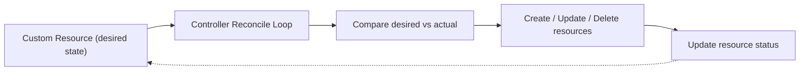

# Controllers and Finalizers

In the previous lesson, we saw that custom resources are just data sitting in etcd. They don't do anything on their own. So how does a `BackupJob` resource actually trigger a backup? That's where **controllers** come in. And when it's time to delete a resource, **finalizers** make sure cleanup happens before the resource disappears.

Let's explore both concepts — they're essential to understanding how the Kubernetes extension model works.

## Controllers: The Brains Behind Custom Resources

A controller is a piece of software that watches custom resources and takes action. It follows the same reconciliation pattern that powers every built-in Kubernetes controller: compare the desired state (what the resource says) with the actual state (what exists in the cluster), and make adjustments.

Think of a controller as a diligent assistant. You leave a note on your desk saying "I need 3 copies of this report printed." The assistant checks the printer, sees zero copies, and prints three. If someone takes one copy, the assistant notices and prints another. That's reconciliation in action.



When you create or update a custom resource, the controller's reconcile loop kicks in. It reads the resource's `spec`, looks at what currently exists, and then creates, updates, or deletes the underlying resources — Pods, Services, PVCs, whatever is needed. The controller also writes back to the custom resource's `status` field, so you can see progress. For example, a database Operator might report "2 of 3 replicas ready."

:::info
Controllers use the Kubernetes client libraries (like <a target="_blank" href="https://github.com/kubernetes/client-go">client-go</a> for Go) to watch resources and interact with the API server. The reconcile loop is event-driven: it runs whenever the watched resource changes.
:::

## Finalizers: Graceful Cleanup Before Deletion

Now let's talk about what happens when you delete a custom resource. Imagine you have a `DatabaseCluster` resource that provisioned three PVCs, a headless Service, and an external DNS record. If Kubernetes just deleted the resource immediately, all that infrastructure would be orphaned — still running, still costing money, but nobody managing it.

**Finalizers** solve this problem. A finalizer is a marker on a resource that tells Kubernetes: "Don't delete this yet — the controller needs to clean up first."

Here's how the flow works:

1. You run `kubectl delete myresource`
2. The API server sets a `deletionTimestamp` on the object, but **does not delete it**
3. The object enters a `Terminating` state
4. The controller detects the deletion timestamp and runs its cleanup logic
5. Once cleanup is done, the controller removes its finalizer from the object
6. When all finalizers are gone, the API server completes the deletion

It's like checking out of a hotel. You can't just leave — you need to return the room key, settle the bill, and check that you haven't left anything behind. The finalizer is the hotel's way of saying "we need to verify a few things before you go."

## Adding a Finalizer

To enable this graceful deletion, you add a finalizer to your resource's metadata:

```yaml
apiVersion: stable.example.com/v1
kind: DatabaseCluster
metadata:
  name: my-db
  finalizers:
    - database.stable.example.com/cleanup
spec:
  replicas: 3
  storage: 50Gi
```

The finalizer name (`database.stable.example.com/cleanup`) is a convention — it usually includes the API group to avoid collisions. Your controller must be programmed to handle this specific finalizer.

## The Deletion Flow in Practice

Let's walk through what happens:

```bash
# Create the resource with its finalizer
kubectl apply -f my-db.yaml

# Later, delete it
kubectl delete databasecluster.stable.example.com my-db
```

After the delete command, the resource enters `Terminating` state. You can verify this:

```bash
# See the deletion timestamp
kubectl get databasecluster.stable.example.com my-db -o jsonpath='{.metadata.deletionTimestamp}'

# See which finalizers are still present
kubectl get databasecluster.stable.example.com my-db -o jsonpath='{.metadata.finalizers}'
```

The controller detects `deletionTimestamp`, runs its cleanup (deletes child Pods, releases storage, removes DNS records), and then patches the object to remove its finalizer. Only then does the resource actually disappear.

:::warning
If the controller is broken or unavailable, the resource will be **stuck in Terminating** indefinitely. In emergencies, you can manually remove the finalizer with `kubectl patch`, but this skips cleanup — use it only as a last resort. Always ensure your controller's cleanup logic completes within a reasonable time, with retries and timeouts.
:::

## Writing Robust Finalizer Logic

When implementing finalizer handling in your controller, keep these principles in mind:

- **Check for deletion first**: In your reconcile function, check if `deletionTimestamp` is set. If it is, run cleanup instead of normal reconciliation.
- **Be idempotent**: Cleanup may run multiple times (the reconcile loop can be triggered again before cleanup finishes). Make sure running it twice doesn't cause errors.
- **Handle missing resources gracefully**: The things you're trying to clean up might already be gone. That's fine — don't fail on "not found" errors.
- **Set timeouts**: Don't block forever. If cleanup can't complete, log the issue and let an operator investigate.

## Common Pitfalls

**Stuck in Terminating** — The most common issue. The controller isn't removing its finalizer, either because it's crashed, has a bug, or can't reach an external system. Check controller logs first, fix the issue, and the deletion will complete automatically.

**Finalizer conflicts** — Make sure only one controller manages a given finalizer key. If two controllers both try to handle the same finalizer, they'll fight each other.

**Cleanup not idempotent** — If your cleanup logic fails partway through and runs again, it should pick up where it left off without errors. Design for re-entrancy from the start.

---

## Hands-On Practice

### Step 1: List CRDs in the Cluster

```bash
kubectl get crds
```

Many clusters have CRDs from operators or add-ons (Prometheus, cert-manager, etc.). Each CRD has an associated controller or Operator.

### Step 2: Inspect an Existing CRD's Spec

```bash
kubectl get crd <some-crd-name> -o yaml
```

Look at the `spec.versions[].schema.openAPIV3Schema` to see the resource structure. For example: `kubectl get crd certificaterequests.cert-manager.io -o yaml | head -80`

## Wrapping Up

Controllers are what bring custom resources to life — they watch for changes and reconcile desired state with reality. Finalizers ensure that when a resource is deleted, the controller gets a chance to clean up before the object disappears. Together, they form the backbone of the Kubernetes extension model: declare what you want, and software handles the rest.
