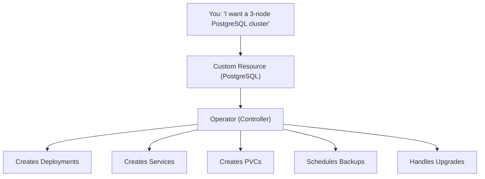

# What Is an Operator?

Imagine you just deployed a PostgreSQL database on Kubernetes using a Deployment, a Service, and a PersistentVolumeClaim. It works — for now. But what happens when you need to add a replica? Perform a backup? Upgrade to a new version without downtime? Suddenly, you're writing runbooks, crafting scripts, and hoping nothing breaks at 3 AM.

An **Operator** takes that operational knowledge — the kind that usually lives in a senior engineer's head — and encodes it into software that runs inside your cluster.

## The Operator Pattern

At its core, an Operator combines two things you already know:

- A **Custom Resource Definition (CRD)** that lets you describe what you want in a simple YAML manifest
- A **Controller** that watches those resources and does the work to make it happen

The difference with a regular controller? An Operator encodes **domain-specific knowledge**. It doesn't just create Pods — it knows *how* to run a database, manage replication, handle failover, perform backups, and orchestrate upgrades. It's like having a database administrator on call 24/7, except it's software.



Instead of managing all those resources yourself, you simply declare:

```yaml
apiVersion: postgresql.example.com/v1
kind: PostgreSQL
metadata:
  name: my-db
spec:
  replicas: 3
  storage: 20Gi
  version: "15.2"
```

And the Operator takes care of everything — creating the StatefulSet, setting up replication, configuring networking, and keeping the cluster healthy.

## Why Operators Exist

Kubernetes is excellent at managing stateless applications. A web server crashes? The Deployment creates a new one. Need more capacity? Scale the replicas. But stateful applications — databases, message queues, monitoring systems — have much more complex lifecycle requirements.

Consider what it takes to run a production database:

- **Installation**: Create storage, configure networking, set up authentication
- **Scaling**: Add replicas, configure replication, rebalance data
- **Upgrades**: Rolling updates with data migration, version compatibility checks
- **Backup & Recovery**: Schedule backups, verify integrity, restore from snapshots
- **Failover**: Detect primary failure, promote a replica, update connections

A Deployment can't do any of this. An Operator can, because it's been programmed with the specific knowledge of how that application works.

:::info
Popular Operators include the <a target="_blank" href="https://github.com/prometheus-operator/prometheus-operator">Prometheus Operator</a>, <a target="_blank" href="https://github.com/zalando/postgres-operator">Zalando's PostgreSQL Operator</a>, and the <a target="_blank" href="https://strimzi.io/">Strimzi Kafka Operator</a>. Each encodes deep operational knowledge for its respective application — backup strategies, scaling procedures, upgrade paths, and failure recovery.
:::

## How Operators Run

An Operator is just a Pod (or set of Pods) running in your cluster. It uses the Kubernetes API like any other controller:

1. **Watch** — It listens for changes to its custom resources
2. **Reconcile** — When something changes, it compares desired state with actual state
3. **Act** — It creates, updates, or deletes the underlying resources (Pods, Services, PVCs, ConfigMaps)
4. **Report** — It updates the custom resource's `status` so you can see what's happening

You interact with the Operator through its custom resources, not by managing Pods and Services directly. Want to scale? Change `replicas` in the CR. Want to upgrade? Change `version`. The Operator figures out the rest.

## Seeing Operators in Action

To discover what Operators are running in your cluster, start by listing the CRDs with `kubectl get crd`. Many Operators register their own CRDs — look for names that describe applications (like `postgresqls.postgresql.example.com` or `prometheuses.monitoring.coreos.com`).

Check for Operator Pods:

```bash
kubectl get pods -A | grep operator
```

And if you know which custom resource an Operator manages:

```bash
kubectl get postgresql.postgresql.example.com
```

:::warning
Operators add complexity to your cluster. Use them when the application genuinely needs lifecycle management beyond what Deployments provide — databases, distributed systems, monitoring stacks. For a simple stateless API, a Deployment is the right tool. Not every application needs an Operator.
:::

## How Operators Are Installed

Operators are typically installed through one of three methods:

- **Helm charts** — The most common approach. `helm install my-operator operator-repo/operator-chart`
- **OLM (Operator Lifecycle Manager)** — A catalog-based system, common in OpenShift environments
- **Raw manifests** — Apply CRDs, RBAC, and Deployment YAML directly

Once installed, the Operator watches for custom resources and starts reconciling. You'll learn more about OLM in a later lesson.

---

## Hands-On Practice

### Step 1: Check for CRDs in your cluster

```bash
kubectl get crds
```

Any CRDs present likely belong to installed Operators.

### Step 2: Look for Operator Pods

```bash
kubectl get pods -A | grep -i operator
```

If an Operator is installed, you will see its controller Pod running in a dedicated namespace.

## Wrapping Up

Operators bring human operational knowledge into your cluster as software. They combine CRDs (to describe what you want) with controllers (to make it happen), enabling Kubernetes to manage complex, stateful applications that go far beyond what Deployments can handle. When you see an Operator in action — scaling a database, performing a zero-downtime upgrade, or recovering from a failure — it feels like magic. But it's just well-encoded expertise, running in a reconciliation loop.
