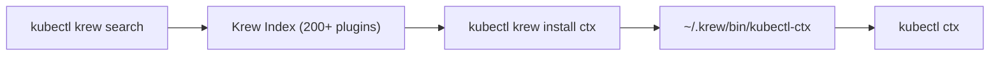

# Krew: The kubectl Plugin Manager

Creating your own plugins is fun, but there's a whole world of community plugins out there. Context switchers, resource visualizers, YAML cleaners, security scanners — hundreds of useful tools built by the Kubernetes community. Finding them, downloading them, placing them in the right directory, and keeping them updated... that gets tedious fast.

**Krew** is the solution. It's a plugin manager for kubectl — think of it as `apt` or `brew`, but specifically for kubectl plugins.

## What Krew Does

Krew maintains a central index of kubectl plugins. When you want a new plugin, you search the index, install with a single command, and Krew handles everything: downloading the right binary for your OS, placing it in a managed directory, and making sure it's in your PATH. Updates are just as easy.

Here's the beauty of it: Krew itself is a kubectl plugin. Once you install it, you access it via `kubectl krew`. It feels native to the kubectl experience.



:::info
The Krew index currently contains over 200 plugins. You can browse them at <a target="_blank" href="https://krew.sigs.k8s.io/plugins/">krew.sigs.k8s.io/plugins</a>. Popular plugins include `ctx` (context switching), `ns` (namespace switching), `neat` (clean YAML output), and `tree` (resource ownership visualization).
:::

## Installing Krew

Krew installation is a one-time setup. Follow the official instructions at <a target="_blank" href="https://krew.sigs.k8s.io/docs/user-guide/setup/install/">krew.sigs.k8s.io</a> — it's typically a short script that downloads the Krew binary and adds `~/.krew/bin` to your PATH.

After installation, verify it works:

```bash
kubectl krew version
```

If you see a version number, you're good to go. Make sure `~/.krew/bin` is in your shell's PATH (add it to your `.bashrc`, `.zshrc`, or equivalent if it isn't):

```bash
echo $PATH | tr ':' '\n' | grep krew
```

## Finding and Installing Plugins

The workflow is intuitive:

```bash
# Search for plugins
kubectl krew search

# Search for something specific
kubectl krew search ctx

# Install a plugin
kubectl krew install ctx

# Use the newly installed plugin
kubectl ctx
```

After `kubectl krew install ctx`, you can switch Kubernetes contexts by simply typing `kubectl ctx` — much faster than `kubectl config use-context my-long-context-name`.

Let's install a few popular plugins to see what's available:

```bash
# Switch contexts quickly
kubectl krew install ctx

# Switch namespaces quickly
kubectl krew install ns

# Clean managed fields from YAML output
kubectl krew install neat

# See resource ownership trees
kubectl krew install tree
```

## Managing Your Plugins

Once you've installed some plugins, Krew makes management simple:

```bash
# List all installed plugins
kubectl krew list

# Upgrade all plugins to their latest versions
kubectl krew upgrade

# Upgrade a specific plugin
kubectl krew upgrade ctx

# Remove a plugin you no longer need
kubectl krew uninstall neat
```

:::warning
Make sure you only manage plugins through **one method**. If you install a plugin manually (by placing a file in PATH) and also install it through Krew, they can conflict. Pick one approach per plugin — Krew for community plugins, manual installation for your own custom scripts.
:::

## Popular Plugins Worth Trying

Here are a few community favorites to get you started:

- **ctx** — Switch between kubectl contexts with fuzzy matching
- **ns** — Switch between namespaces quickly
- **neat** — Remove clutter (managed fields, status) from `kubectl get -o yaml` output
- **tree** — Show the ownership hierarchy of Kubernetes resources (Deployment → ReplicaSet → Pods)
- **view-secret** — Decode and display Secret values without manual base64
- **images** — List container images used in the cluster
- **whoami** — Show the current user/service account and their permissions

Each of these saves you a few keystrokes or a few minutes of manual work. Over time, they add up to a significantly smoother workflow.

## Verifying Your Setup

A quick health check to make sure everything is working:

```bash
# Is Krew installed?
kubectl krew version

# Is the Krew bin directory in PATH?
echo $PATH | tr ':' '\n' | grep krew

# What plugins are installed?
kubectl krew list

# Does kubectl see them?
kubectl plugin list
```

## Common Pitfalls

- **Krew bin not in PATH** — The most common issue. After installing Krew, make sure `~/.krew/bin` is in your shell's PATH. Add `export PATH="${KREW_ROOT:-$HOME/.krew}/bin:$PATH"` to your shell profile.
- **Platform compatibility** — Some plugins only have binaries for certain OS/architecture combinations. If installation fails, check the plugin's page for supported platforms.
- **Stale index** — If a plugin you expected isn't showing up, run `kubectl krew update` to refresh the index.

## Wrapping Up

Krew transforms kubectl from a powerful tool into a customizable platform. With a single command, you can install any of hundreds of community plugins — from context switchers to security scanners. Combined with the custom plugins you build yourself, kubectl becomes a toolkit tailored to your exact workflow. That's the power of Kubernetes extensibility, all the way down to the command line.
