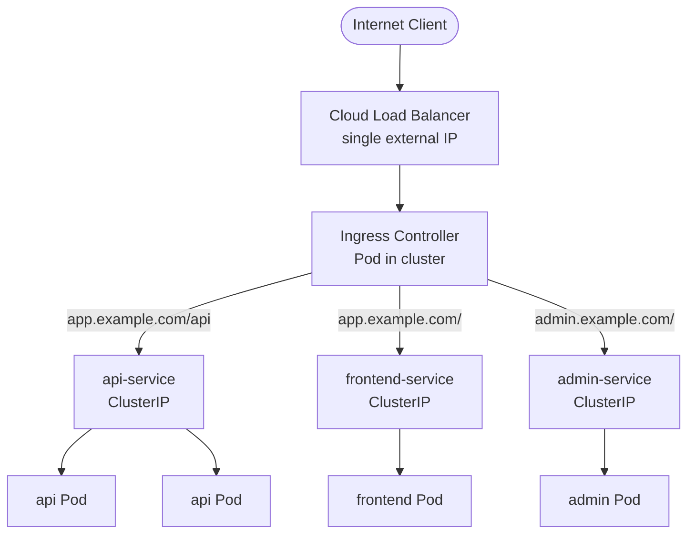

# What Is Ingress?

As soon as a Kubernetes application needs to be accessed from the outside world, you need a strategy for getting external traffic into your cluster. For simple cases, a Service of type `LoadBalancer` does the job. But once your application grows beyond a single component, the LoadBalancer-per-Service approach starts to show its cracks, and that is exactly the problem Ingress was designed to solve.

## The Problem: One LoadBalancer per Service

Imagine a typical web application composed of three separate Services: a `frontend` that serves the React app, an `api` that handles business logic, and an `auth` service that manages login and tokens. If you expose each with a `LoadBalancer` Service, you get three separate external IP addresses and three separate cloud load balancers.

This approach gets expensive fast, and cost is only part of the problem:

- Cloud providers charge by the hour for load balancers; at scale this adds up quickly.
- You now manage three different hostnames or IP addresses, three TLS certificates, and three sets of routing rules.
- DNS configuration grows complex, and clients need to know which endpoint to use for which purpose.

What you really want is a single entry point, one external IP, one load balancer, smart enough to route traffic to the right backend Service based on what the client is asking for. That is exactly what Ingress provides.

## What Ingress Is

Ingress is a Kubernetes API object that defines a set of HTTP and HTTPS routing rules. Think of it as a traffic director that sits in front of your Services. You declare the rules, "requests for `app.example.com/api` go to the `api-service`; requests for `app.example.com/` go to the `frontend-service`", and the Ingress resource captures those rules in a structured, version-controlled Kubernetes object.

A helpful analogy: an Ingress is like the receptionist at a large hotel. When guests arrive at the front entrance, they do not each get their own door, there is one entrance for everyone. The receptionist looks at who the guest is and what they need, then directs them: "You are here for the conference? Room 201. You want the restaurant? Down the hall on the left." One entrance, one receptionist, many destinations. The hotel lobby is the Ingress, the receptionist is the Ingress controller (more on that in the next lesson), and the conference rooms and restaurant are your backend Services.

## What Ingress Can Do

Ingress enables several powerful routing capabilities that plain Services do not offer:

- **Host-based routing**, Different domain names reach different Services through a single entry point. Requests to `api.example.com` go to your API service; requests to `app.example.com` go to your frontend, both sharing the same external IP and load balancer.
- **Path-based routing**, Traffic is split by URL path. `example.com/api` goes to the API service, `example.com/` goes to the frontend, all on the same hostname.
- **TLS termination**, The Ingress controller handles HTTPS on behalf of your backend Services. Your backend Pods serve plain HTTP internally; the controller manages certificates and the secure connection with clients.

Together, these three capabilities let you run a complex multi-service application with a single external load balancer, a single external IP, and a single TLS certificate.



## What Ingress Does Not Do on Its Own

Here is a critical point that trips up many beginners: **an Ingress resource is just a set of rules stored in etcd**. By itself it does nothing. Creating an Ingress object without an Ingress controller is like writing a recipe without having a kitchen, the instructions exist, but nothing gets cooked.

You need an **Ingress controller** to actually process and implement those rules. The controller is a separate software component, typically a Pod running nginx, Traefik, or another proxy, that watches your Ingress resources and configures the underlying proxy to enforce them. We will cover Ingress controllers in the very next lesson.

:::info
Kubernetes intentionally separates the Ingress resource (the what) from the Ingress controller (the how). This design lets you swap out the controller implementation without changing your application's Ingress manifests. You could migrate from nginx to Traefik, and your Ingress YAML files stay the same.
:::

## The Economics: One Load Balancer for Everything

With the Ingress pattern, you deploy one `LoadBalancer` Service in front of the Ingress controller. All external traffic flows through that single load balancer; the controller then routes internally to the right Service using cluster-internal networking, which costs nothing extra.

Without Ingress, 10 Services means 10 cloud load balancers. With Ingress, 10 Services (or 100) still means one.

:::warning
Ingress only handles HTTP and HTTPS traffic (Layer 7). If you need to expose non-HTTP services, such as a raw TCP database connection, a UDP service, or a gRPC service that requires more advanced configuration, you will need other approaches: a plain `LoadBalancer` Service, or controller-specific annotations/extensions.
:::

## Hands-On Practice

Let's deploy a simple application and inspect what an Ingress resource looks like before and after the controller processes it.

**Step 1: Deploy two simple services to use as backends**

```bash
kubectl create deployment frontend --image=nginx
kubectl expose deployment frontend --port=80 --name=frontend-service

kubectl create deployment api --image=hashicorp/http-echo --port=5678 -- /http-echo -text="Hello from the API"
kubectl expose deployment api --port=5678 --name=api-service
```

**Step 2: Verify both Services are running**

```bash
kubectl get svc
```

Expected output:

```
NAME               TYPE        CLUSTER-IP      EXTERNAL-IP   PORT(S)    AGE
frontend-service   ClusterIP   10.96.xxx.xxx   <none>        80/TCP     5s
api-service        ClusterIP   10.96.yyy.yyy   <none>        5678/TCP   3s
```

**Step 3: Create an Ingress resource**

```yaml
apiVersion: networking.k8s.io/v1
kind: Ingress
metadata:
  name: demo-ingress
spec:
  rules:
    - host: demo.example.com
      http:
        paths:
          - path: /api
            pathType: Prefix
            backend:
              service:
                name: api-service
                port:
                  number: 5678
          - path: /
            pathType: Prefix
            backend:
              service:
                name: frontend-service
                port:
                  number: 80
```

**Step 4: Inspect the Ingress resource**

```bash
kubectl get ingress demo-ingress
kubectl describe ingress demo-ingress
```

Expected output from `describe`:

```
Name:             demo-ingress
Namespace:        default
Rules:
  Host              Path  Backends
  ----              ----  --------
  demo.example.com
                    /api   api-service:5678
                    /      frontend-service:80
```

Notice the `ADDRESS` field is likely empty, because without an Ingress controller, no one is assigning an external IP to this Ingress. The rules are stored and visible, but not yet enforced. This demonstrates the separation between the Ingress resource and the controller.

**Step 5: Check Ingress classes available**

```bash
kubectl get ingressclass
```

If nothing is returned, no Ingress controller is installed. If you see an entry like `nginx`, an Ingress controller is ready to process your rules.

**Step 6: Clean up**

```bash
kubectl delete ingress demo-ingress
kubectl delete service frontend-service api-service
kubectl delete deployment frontend api
```
