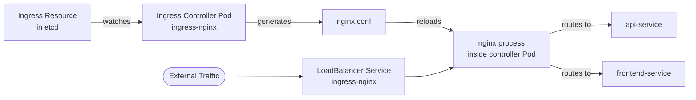

# Ingress Controllers

In the previous lesson you learned that an Ingress resource is just a declaration of routing rules, a piece of configuration stored in etcd. By itself it has no effect. The component that reads those rules and actually implements them is the **Ingress controller**, and understanding how it works is essential before you can use Ingress in practice.

:::info
Kubernetes does not ship with a built-in Ingress controller. This is an intentional design choice: different organizations have different needs, and there is a rich ecosystem of controllers to choose from. You are responsible for installing one before Ingress resources have any effect.
:::

## Popular Ingress Controllers

The ecosystem is large, but a handful stand out as the most commonly used:

- **ingress-nginx** The most widely deployed open-source controller, maintained by the Kubernetes community. Uses nginx as the underlying proxy and supports a rich set of features via annotations. Solid default choice if you are not sure what to use.
- **Traefik** A cloud-native proxy built with Kubernetes in mind from the start. Clean configuration model, excellent web dashboard, and tight integration with Let's Encrypt for automatic TLS.
- **HAProxy Ingress** Uses HAProxy under the hood, known for extreme performance and fine-grained connection control. Often chosen for high-throughput production workloads.
- **Contour** Uses Envoy as the proxy, developed by the VMware/Broadcom team. Strong support for advanced HTTP features and the reference implementation for the Gateway API (the successor to Ingress).
- **Cloud-managed controllers**, The AWS Load Balancer Controller (ALBs/NLBs), GKE Ingress controller (Google Cloud Load Balancers), and Azure Application Gateway Ingress Controller all integrate deeply with their respective clouds, automatically provisioning cloud-native load balancers from Ingress resources.

On managed Kubernetes platforms (GKE, EKS, AKS), the cloud provider typically offers a managed controller that is either pre-installed or easily enabled. On self-managed clusters, you install one yourself.

## How an Ingress Controller Works

The controller runs as one or more Pods inside your cluster, typically in a dedicated namespace like `ingress-nginx`. When it starts up, it registers a watch on the Kubernetes API for Ingress resources (and Secrets, for TLS). Every time an Ingress is created, updated, or deleted, the API server notifies the controller.

The controller reads the Ingress rules and translates them into its underlying proxy's configuration. For ingress-nginx, this means generating an nginx configuration file and reloading nginx. For Traefik, it updates Traefik's routing table in memory. For cloud controllers, it calls the cloud provider's API to configure load balancer rules.



The controller Pod is exposed via a Service of type `LoadBalancer` (or `NodePort` in local environments). This is the single entry point through which all external traffic flows. The cloud provider assigns a single external IP to this Service, and that IP is what you point your DNS records at.

## Installing ingress-nginx

The ingress-nginx controller can be installed with a single `kubectl apply` command using the official manifest. The exact manifest URL depends on your environment:

For cloud environments (where LoadBalancer Services work):

```bash
kubectl apply -f https://raw.githubusercontent.com/kubernetes/ingress-nginx/main/deploy/static/provider/cloud/deploy.yaml
```

For local development environments like `kind` or `minikube`:

```bash
# For kind
kubectl apply -f https://raw.githubusercontent.com/kubernetes/ingress-nginx/main/deploy/static/provider/kind/deploy.yaml

# For minikube, enable the add-on instead
minikube addons enable ingress
```

Alternatively, if you use Helm:

```bash
helm repo add ingress-nginx https://kubernetes.github.io/ingress-nginx
helm repo update
helm install ingress-nginx ingress-nginx/ingress-nginx \
  --namespace ingress-nginx \
  --create-namespace
```

After installation, wait for the controller Pod to be ready:

```bash
kubectl wait --namespace ingress-nginx \
  --for=condition=ready pod \
  --selector=app.kubernetes.io/component=controller \
  --timeout=120s
```

:::info
The ingress-nginx controller maintained by the Kubernetes community lives at `kubernetes/ingress-nginx` on GitHub. There is a separate, commercial nginx controller at `nginxinc/kubernetes-ingress`. They are different projects with different installation steps and annotation namespaces. The community version is what most tutorials refer to when they say "nginx Ingress controller."
:::

## The `ingressClassName` Field

When your cluster has multiple Ingress controllers installed, for example, ingress-nginx for public traffic and a cloud-native controller for internal traffic, you need a way to tell each Ingress resource which controller should handle it. That is what `ingressClassName` is for.

Each Ingress controller creates an **IngressClass** object when it is installed. An IngressClass is a simple Kubernetes object that represents a class of Ingress that a particular controller can handle. When you create an Ingress resource, you set `spec.ingressClassName` to the name of the IngressClass you want to use:

```yaml
spec:
  ingressClassName: nginx
  rules:
    - ...
```

If you omit `ingressClassName`, some controllers will claim all Ingresses without a class (depending on their configuration), while others will ignore them. To avoid ambiguity, especially in clusters with multiple controllers, always specify `ingressClassName` explicitly.

You can mark one IngressClass as the cluster default using the annotation `ingressclass.kubernetes.io/is-default-class: "true"`. With a default class set, Ingress resources that omit `ingressClassName` will automatically be assigned to that class.

:::warning
The `kubernetes.io/ingress.class` annotation (note: an annotation, not a field) was the old way to specify the controller before `spec.ingressClassName` was introduced in Kubernetes 1.18. You will still see it in older manifests and tutorials. The field approach is preferred for all modern clusters.
:::

## Hands-On Practice

**Step 1: Check if an Ingress controller is installed**

```bash
kubectl get pods -n ingress-nginx
```

If no pods are returned, no controller is installed. If you see something like:

```
NAME                                        READY   STATUS    RESTARTS   AGE
ingress-nginx-controller-7d5fb757db-4wrtk   1/1     Running   0          2m
```

You are ready to go.

**Step 2: List available IngressClasses**

```bash
kubectl get ingressclass
```

Expected output:

```
NAME    CONTROLLER             PARAMETERS   AGE
nginx   k8s.io/ingress-nginx   <none>       2m
```

**Step 3: Look at the IngressClass details**

```bash
kubectl describe ingressclass nginx
```

Expected output:

```
Name:         nginx
Labels:       ...
Annotations:  ingressclass.kubernetes.io/is-default-class: true
Controller:   k8s.io/ingress-nginx
```

The annotation confirms this is the default class, meaning Ingress resources without an explicit `ingressClassName` will be handled by this controller.

**Step 4: Find the external IP of the Ingress controller**

```bash
kubectl get svc -n ingress-nginx
```

Expected output:

```
NAME                                 TYPE           CLUSTER-IP      EXTERNAL-IP     PORT(S)
ingress-nginx-controller             LoadBalancer   10.96.xxx.xxx   203.0.113.50    80:31xxx/TCP,443:32xxx/TCP
ingress-nginx-controller-admission   ClusterIP      10.96.yyy.yyy   <none>          443/TCP
```

The `EXTERNAL-IP` of the `ingress-nginx-controller` Service is the address you point your DNS records at. All HTTP/HTTPS traffic for your Ingress-managed hostnames flows through this single IP.

**Step 5: View the controller logs**

```bash
kubectl logs -n ingress-nginx -l app.kubernetes.io/component=controller --tail=30
```

As you create Ingress resources in the next lessons, you can watch these logs to see the controller responding to changes and reloading its nginx configuration.
