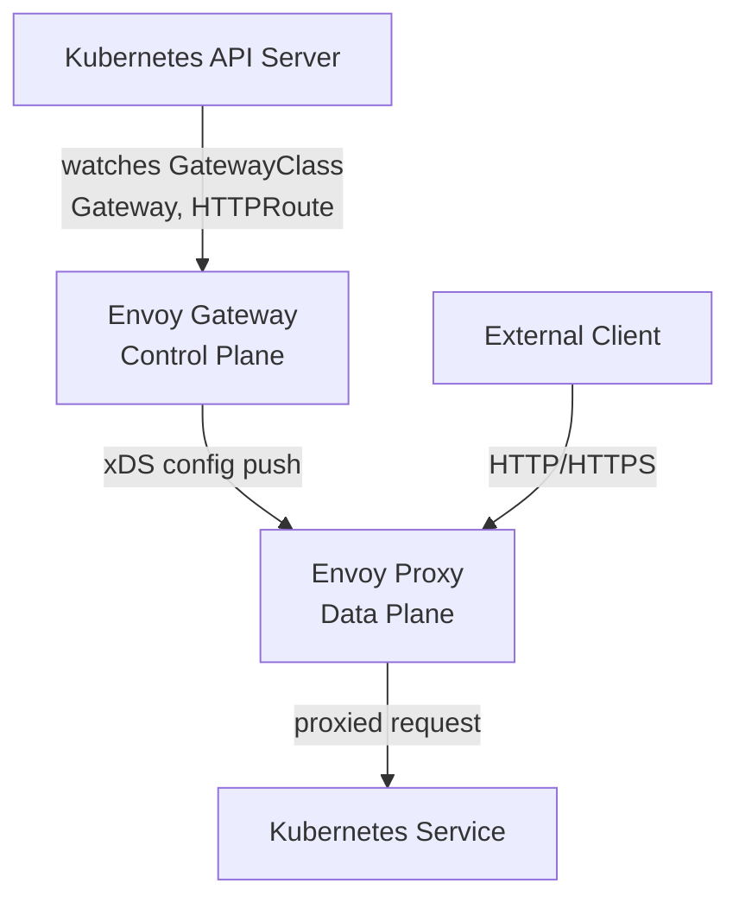

# Envoy Gateway Controller

In the previous lesson you learned about the three building blocks of Gateway API: GatewayClass, Gateway, and HTTPRoute. But those are just Kubernetes objects, YAML stored in etcd. On their own, they do nothing. Something has to watch them, understand them, and translate them into actual proxy behavior that can route real network traffic. That something is the **controller**.

Every Gateway API implementation ships a controller, and the one used in this module is **Envoy Gateway**. Understanding what this controller does, and how it does it, will help you reason about what happens when things break, when routes don't appear to work, or when configuration changes don't seem to take effect.

## The Two Sides of a Proxy System

Proxy systems like Envoy Gateway are typically divided into two distinct layers:

The **control plane** is the brain. It watches for configuration changes, validates them, and computes the desired state of the data plane. It never touches actual user traffic. In Envoy Gateway, the control plane is a Kubernetes controller running as a Deployment in the `envoy-gateway-system` namespace.

The **data plane** is the muscle. It is the actual proxy that receives incoming connections, applies routing rules, and forwards requests to backend services. In Envoy Gateway, the data plane is an Envoy Proxy instance, also running in the cluster, managed by the control plane.

This separation is intentional. The control plane can be restarted without dropping any active connections. The data plane handles traffic independently. You can update routing rules without causing a blip in traffic, because the control plane pushes incremental config updates to the data plane using a protocol called xDS.



## What the Control Plane Watches

The Envoy Gateway controller runs a reconciliation loop, similar to every other Kubernetes controller. It watches several resource types:

- **GatewayClass**: is this class mine? If yes, manage all Gateways that reference it.
- **Gateway**: what ports and protocols should I listen on? What TLS certificates apply?
- **HTTPRoute, TLSRoute, GRPCRoute**: what are the routing rules? Which Service should receive which traffic?
- **Secrets**: for TLS Gateways, what certificate and key should I load?

When any of these resources change, the controller recomputes the full desired configuration and pushes an update to the Envoy data plane. The data plane applies the new configuration without restarting, which means routing updates are effectively live within seconds.

:::info
This is the Kubernetes controller pattern you may have already seen with Deployments and ReplicaSets. Envoy Gateway follows the exact same model: watch resources, compute desired state, reconcile actual state toward desired state, repeat.
:::

## Validation and Status Reporting

One of the responsibilities of the control plane is validation. Not every combination of Gateway API resources is valid. For example, an HTTPRoute can reference a Gateway by name, but if that Gateway does not exist, or if the Gateway does not allow routes from the HTTPRoute's namespace, the route will not be accepted.

When the controller validates resources, it writes back **status conditions** to them. These conditions are visible on the resources themselves and are extremely useful for debugging. If an HTTPRoute is not working, `kubectl describe httproute <name>` will show you the conditions set by the controller, including any reason why the route was rejected.

:::warning
A common mistake is to apply an HTTPRoute that references a Gateway in a different namespace without proper `allowedRoutes` configuration on the Gateway. The HTTPRoute will be created successfully, but the controller will reject it and set a `NotAllowed` condition. Always check the status conditions if traffic is not flowing.
:::

## How Envoy Proxy Receives Its Configuration

Envoy Proxy does not read Kubernetes objects directly. It speaks a protocol called **xDS** (short for "x Discovery Service"), a gRPC-based API for pushing configuration to Envoy instances. The control plane acts as an xDS server: when routing config changes, it streams the update to all connected Envoy instances.

This is what makes Envoy Gateway so efficient at handling configuration changes. You do not restart anything, you do not reload config files. The control plane translates your Kubernetes objects into xDS messages and streams them to Envoy in real time.

## The Envoy Gateway Services

When you inspect the `envoy-gateway-system` namespace, you will find several services:

- The Envoy Gateway control plane service handles internal communication.
- The Envoy proxy data plane is exposed as a `LoadBalancer` service, which is how external traffic enters the cluster and reaches Envoy.

The `LoadBalancer` service gets an external IP (or remains in `<pending>` in local environments without a cloud load balancer). This is the IP address that your DNS records should point to, so that hostnames like `app.example.com` reach the Envoy proxy.

## Hands-On Practice

**Step 1: Verify the control plane pods are running**

```bash
kubectl get pods -n envoy-gateway-system -l control-plane=envoy-gateway
```

Expected output:

```
NAME                             READY   STATUS    RESTARTS   AGE
envoy-gateway-<hash>             1/1     Running   0          <age>
```

**Step 2: Inspect the Envoy Gateway services**

```bash
kubectl get svc -n envoy-gateway-system
```

Expected output:

```
NAME                         TYPE           CLUSTER-IP      EXTERNAL-IP   PORT(S)
envoy-gateway                ClusterIP      10.96.xxx.xxx   <none>        18000/TCP,...
envoy-default-eg-<hash>      LoadBalancer   10.96.yyy.yyy   <pending>     80:30xxx/TCP
```

The `LoadBalancer` service is your data plane entry point. In a real cloud environment, `EXTERNAL-IP` would be a public IP address.

**Step 3: Inspect the GatewayClass status**

```bash
kubectl describe gatewayclass eg
```

Expected output excerpt:

```
Name:         eg
API Version:  gateway.networking.k8s.io/v1
Kind:         GatewayClass
...
Spec:
  Controller Name:  gateway.envoyproxy.io/gatewayclass-controller
Status:
  Conditions:
    Type:                  Accepted
    Status:                True
```

An `Accepted: True` condition confirms the controller has adopted this GatewayClass.

**Step 4: Inspect the Gateway status**

```bash
kubectl describe gateway eg
```

Expected output excerpt:

```
Name:         eg
Namespace:    default
Class:        eg
Address:      127.0.0.1
Listeners:
  Name: http
  Port: 80
  Protocol: HTTP
Allowed Routes:
  Namespaces: from: Same
```

Look at listener and route attachment fields, they are set by the controller after it processes the Gateway resource.

**Step 5: View recent controller logs**

```bash
kubectl logs -n envoy-gateway-system -l control-plane=envoy-gateway --tail=30
```

You will see reconciliation activity logged here. When you create or update a Gateway API resource, new log lines appear within seconds as the controller picks up the change.
