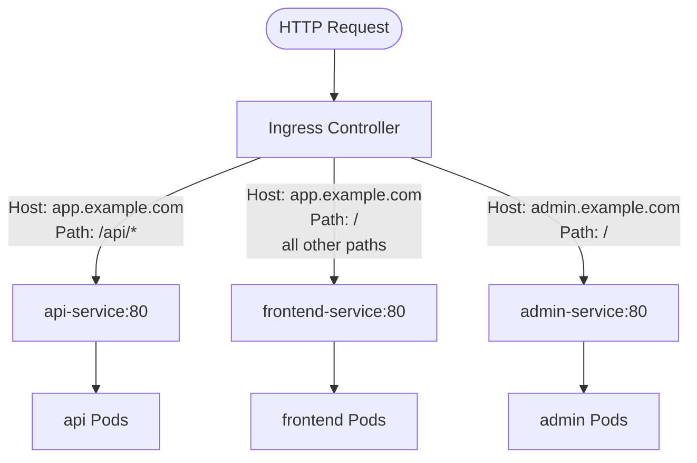

# Routing Rules: Host-Based and Path-Based

The true power of Ingress lies in its routing rules — the precise, declarative way you tell the controller how to direct incoming traffic to the right backend Service. Kubernetes Ingress supports two fundamental routing strategies: host-based routing, which separates traffic by the domain name in the request, and path-based routing, which separates traffic by the URL path. In practice, you will often combine both strategies in a single Ingress resource.

## Host-Based Routing

Host-based routing works by inspecting the `Host` HTTP header that every web browser and HTTP client sends with each request. When you visit `api.example.com`, your browser sends `Host: api.example.com`. When you visit `app.example.com`, it sends `Host: app.example.com`. The Ingress controller reads this header and matches it against the `host` field in each Ingress rule.

This allows you to serve completely different applications from the same external IP address and Ingress controller, distinguished purely by hostname. Your API team can deploy independently behind `api.example.com`, your frontend team can deploy behind `app.example.com`, and your internal admin panel can sit at `admin.example.com` — all sharing the same entry point, with the Ingress controller handling the routing transparently.

## Path-Based Routing

Path-based routing inspects the URL path after the hostname. When a request arrives for `app.example.com/api/users`, the controller matches it against rules based on the `/api` path prefix. A different request for `app.example.com/` matches the root path rule and goes to a different Service.

This is particularly useful for monolithic applications being broken apart into microservices, where you want to maintain a single public hostname but route different URL paths to different backend teams or services.

## A Complete Ingress Manifest

Let's look at a real Ingress manifest that combines both routing strategies:

```yaml
apiVersion: networking.k8s.io/v1
kind: Ingress
metadata:
  name: my-ingress
spec:
  ingressClassName: nginx
  rules:
    - host: app.example.com
      http:
        paths:
          - path: /api
            pathType: Prefix
            backend:
              service:
                name: api-service
                port:
                  number: 80
          - path: /
            pathType: Prefix
            backend:
              service:
                name: frontend-service
                port:
                  number: 80
    - host: admin.example.com
      http:
        paths:
          - path: /
            pathType: Prefix
            backend:
              service:
                name: admin-service
                port:
                  number: 80
```

Reading through this manifest: there are two host rules. For requests to `app.example.com`, there are two path rules — requests with paths starting with `/api` go to `api-service`, and everything else goes to `frontend-service`. For requests to `admin.example.com`, everything goes to `admin-service`. The `ingressClassName: nginx` field tells the controller which IngressClass should handle this resource.



## `pathType`: Prefix vs Exact

The `pathType` field controls how strictly the path is matched. There are two values you will use regularly:

**`Prefix`** matches the path and anything that starts with it. A rule with `path: /api` and `pathType: Prefix` will match `/api`, `/api/`, `/api/users`, `/api/v1/products`, and so on. This is the most commonly used path type and is what you want for routing to an API or any sub-path tree.

**`Exact`** matches only the exact path string, with no trailing variations. A rule with `path: /healthz` and `pathType: Exact` will match `/healthz` and nothing else — not `/healthz/`, not `/healthz/live`. Use `Exact` when you need to expose a very specific endpoint without accidentally routing other paths to the same backend.

There is an important subtlety with `Prefix` and trailing slashes. The path `/api` with `Prefix` matches `/api` and `/api/anything`, but different Ingress controllers handle the trailing slash case slightly differently. When in doubt, use a path like `/api/` with a trailing slash, or test explicitly.

:::info
When multiple path rules could match the same request, Ingress controllers generally apply a longest-match-wins rule: the most specific path that matches wins. So if you have rules for `/` and `/api`, a request for `/api/users` will match `/api` and not `/`, because `/api` is a longer and therefore more specific prefix.
:::

## The Default Backend

What happens when an incoming request does not match any rule in your Ingress? The answer is the **default backend**. You can specify a global fallback service at the top level of the Ingress spec:

```yaml
spec:
  defaultBackend:
    service:
      name: catch-all-service
      port:
        number: 80
  rules:
    - ...
```

If no rule matches — wrong hostname, unknown path — the request is routed to `catch-all-service`. This is typically a simple service that returns a 404 page with a user-friendly message.

If you do not specify a default backend in your Ingress, the Ingress controller's own default backend handles unmatched requests. For ingress-nginx, this is a built-in 404 page served by the controller itself.

:::warning
Do not confuse the Ingress `defaultBackend` (for unmatched requests) with the `default` IngressClass. They are completely different concepts. The `defaultBackend` is a fallback routing target; the default IngressClass is the class assigned to Ingress resources that do not specify `spec.ingressClassName`.
:::

## Hands-On Practice

Let's build a working multi-service Ingress and test both host-based and path-based routing.

**Step 1: Deploy three backend applications**

```bash
kubectl create deployment frontend --image=nginx --port=80
kubectl expose deployment frontend --port=80 --name=frontend-service

kubectl create deployment api --image=nginx --port=80
kubectl expose deployment api --port=80 --name=api-service

kubectl create deployment admin --image=nginx --port=80
kubectl expose deployment admin --port=80 --name=admin-service
```

To make the responses distinguishable, patch each deployment to return a different body:

```bash
kubectl exec -it deploy/frontend -- sh -c 'echo "FRONTEND" > /usr/share/nginx/html/index.html'
kubectl exec -it deploy/api -- sh -c 'echo "API" > /usr/share/nginx/html/index.html'
kubectl exec -it deploy/admin -- sh -c 'echo "ADMIN" > /usr/share/nginx/html/index.html'
```

**Step 2: Create the Ingress**

```bash
kubectl apply -f - <<EOF
apiVersion: networking.k8s.io/v1
kind: Ingress
metadata:
  name: demo-routing
spec:
  ingressClassName: nginx
  defaultBackend:
    service:
      name: frontend-service
      port:
        number: 80
  rules:
    - host: app.example.com
      http:
        paths:
          - path: /api
            pathType: Prefix
            backend:
              service:
                name: api-service
                port:
                  number: 80
          - path: /
            pathType: Prefix
            backend:
              service:
                name: frontend-service
                port:
                  number: 80
    - host: admin.example.com
      http:
        paths:
          - path: /
            pathType: Prefix
            backend:
              service:
                name: admin-service
                port:
                  number: 80
EOF
```

**Step 3: Get the Ingress controller's external IP**

```bash
kubectl get svc -n ingress-nginx ingress-nginx-controller
```

Note the `EXTERNAL-IP` (or use `localhost`/`127.0.0.1` for local clusters like `kind`).

**Step 4: Test host-based routing using curl with the Host header**

```bash
# Should return "FRONTEND"
curl -H "Host: app.example.com" http://<INGRESS-IP>/

# Should return "API"
curl -H "Host: app.example.com" http://<INGRESS-IP>/api

# Should return "ADMIN"
curl -H "Host: admin.example.com" http://<INGRESS-IP>/

# Unmatched host — hits default backend, returns "FRONTEND"
curl -H "Host: unknown.example.com" http://<INGRESS-IP>/
```

**Step 5: Inspect the Ingress status**

```bash
kubectl describe ingress demo-routing
```

Look at the `Rules` section to confirm path and backend mappings are correct. Also check the `Address` field — it should now show the Ingress controller's external IP, which means the controller has acknowledged and configured this Ingress.

**Step 6: Test Exact pathType**

```bash
kubectl apply -f - <<EOF
apiVersion: networking.k8s.io/v1
kind: Ingress
metadata:
  name: exact-test
spec:
  ingressClassName: nginx
  rules:
    - host: app.example.com
      http:
        paths:
          - path: /healthz
            pathType: Exact
            backend:
              service:
                name: api-service
                port:
                  number: 80
EOF

# Should route to api-service
curl -H "Host: app.example.com" http://<INGRESS-IP>/healthz

# Should NOT match the exact rule (returns 404 or default backend)
curl -H "Host: app.example.com" http://<INGRESS-IP>/healthz/extra
```

**Step 7: Clean up**

```bash
kubectl delete ingress demo-routing exact-test
kubectl delete service frontend-service api-service admin-service
kubectl delete deployment frontend api admin
```
