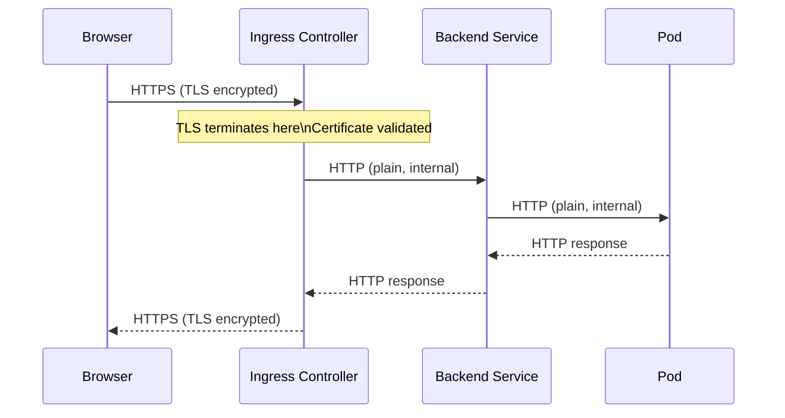

# TLS Termination with Ingress

Virtually every production web application needs HTTPS. Browsers warn users about HTTP sites, search engines penalize them, and for anything handling user data or authentication, plain HTTP is simply not acceptable. Kubernetes Ingress makes configuring HTTPS remarkably straightforward through a mechanism called **TLS termination** — the controller handles the secure connection with the outside world, while your backend Services can keep speaking plain HTTP internally.

## What TLS Termination Means

TLS termination is the act of decrypting an incoming HTTPS connection at a specific point in your infrastructure and then forwarding the decrypted traffic to the backend. The "termination" refers to the end of the encrypted tunnel — beyond that point, traffic flows as HTTP.

In the Ingress model, the controller Pod is where TLS terminates. An HTTPS request from a browser travels encrypted over the public internet, hits the Ingress controller, and at that point the controller decrypts it using your certificate and private key. The request then travels as plain HTTP from the controller to your backend Service and Pods, all within the private cluster network.

This approach has significant advantages. Your application code never has to deal with TLS — no certificate configuration in nginx or Express or Spring Boot. All certificate management is centralized at the Ingress layer. And since cluster-internal traffic is already within a trusted network boundary, plain HTTP inside the cluster is a widely accepted trade-off (though service meshes like Istio can encrypt internal traffic too if you need it).



## The TLS Secret

Before you can configure TLS in an Ingress, you need a Kubernetes Secret of type `kubernetes.io/tls`. This Secret holds exactly two pieces of data: the certificate (public) and the private key (private). Kubernetes names these `tls.crt` and `tls.key`.

To create a TLS Secret from existing certificate files:

```bash
kubectl create secret tls my-tls-secret \
  --cert=cert.pem \
  --key=key.pem
```

If you want to create a self-signed certificate for testing purposes:

```bash
# Generate a self-signed certificate and key
openssl req -x509 -nodes -days 365 -newkey rsa:2048 \
  -keyout tls.key \
  -out tls.crt \
  -subj "/CN=app.example.com/O=my-org"

# Create the Secret
kubectl create secret tls my-tls-secret --cert=tls.crt --key=tls.key
```

You can verify the Secret was created correctly:

```bash
kubectl get secret my-tls-secret
kubectl describe secret my-tls-secret
```

The `describe` output will show two data keys (`tls.crt` and `tls.key`) but will not reveal their values — Kubernetes keeps Secret data protected from casual inspection.

:::warning
The TLS Secret **must be in the same namespace as the Ingress resource** that references it. An Ingress in the `production` namespace cannot reference a Secret in the `default` namespace. If you need the same certificate in multiple namespaces, you must copy the Secret into each one — or use a tool like cert-manager's Certificate resource to manage this automatically.
:::

## Configuring TLS in the Ingress Manifest

Once your Secret exists, referencing it in an Ingress is a single `spec.tls` block:

```yaml
apiVersion: networking.k8s.io/v1
kind: Ingress
metadata:
  name: my-ingress
spec:
  ingressClassName: nginx
  tls:
    - hosts:
        - app.example.com
      secretName: my-tls-secret
  rules:
    - host: app.example.com
      http:
        paths:
          - path: /
            pathType: Prefix
            backend:
              service:
                name: frontend-service
                port:
                  number: 80
```

The `spec.tls` block is a list, meaning you can specify multiple TLS entries — useful when your Ingress serves multiple hostnames with different certificates. Each entry has a list of `hosts` that should use that certificate, and the `secretName` pointing to the Secret containing the certificate and key.

When the Ingress controller reads this, it configures the underlying proxy (nginx, Traefik, etc.) to listen on port 443, load the certificate from the Secret, and handle the HTTPS handshake for the listed hosts. The controller automatically watches the Secret and reloads when the certificate is renewed.

## Automatic HTTP to HTTPS Redirect

Most of the time you want to ensure that any HTTP request is redirected to HTTPS. With ingress-nginx, you can enable this with an annotation:

```yaml
metadata:
  annotations:
    nginx.ingress.kubernetes.io/ssl-redirect: "true"
```

When this annotation is set (it defaults to `true` when TLS is configured in ingress-nginx), the controller will respond to any HTTP request on port 80 with a `301 Moved Permanently` redirect to the equivalent HTTPS URL. Your users can visit `http://app.example.com` and will be instantly redirected to `https://app.example.com`.

:::info
With ingress-nginx, when you configure TLS in the Ingress spec, `ssl-redirect` defaults to `true`. You only need to explicitly set the annotation if you want to disable the redirect (e.g., for internal tooling that uses HTTP). For most production workloads, the default is exactly what you want.
:::

## cert-manager: Automatic Certificate Management

Managing TLS certificates manually — generating them, tracking expiry dates, renewing them before they expire, and updating Secrets — is a tedious and error-prone process. A missed renewal means users see scary certificate error pages in their browsers.

**cert-manager** is a Kubernetes add-on that automates the entire certificate lifecycle. It integrates with certificate authorities like Let's Encrypt (free, publicly trusted certificates) and internal PKI systems. Once installed and configured, you add annotations to your Ingress resource, and cert-manager handles everything else: requesting the certificate, proving domain ownership, storing the certificate in a Secret, and renewing it automatically before expiry.

The typical annotation for cert-manager with Let's Encrypt looks like this:

```yaml
metadata:
  annotations:
    cert-manager.io/cluster-issuer: letsencrypt-prod
```

And you add a `tls` block to your Ingress as normal, pointing to a Secret name that cert-manager will create:

```yaml
spec:
  tls:
    - hosts:
        - app.example.com
      secretName: app-example-com-tls
```

cert-manager sees the Ingress, notices the annotation, requests a certificate from Let's Encrypt for `app.example.com`, completes the ACME challenge (typically HTTP-01 or DNS-01), and stores the resulting certificate in the Secret `app-example-com-tls`. The Ingress controller then picks it up and starts serving HTTPS. Thirty days before the certificate expires, cert-manager renews it automatically, updates the Secret, and the controller reloads. Zero manual intervention.

## Hands-On Practice

Let's create a TLS-terminated Ingress using a self-signed certificate.

**Step 1: Generate a self-signed TLS certificate**

```bash
openssl req -x509 -nodes -days 365 -newkey rsa:2048 \
  -keyout tls.key \
  -out tls.crt \
  -subj "/CN=app.example.com/O=kube-mastery"
```

**Step 2: Create the TLS Secret**

```bash
kubectl create secret tls demo-tls-secret --cert=tls.crt --key=tls.key
```

Verify it:
```bash
kubectl get secret demo-tls-secret
```

Expected output:
```
NAME              TYPE                DATA   AGE
demo-tls-secret   kubernetes.io/tls   2      5s
```

**Step 3: Deploy a backend Service**

```bash
kubectl create deployment web --image=nginx
kubectl expose deployment web --port=80 --name=web-service
```

**Step 4: Create a TLS-enabled Ingress**

```bash
kubectl apply -f - <<EOF
apiVersion: networking.k8s.io/v1
kind: Ingress
metadata:
  name: tls-demo
  annotations:
    nginx.ingress.kubernetes.io/ssl-redirect: "true"
spec:
  ingressClassName: nginx
  tls:
    - hosts:
        - app.example.com
      secretName: demo-tls-secret
  rules:
    - host: app.example.com
      http:
        paths:
          - path: /
            pathType: Prefix
            backend:
              service:
                name: web-service
                port:
                  number: 80
EOF
```

**Step 5: Get the Ingress controller IP and test HTTPS**

```bash
INGRESS_IP=$(kubectl get svc -n ingress-nginx ingress-nginx-controller -o jsonpath='{.status.loadBalancer.ingress[0].ip}')
echo "Ingress IP: $INGRESS_IP"

# Test HTTPS (--insecure because it's a self-signed cert)
curl -k -H "Host: app.example.com" https://$INGRESS_IP/
```

Expected output:
```html
<!DOCTYPE html>
<html>
<head>
<title>Welcome to nginx!</title>
...
```

**Step 6: Verify the redirect from HTTP to HTTPS**

```bash
# Should return 308 redirect to https://
curl -v -H "Host: app.example.com" http://$INGRESS_IP/
```

Look for `Location: https://app.example.com/` in the response headers, confirming the HTTP-to-HTTPS redirect is working.

**Step 7: Inspect the certificate the controller is serving**

```bash
openssl s_client -connect $INGRESS_IP:443 -servername app.example.com -showcerts </dev/null 2>/dev/null | openssl x509 -noout -text | grep -E "Subject:|Not After"
```

This should show your certificate's subject (`CN=app.example.com`) and expiry date.

**Step 8: Clean up**

```bash
kubectl delete ingress tls-demo
kubectl delete secret demo-tls-secret
kubectl delete service web-service
kubectl delete deployment web
rm tls.crt tls.key
```
