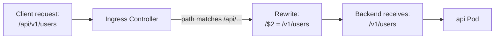

# Ingress Annotations and Rewrite-Target

The Kubernetes Ingress API is intentionally minimal. It covers the essential routing concepts , host-based rules, path-based rules, TLS , but deliberately leaves out the dozens of advanced features that proxy servers offer. Different controllers implement different features in different ways, and the Ingress spec cannot possibly standardize all of them. The solution to this extensibility problem is **annotations**: key-value pairs in the Ingress metadata that pass controller-specific configuration directly to the underlying proxy.

## Annotations as Controller-Specific Extensions

Annotations are a general Kubernetes mechanism , every object can carry annotations , but for Ingress they serve a specific purpose: they allow you to pass configuration to the Ingress controller that goes beyond what the Ingress spec supports.

Think of the Ingress spec as a universal language that all controllers understand, and annotations as dialects that are specific to each controller. A configuration option that ingress-nginx reads via an annotation will be silently ignored by Traefik, and vice versa. This is both a strength (no lock-in in the core spec) and a practical consideration (if you switch controllers, you need to translate your annotations).

All ingress-nginx annotations share the prefix `nginx.ingress.kubernetes.io/`. This namespace prefix makes it clear which controller they target. Traefik uses `traefik.io/` prefixed annotations. HAProxy uses `haproxy.org/`.

## Common ingress-nginx Annotations

Let's walk through the most useful ingress-nginx annotations you will encounter regularly.

**`ssl-redirect`** forces all HTTP traffic to redirect to HTTPS. When TLS is configured in the Ingress, this defaults to `"true"`:

```yaml
annotations:
  nginx.ingress.kubernetes.io/ssl-redirect: "true"
```

**`proxy-body-size`** controls the maximum size of the request body that nginx will accept. The default is typically 1MB, which is too small for file uploads. Setting it to `"0"` disables the limit:

```yaml
annotations:
  nginx.ingress.kubernetes.io/proxy-body-size: "50m"
```

**`proxy-read-timeout`** and **`proxy-send-timeout`** control how long nginx waits for the backend to respond. Useful for slow API endpoints or long-running operations:

```yaml
annotations:
  nginx.ingress.kubernetes.io/proxy-read-timeout: "120"
  nginx.ingress.kubernetes.io/proxy-send-timeout: "120"
```

**`rate-limit`** enables basic rate limiting on requests per second. ingress-nginx implements this using the nginx `limit_req` module:

```yaml
annotations:
  nginx.ingress.kubernetes.io/limit-rps: "10"
```

**`cors-enable`** adds CORS headers automatically, so you do not have to implement CORS in your application:

```yaml
annotations:
  nginx.ingress.kubernetes.io/enable-cors: "true"
  nginx.ingress.kubernetes.io/cors-allow-origin: "https://app.example.com"
```

## The Rewrite-Target Annotation

The `rewrite-target` annotation is one of the most commonly needed , and most commonly misunderstood , annotations in ingress-nginx. Understanding it well is worth your time.

**The problem it solves:** Imagine your Ingress exposes the path `/api/v1` to the public, routing requests to your backend API service. However, your API service only knows about paths like `/v1/users`, `/v1/products` , it has no idea it's being served under `/api`. When a request for `/api/v1/users` arrives at the controller and gets forwarded to the backend, the backend receives the full path `/api/v1/users`. The backend tries to find a route for `/api/v1/users` and fails, returning a 404.

What you actually need is for the controller to strip the `/api` prefix before forwarding the request. The backend should receive `/v1/users`, not `/api/v1/users`. This is exactly what `rewrite-target` does.

A simple rewrite looks like this:

```yaml
apiVersion: networking.k8s.io/v1
kind: Ingress
metadata:
  name: api-ingress
  annotations:
    nginx.ingress.kubernetes.io/rewrite-target: /
spec:
  ingressClassName: nginx
  rules:
    - host: app.example.com
      http:
        paths:
          - path: /api
            pathType: Prefix
            backend:
              service:
                name: api-service
                port:
                  number: 80
```

With `rewrite-target: /`, any request to `/api` or `/api/anything` gets rewritten so the backend receives `/` or simply the root path. But this is too aggressive , you lose everything after `/api`.

## Regex Capture Groups for Precise Rewrites

For a more surgical rewrite that preserves the rest of the path, you use a regex in the path and a capture group in the rewrite target. This is where the power really comes in:

```yaml
metadata:
  annotations:
    nginx.ingress.kubernetes.io/use-regex: "true"
    nginx.ingress.kubernetes.io/rewrite-target: /$2
spec:
  rules:
    - host: app.example.com
      http:
        paths:
          - path: /api(/|$)(.*)
            pathType: ImplementationSpecific
            backend:
              service:
                name: api-service
                port:
                  number: 80
```

In this example, the path regex `/api(/|$)(.*)` captures everything after `/api/` in capture group `$2`. The `rewrite-target: /$2` tells nginx to rewrite the path to just `/$2` , the part after the prefix. So a request for `/api/v1/users` gets rewritten to `/v1/users` before reaching the backend.



:::warning
The annotation `nginx.ingress.kubernetes.io/use-regex: "true"` enables regex matching for **all paths** on that Ingress resource. Mixing regex and non-regex paths on the same Ingress can cause unexpected matching behavior. If you need regex, use a dedicated Ingress resource for those paths.
:::

## Annotations Are Controller-Specific

This cannot be stressed enough: annotations are not portable between controllers. An annotation that works perfectly with ingress-nginx will be silently ignored by Traefik, and might even conflict with a Traefik annotation that happens to have a similar name.

If your team is evaluating multiple Ingress controllers or you are working in a multi-controller environment (e.g., ingress-nginx for public traffic, Traefik for internal), you need to maintain separate Ingress resources for each controller with the appropriate annotations for each.

:::info
The Gateway API , the successor to Ingress , addresses this portability problem by providing standardized resources (HTTPRoute, GRPCRoute, etc.) with controller-specific extensions moved to separate `Policy` objects. If you're building greenfield infrastructure, it's worth investigating Gateway API as a more future-proof alternative to annotated Ingresses.
:::

## Putting It All Together: A Production-Style Ingress

Here is a realistic example that combines several annotations:

```yaml
apiVersion: networking.k8s.io/v1
kind: Ingress
metadata:
  name: production-api
  namespace: production
  annotations:
    nginx.ingress.kubernetes.io/ssl-redirect: "true"
    nginx.ingress.kubernetes.io/use-regex: "true"
    nginx.ingress.kubernetes.io/rewrite-target: /$2
    nginx.ingress.kubernetes.io/proxy-body-size: "10m"
    nginx.ingress.kubernetes.io/proxy-read-timeout: "60"
    nginx.ingress.kubernetes.io/limit-rps: "20"
spec:
  ingressClassName: nginx
  tls:
    - hosts:
        - api.example.com
      secretName: api-tls-secret
  rules:
    - host: api.example.com
      http:
        paths:
          - path: /v1(/|$)(.*)
            pathType: ImplementationSpecific
            backend:
              service:
                name: api-service
                port:
                  number: 8080
```

This Ingress forces HTTPS, accepts request bodies up to 10MB, allows 60 seconds for the backend to respond, rate-limits to 20 requests per second per IP, and rewrites `/v1/anything` to `/anything` before sending to the backend.

## Hands-On Practice

**Step 1: Deploy a backend that reveals the path it received**

```bash
kubectl create deployment echo --image=ealen/echo-server --port=80
kubectl expose deployment echo --port=80 --name=echo-service
```

The `ealen/echo-server` image responds with a JSON body showing the request details, including the path the server received.

**Step 2: Create an Ingress without rewrite to observe the problem**

```bash
kubectl apply -f - <<EOF
apiVersion: networking.k8s.io/v1
kind: Ingress
metadata:
  name: no-rewrite
spec:
  ingressClassName: nginx
  rules:
    - host: app.example.com
      http:
        paths:
          - path: /api
            pathType: Prefix
            backend:
              service:
                name: echo-service
                port:
                  number: 80
EOF
```

Test it:
```bash
INGRESS_IP=$(kubectl get svc -n ingress-nginx ingress-nginx-controller -o jsonpath='{.status.loadBalancer.ingress[0].ip}')
curl -s -H "Host: app.example.com" http://$INGRESS_IP/api/users | python3 -m json.tool | grep path
```

Notice the backend receives `/api/users` , the full path including the prefix.

**Step 3: Add rewrite-target to strip the prefix**

```bash
kubectl apply -f - <<EOF
apiVersion: networking.k8s.io/v1
kind: Ingress
metadata:
  name: with-rewrite
  annotations:
    nginx.ingress.kubernetes.io/use-regex: "true"
    nginx.ingress.kubernetes.io/rewrite-target: /$2
spec:
  ingressClassName: nginx
  rules:
    - host: app.example.com
      http:
        paths:
          - path: /api(/|$)(.*)
            pathType: ImplementationSpecific
            backend:
              service:
                name: echo-service
                port:
                  number: 80
EOF
```

Test again:
```bash
curl -s -H "Host: app.example.com" http://$INGRESS_IP/api/users | python3 -m json.tool | grep path
```

Now the backend receives `/users` , the prefix has been stripped. The rewrite worked.

**Step 4: Test rate limiting**

```bash
kubectl apply -f - <<EOF
apiVersion: networking.k8s.io/v1
kind: Ingress
metadata:
  name: rate-limited
  annotations:
    nginx.ingress.kubernetes.io/limit-rps: "2"
spec:
  ingressClassName: nginx
  rules:
    - host: app.example.com
      http:
        paths:
          - path: /
            pathType: Prefix
            backend:
              service:
                name: echo-service
                port:
                  number: 80
EOF

# Fire 10 rapid requests and watch for 503 responses
for i in $(seq 1 10); do
  curl -s -o /dev/null -w "%{http_code}\n" -H "Host: app.example.com" http://$INGRESS_IP/
done
```

You should see some `200` responses followed by `503` (Service Unavailable) responses when the rate limit kicks in.

**Step 5: Clean up**

```bash
kubectl delete ingress no-rewrite with-rewrite rate-limited
kubectl delete service echo-service
kubectl delete deployment echo
```
