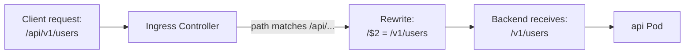

# Ingress Annotations and Rewrite-Target

The Kubernetes Ingress API is intentionally minimal, it covers host-based rules, path-based rules, and TLS, but deliberately leaves out the dozens of advanced features that proxy servers offer. The solution to this extensibility problem is **annotations**: key-value pairs in the Ingress metadata that pass controller-specific configuration directly to the underlying proxy.

:::info
Think of the Ingress spec as a universal language that all controllers understand, and annotations as dialects specific to each controller. All ingress-nginx annotations share the prefix `nginx.ingress.kubernetes.io/`. Traefik uses `traefik.io/`, HAProxy uses `haproxy.org/`. A configuration option one controller reads will be silently ignored by another.
:::

## Common ingress-nginx Annotations

Here are the most useful ingress-nginx annotations you will encounter regularly.

**`ssl-redirect`** forces all HTTP traffic to redirect to HTTPS. When TLS is configured in the Ingress, this defaults to `"true"`:

```yaml
annotations:
  nginx.ingress.kubernetes.io/ssl-redirect: 'true'
```

**`proxy-body-size`** controls the maximum size of the request body that nginx will accept. The default is typically 1MB, which is too small for file uploads. Setting it to `"0"` disables the limit:

```yaml
annotations:
  nginx.ingress.kubernetes.io/proxy-body-size: '50m'
```

**`proxy-read-timeout`** and **`proxy-send-timeout`** control how long nginx waits for the backend to respond. Useful for slow API endpoints or long-running operations:

```yaml
annotations:
  nginx.ingress.kubernetes.io/proxy-read-timeout: '120'
  nginx.ingress.kubernetes.io/proxy-send-timeout: '120'
```

**`limit-rps`** enables basic rate limiting on requests per second, implemented via the nginx `limit_req` module:

```yaml
annotations:
  nginx.ingress.kubernetes.io/limit-rps: '10'
```

**`enable-cors`** adds CORS headers automatically, so you do not have to implement CORS in your application:

```yaml
annotations:
  nginx.ingress.kubernetes.io/enable-cors: 'true'
  nginx.ingress.kubernetes.io/cors-allow-origin: 'https://app.example.com'
```

## The Rewrite-Target Annotation

The `rewrite-target` annotation is one of the most commonly needed, and most commonly misunderstood, annotations in ingress-nginx.

**The problem it solves:** your Ingress exposes `/api/v1` to the public, routing requests to your backend API service. But your API only knows about paths like `/v1/users`, it has no idea it's being served under `/api`. When a request for `/api/v1/users` arrives and gets forwarded to the backend, the backend receives the full path `/api/v1/users`, fails to find a route, and returns a 404. What you need is for the controller to strip the `/api` prefix before forwarding. That is exactly what `rewrite-target` does.

A simple rewrite looks like this:

```yaml
apiVersion: networking.k8s.io/v1
kind: Ingress
metadata:
  name: api-ingress
  annotations:
    nginx.ingress.kubernetes.io/rewrite-target: /
spec:
  ingressClassName: nginx
  rules:
    - host: app.example.com
      http:
        paths:
          - path: /api
            pathType: Prefix
            backend:
              service:
                name: api-service
                port:
                  number: 80
```

With `rewrite-target: /`, any request to `/api` or `/api/anything` gets rewritten so the backend receives `/`. But this is too aggressive, you lose everything after `/api`.

## Regex Capture Groups for Precise Rewrites

For a more surgical rewrite that preserves the rest of the path, use a regex in the path and a capture group in the rewrite target:

```yaml
metadata:
  annotations:
    nginx.ingress.kubernetes.io/use-regex: 'true'
    nginx.ingress.kubernetes.io/rewrite-target: /$2
spec:
  rules:
    - host: app.example.com
      http:
        paths:
          - path: /api(/|$)(.*)
            pathType: ImplementationSpecific
            backend:
              service:
                name: api-service
                port:
                  number: 80
```

The path regex `/api(/|$)(.*)` captures everything after `/api/` in capture group `$2`. The `rewrite-target: /$2` tells nginx to rewrite the path to just `/$2`. So a request for `/api/v1/users` gets rewritten to `/v1/users` before reaching the backend.



:::warning
The annotation `nginx.ingress.kubernetes.io/use-regex: "true"` enables regex matching for **all paths** on that Ingress resource. Mixing regex and non-regex paths on the same Ingress can cause unexpected matching behavior. If you need regex, use a dedicated Ingress resource for those paths.
:::

## Putting It All Together: A Production-Style Ingress

Here is a realistic example that combines several annotations:

```yaml
apiVersion: networking.k8s.io/v1
kind: Ingress
metadata:
  name: production-api
  namespace: production
  annotations:
    nginx.ingress.kubernetes.io/ssl-redirect: 'true'
    nginx.ingress.kubernetes.io/use-regex: 'true'
    nginx.ingress.kubernetes.io/rewrite-target: /$2
    nginx.ingress.kubernetes.io/proxy-body-size: '10m'
    nginx.ingress.kubernetes.io/proxy-read-timeout: '60'
    nginx.ingress.kubernetes.io/limit-rps: '20'
spec:
  ingressClassName: nginx
  tls:
    - hosts:
        - api.example.com
      secretName: api-tls-secret
  rules:
    - host: api.example.com
      http:
        paths:
          - path: /v1(/|$)(.*)
            pathType: ImplementationSpecific
            backend:
              service:
                name: api-service
                port:
                  number: 8080
```

This Ingress forces HTTPS, accepts request bodies up to 10MB, allows 60 seconds for the backend to respond, rate-limits to 20 requests per second per IP, and rewrites `/v1/anything` to `/anything` before sending to the backend.

:::info
The Gateway API, the successor to Ingress, addresses the annotation portability problem by providing standardized resources (HTTPRoute, GRPCRoute, etc.) with controller-specific extensions moved to separate `Policy` objects. If you're building greenfield infrastructure, it's worth investigating Gateway API as a more future-proof alternative.
:::

## Hands-On Practice

**Step 1: Deploy a backend that reveals the path it received**

```bash
kubectl create deployment echo --image=ealen/echo-server --port=80
kubectl expose deployment echo --port=80 --name=echo-service
```

The `ealen/echo-server` image responds with a JSON body showing the request details, including the path the server received.

**Step 2: Create an Ingress without rewrite to observe the problem**

```yaml
# no-rewrite-ingress.yaml
apiVersion: networking.k8s.io/v1
kind: Ingress
metadata:
  name: no-rewrite
spec:
  ingressClassName: nginx
  rules:
    - host: app.example.com
      http:
        paths:
          - path: /api
            pathType: Prefix
            backend:
              service:
                name: echo-service
                port:
                  number: 80
```

```bash
kubectl apply -f no-rewrite-ingress.yaml
```

Test it:

```bash
INGRESS_IP=$(kubectl get svc -n ingress-nginx ingress-nginx-controller -o jsonpath='{.status.loadBalancer.ingress[0].ip}')
curl -s -H "Host: app.example.com" http://$INGRESS_IP/api/users | python3 -m json.tool | grep path
```

Notice the backend receives `/api/users`, the full path including the prefix.

**Step 3: Add rewrite-target to strip the prefix**

```yaml
# with-rewrite-ingress.yaml
apiVersion: networking.k8s.io/v1
kind: Ingress
metadata:
  name: with-rewrite
  annotations:
    nginx.ingress.kubernetes.io/use-regex: 'true'
    nginx.ingress.kubernetes.io/rewrite-target: /$2
spec:
  ingressClassName: nginx
  rules:
    - host: app.example.com
      http:
        paths:
          - path: /api(/|$)(.*)
            pathType: ImplementationSpecific
            backend:
              service:
                name: echo-service
                port:
                  number: 80
```

```bash
kubectl apply -f with-rewrite-ingress.yaml
```

Test again:

```bash
curl -s -H "Host: app.example.com" http://$INGRESS_IP/api/users | python3 -m json.tool | grep path
```

Now the backend receives `/users`, the prefix has been stripped. The rewrite worked.

**Step 4: Test rate limiting**

```yaml
# rate-limited-ingress.yaml
apiVersion: networking.k8s.io/v1
kind: Ingress
metadata:
  name: rate-limited
  annotations:
    nginx.ingress.kubernetes.io/limit-rps: '2'
spec:
  ingressClassName: nginx
  rules:
    - host: app.example.com
      http:
        paths:
          - path: /
            pathType: Prefix
            backend:
              service:
                name: echo-service
                port:
                  number: 80
```

```bash
kubectl apply -f rate-limited-ingress.yaml

# Fire 10 rapid requests and watch for 503 responses
for i in $(seq 1 10); do
  curl -s -o /dev/null -w "%{http_code}<br/>" -H "Host: app.example.com" http://$INGRESS_IP/
done
```

You should see some `200` responses followed by `503` (Service Unavailable) responses when the rate limit kicks in.

**Step 5: Clean up**

```bash
kubectl delete ingress no-rewrite with-rewrite rate-limited
kubectl delete service echo-service
kubectl delete deployment echo
```
