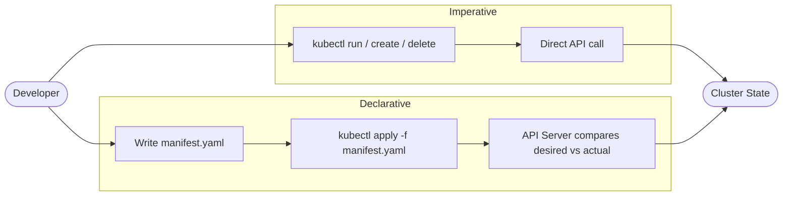

# Imperative vs Declarative

When you first start working with Kubernetes, one of the most fundamental concepts to grasp is not about pods or deployments, it is about _how you communicate with the cluster_. Kubernetes gives you two distinct mental models: the **imperative** approach and the **declarative** approach. Understanding the difference will shape how you work with Kubernetes for everything that follows.

## The Imperative Approach

When you use kubectl imperatively, you are issuing direct commands that take immediate effect. You are telling Kubernetes _what action to perform right now_.

```bash
# Run a pod immediately
kubectl run nginx --image=nginx

# Create a deployment
kubectl create deployment myapp --image=myapp:v1 --replicas=3

# Delete a pod
kubectl delete pod nginx
```

These commands execute instantly. Kubernetes receives the instruction, carries it out, and that is the end of the story. There is no file on disk, no record of intent, just the resulting cluster state.

The imperative style is fast and convenient for quick experiments, debugging ("Let me quickly spin up a pod to test network connectivity"), and certification exams like CKA/CKAD where speed matters. However, it has a significant weakness: if you run `kubectl create deployment myapp --image=myapp:v1` and someone asks tomorrow "how was this configured?", you have no easy answer. The command is gone; the intent is lost.

## The Declarative Approach

The declarative approach centers on YAML manifest files. Instead of telling Kubernetes what to _do_, you write a file describing what you _want_, and then tell Kubernetes to make the cluster match that description.

```bash
# Apply a manifest file, creates or updates the resource
kubectl apply -f deployment.yaml
```

A typical manifest for that same deployment looks like this:

```yaml
apiVersion: apps/v1
kind: Deployment
metadata:
  name: myapp
spec:
  replicas: 3
  selector:
    matchLabels:
      app: myapp
  template:
    metadata:
      labels:
        app: myapp
    spec:
      containers:
        - name: myapp
          image: myapp:v1
```

When you run `kubectl apply -f deployment.yaml`, Kubernetes reads your desired state, compares it to the current cluster state, and makes whatever changes are necessary to reconcile the two. If the deployment already exists with two replicas and you apply a file specifying three, Kubernetes adds one more. If nothing has changed, nothing happens.

This idempotency, the property that you can run the same command multiple times and always end up in the same state, is what makes the declarative approach so powerful for production systems.

:::info
`kubectl apply` is idempotent: running it multiple times with the same file is safe and will not create duplicate resources. This makes it the right choice for automation and CI/CD pipelines.
:::

## When to Use Each Approach

Neither approach is universally better. They complement each other.

**Use imperative** when:

- Experimenting, debugging, or doing a quick one-off task
- You do not need a record of the change ("delete that stuck pod", "scale temporarily")
- Taking a Kubernetes certification exam (CKA/CKAD), speed matters

**Use declarative** when:

- Managing production workloads
- Working in a team or practicing GitOps (Git as the source of truth)
- You need version control and auditability, manifests are self-documenting, reviewable in pull requests, and allow full cluster restoration by re-applying files

## The Bridge: Generating YAML from Imperative Commands

This is a trick we already covered in the Yaml and Objects module: you can use imperative commands to _generate_ declarative YAML, without actually creating anything in the cluster.

The `--dry-run=client -o yaml` combination tells kubectl to simulate the command locally and print the resulting YAML instead of sending it to the API server.

```bash
# Generate a deployment YAML without creating it
kubectl create deployment myapp --image=myapp:v1 --replicas=3 --dry-run=client -o yaml

# Save it to a file
kubectl create deployment myapp --image=myapp:v1 --replicas=3 --dry-run=client -o yaml > deployment.yaml
```

This is the best of both worlds: the speed of imperative commands to scaffold the YAML, then the permanence of declarative files to store and apply. You will use this pattern constantly once you get used to it.

:::warning
`--dry-run=client` only simulates the command on your machine, it does not contact the API server to validate the manifest against the cluster. For a fuller validation, use `--dry-run=server`, which sends the request to the API server without persisting the object.
:::

## The Two Paths to the Same Destination



Both paths ultimately change the same cluster state. The difference is in _how_ you express your intent and what trail you leave behind.

## Hands-On Practice

Open the terminal on the right and try these commands against your practice cluster. You will see both approaches in action.

```bash
# --- Imperative approach ---

# Create a pod immediately
kubectl run demo-pod --image=nginx

# Check it's running
kubectl get pods

# Delete it
kubectl delete pod demo-pod

# --- Generate YAML without creating anything ---

kubectl create deployment demo-app --image=nginx --replicas=2 --dry-run=client -o yaml

# Save the YAML to a file
kubectl create deployment demo-app --image=nginx --replicas=2 --dry-run=client -o yaml > /tmp/demo-app.yaml

# Inspect the generated file
cat /tmp/demo-app.yaml

# --- Declarative approach ---

# Apply the manifest (creates the deployment)
kubectl apply -f /tmp/demo-app.yaml

# Apply it again, no error, no duplicate
kubectl apply -f /tmp/demo-app.yaml
# Expected: deployment.apps/demo-app unchanged

# Check the deployment
kubectl get deployments

# Clean up declaratively
kubectl delete -f /tmp/demo-app.yaml
```

As you run these commands, notice how the imperative commands give you immediate feedback, while the declarative `kubectl apply` workflow keeps the manifest file as your source of truth.
