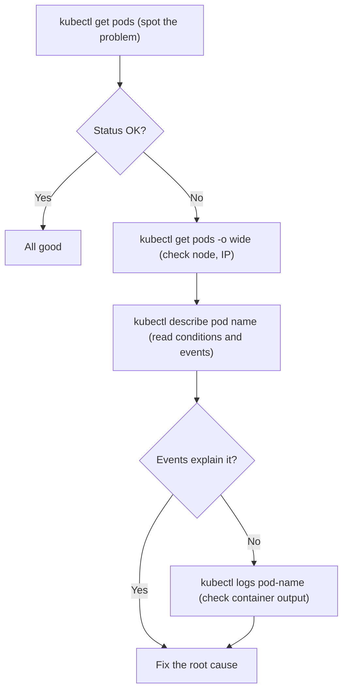

# Viewing Resources with kubectl

Before you can fix anything in a Kubernetes cluster, you need to know how to _look_ at it. This lesson covers the two most essential observation tools in kubectl: `kubectl get` and `kubectl describe`. Think of `kubectl get` as the high-altitude dashboard, it shows you what is running, and `kubectl describe` as the magnifying glass you pull out when something looks off.

:::info
These two commands form the foundation of your debugging workflow. Together they cover the vast majority of day-to-day Kubernetes investigation.
:::

## kubectl get: Your First Stop

The `kubectl get` command retrieves one or more resources and displays them in a compact table. It is the first thing you run when you want to know what is happening in your cluster.

```bash
# List all pods in the current namespace
kubectl get pods

# List all deployments
kubectl get deployments

# List services
kubectl get services
```

The output is deliberately concise. For pods, you get the name, the number of ready containers, the status, the restart count, and the age. This compact view lets you scan dozens of resources at a glance.

### Useful Flags

The raw `kubectl get` output is just the starting point. A handful of flags transform it into a much more powerful tool.

`-o wide` expands the table with additional columns, most importantly, the node a pod is scheduled on and its internal IP address. This is invaluable when you suspect a node-level problem or need to find out exactly where a workload is running.

```bash
kubectl get pods -o wide
```

`-A` (or `--all-namespaces`) shows everything across every namespace, with a NAMESPACE column added to the left. Use this when you are looking for something and are not sure which namespace it lives in.

```bash
kubectl get pods -A
```

`-l` lets you filter by label. Labels are key-value pairs attached to resources, and filtering by them is one of the most practical things you can do. For example, if all your frontend pods carry the label `tier=frontend`:

```bash
kubectl get pods -l tier=frontend
```

`-o yaml` dumps the full resource definition, including both the spec you wrote and the status that Kubernetes has filled in. Reach for this when you need to understand exactly what a resource looks like under the hood, or when you want to copy a resource's configuration as a starting point for a new manifest.

```bash
kubectl get pod my-pod -o yaml
```

`--show-labels` appends a LABELS column to the standard table view, which helps you understand how resources are organized without switching to full YAML output.

```bash
kubectl get pods --show-labels
```

:::info
You can combine resource types in a single `kubectl get` call: `kubectl get pods,services,deployments`. This saves time and gives you a unified view.
:::

### The Truth About kubectl get all

You will often see `kubectl get all` recommended as a way to see everything in a namespace. It is useful, but the name is slightly misleading: it covers the most common types (pods, services, deployments, replicasets, statefulsets, daemonsets, jobs) but not ConfigMaps, Secrets, PersistentVolumeClaims, or Ingresses.

```bash
# Gets the common resource types, not literally everything
kubectl get all

# To truly get everything, use kubectl api-resources to discover types
# and then query them explicitly
```

## kubectl describe: The Full Story

Where `kubectl get` gives you the summary, `kubectl describe` gives you the full narrative. It aggregates all the information Kubernetes holds about a resource, its configuration, current status, conditions, labels, annotations, and critically, its recent **Events**.

```bash
kubectl describe pod my-pod
kubectl describe deployment my-deployment
kubectl describe node worker-node-1
```

The output is long and text-formatted. Scroll through it and you will see sections like Containers (image, ports, resource requests/limits, environment variables, volume mounts), Conditions (whether the resource is ready, available, etc.), and Volumes.

### The Events Section: Your Best Debugging Friend

At the very bottom of `kubectl describe` output is the Events section, and it is often the most important part. Kubernetes records events as things happen to a resource: scheduling decisions, image pulls, container starts and stops, probe failures, and error messages.

When a pod is stuck in Pending state, the events will tell you why: perhaps the scheduler cannot find a node with enough CPU, or a PersistentVolumeClaim is not bound. When a pod is in ImagePullBackOff, the events will show the exact error message from the container runtime. This information is not visible in `kubectl get`, you need `kubectl describe` to surface it.

:::info
Events are only retained for about one hour by default. If a pod crashed overnight, the events may already be gone by the time you look. In that case, turn to `kubectl logs --previous` (covered in the next lesson).
:::

## Discovering Resource Types with kubectl api-resources

Kubernetes is extensible, and clusters often have many more resource types than the built-in ones. The `kubectl api-resources` command lists every resource type available in the cluster, along with its short name, API group, whether it is namespaced, and its kind.

```bash
kubectl api-resources
```

The short names column is particularly handy, `po` is short for `pods`, `svc` for `services`, `deploy` for `deployments`, and so on. You can use these short names in any kubectl command.

```bash
# These are equivalent
kubectl get pods
kubectl get po
```

You can also filter to show only namespaced or cluster-scoped resources:

```bash
kubectl api-resources --namespaced=true
kubectl api-resources --namespaced=false
```

:::warning
When using `-A` (all namespaces), be mindful that in large clusters this can return thousands of resources. In production, narrow your query with a label selector (`-l`) or a specific resource type rather than dumping everything at once.
:::

## The Debugging Flow

In practice, these commands form a natural progression when something is wrong. You start broad and zoom in as you gather information.



This flow, get, then get wide, then describe, then logs, covers the vast majority of Kubernetes debugging scenarios. Memorize it, and you will be able to diagnose most issues methodically rather than guessing.

## Hands-On Practice

Open the terminal on the right and work through these commands. The cluster visualizer (telescope icon) will show you a graphical view of what you are inspecting.

```bash
# List pods in the default namespace
kubectl get pods

# Expand the view, see which node each pod is on
kubectl get pods -o wide

# List pods across all namespaces
kubectl get pods -A

# Look at the system pods (Kubernetes internals)
kubectl get pods -n kube-system

# See the common resources in your namespace
kubectl get all

# Filter pods by a label (adjust the label to match your cluster)
kubectl get pods -l app=my-app

# Show labels on all pods
kubectl get pods --show-labels

# Get the full YAML of a pod (replace 'my-pod' with a real pod name)
kubectl get pod my-pod -o yaml

# Describe a pod in detail, read the Events section carefully
kubectl describe pod my-pod

# Describe a node to see its capacity and allocated resources
kubectl get nodes
kubectl describe node sim-worker

# Discover all resource types in the cluster
kubectl api-resources

# Find only namespaced resource types
kubectl api-resources --namespaced=true
```

Take your time reading the output of `kubectl describe`. The Events section at the bottom often tells you everything you need to know.
