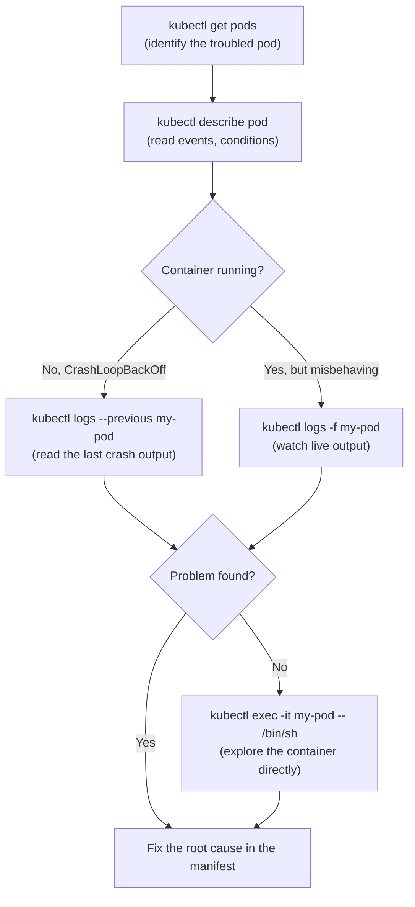

# kubectl logs and kubectl exec, Looking Inside Containers

So far you have learned to observe Kubernetes resources from the outside, listing pods, reading their status, examining their conditions and events. But sometimes the outside view is not enough. You need to look *inside* the container itself: what is the application printing? Is a configuration file in the right place? Can it reach another service?

That is where `kubectl logs` and `kubectl exec` come in. They are your windows directly into the running container, and they are indispensable for debugging application-level problems.

:::info
`kubectl logs` reads what your application writes to stdout/stderr. `kubectl exec` lets you run commands directly inside a container, similar to SSH-ing into a server.
:::

## kubectl logs: Reading What Your Application Says

Every well-behaved application writes its output to stdout and stderr. In Kubernetes, the container runtime captures those streams, and `kubectl logs` makes them available to you.

```bash
kubectl logs my-pod
```

This streams the standard output and error of the main container straight to your terminal, startup messages, request logs, error stack traces, anything the application prints.

### Following Logs in Real Time

The `-f` flag (short for "follow") keeps the connection open and streams new log lines as they are produced, similar to `tail -f` on a traditional log file. This is extremely useful when you are watching a pod start up or trying to catch a sporadic error.

```bash
kubectl logs -f my-pod
```

Press `Ctrl+C` to stop following.

### Limiting the Output

In production, containers can produce enormous volumes of logs. Two flags help you control the output:

- `--tail=N`, shows only the last N lines
- `--since=<duration>`, shows only logs produced within the specified duration (`1h`, `30m`, `5s`)

```bash
kubectl logs --tail=50 my-pod
kubectl logs --since=1h my-pod
kubectl logs --since=30m my-pod
```

### Multi-Container Pods

A pod can contain more than one container. If it does, `kubectl logs` will ask you to specify which container you want with the `-c` flag:

```bash
# List the containers in the pod first
kubectl get pod my-pod -o jsonpath='{.spec.containers[*].name}'

# Then read the logs of a specific container
kubectl logs my-pod -c sidecar-container
```

### Logs from a Crashed Container

This is one of the most important flags: `--previous`. When a container crashes and restarts, Kubernetes starts a fresh container, and the logs of the previous run are no longer in the live view. The `--previous` flag retrieves the logs from the *last terminated* instance, which is exactly what you need when debugging a crash.

```bash
kubectl logs --previous my-pod
```

:::info
`kubectl logs` can only show you logs from the most recent container run and, with `--previous`, the one before that. For long-term retention and querying across restarts, teams typically deploy a log aggregation stack like the EFK stack (Elasticsearch, Fluentd, Kibana) or Loki with Grafana.
:::

## kubectl exec: Running Commands Inside a Container

`kubectl exec` lets you execute a command *inside a running container*. The general form is:

```bash
kubectl exec <pod-name> -- <command>
```

The double dash `--` separates kubectl's arguments from the command you want to run inside the container. Everything after `--` is passed directly to the container.

```bash
# Check environment variables inside the container
kubectl exec my-pod -- env

# See if a file exists
kubectl exec my-pod -- ls /etc/config

# Read a file inside the container
kubectl exec my-pod -- cat /etc/config/app.properties

# Check network connectivity from inside the container
kubectl exec my-pod -- wget -qO- http://other-service:8080/health
```

### Interactive Shell Sessions

For deeper exploration, open a full interactive shell with the `-it` flags (interactive + TTY):

```bash
kubectl exec -it my-pod -- /bin/sh
```

Once inside, you can:
- Browse the container's filesystem
- Check running processes
- Test network connections
- Inspect environment variables
- Read mounted config files

Type `exit` or press `Ctrl+D` to leave. If the container includes bash, use `/bin/bash` instead.

### Multi-Container Exec

Just like with logs, if a pod has multiple containers, specify which one to exec into:

```bash
kubectl exec -it my-pod -c my-container -- /bin/sh
```

:::warning
Not all container images include a shell. Minimal images built on distroless base images or the `scratch` layer deliberately exclude shells and package managers to reduce the attack surface and image size. If you get "executable file not found," that is why. In those cases, use `kubectl debug` (covered in a later lesson) to attach a debug container to the pod.
:::

:::warning
`kubectl exec` gives you direct access to a running container. In production, treat this with the same care you would give SSH access to a production server. Container filesystems are ephemeral, any changes made inside are lost when the container restarts. Use exec for observation and diagnosis, not for making permanent changes.
:::

## The Debugging Flow: From Outside to Inside

These tools slot into a natural diagnostic sequence. You start with the broad cluster view and progressively zoom in.



Most production issues are diagnosed with events from `kubectl describe` and output from `kubectl logs`. The ability to drop into a shell is the last resort, but when you need it, it is invaluable.

## Hands-On Practice

Open the terminal on the right and follow along. First, create a simple pod to work with:

```bash
# Create a test pod
kubectl run log-demo --image=busybox -- /bin/sh -c "while true; do echo 'Hello from log-demo' $(date); sleep 2; done"

# Wait a moment for it to start
kubectl get pods -w

# Once it's Running, press Ctrl+C to stop watching

# Read its logs
kubectl logs log-demo

# Follow the logs live (press Ctrl+C to stop)
kubectl logs -f log-demo

# Read only the last 5 lines
kubectl logs --tail=5 log-demo

# Read logs from the last 1 minute
kubectl logs --since=1m log-demo

# Execute a one-off command inside the container
kubectl exec log-demo -- env

kubectl exec log-demo -- ls /

# Open an interactive shell
kubectl exec -it log-demo -- /bin/sh

# Inside the shell, explore:
#   ls /
#   cat /etc/hostname
#   env
#   exit

# Now simulate a crash to see --previous in action
kubectl run crash-demo --image=busybox -- /bin/sh -c "echo 'Starting up'; sleep 2; echo 'About to crash'; exit 1"

# Watch it enter CrashLoopBackOff
kubectl get pods -w

# Read the logs from the previous (crashed) run
kubectl logs --previous crash-demo

# Clean up
kubectl delete pod log-demo crash-demo
```

Practice these commands until they feel natural, the combination of `kubectl logs` and `kubectl exec` puts you in a strong position to diagnose virtually any application-level problem in your cluster.
