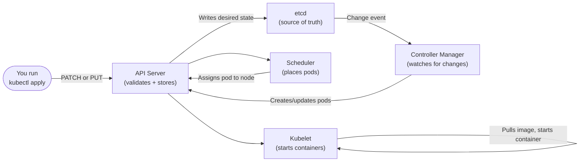

# Creating and Editing Resources

Now that you know how to observe resources and look inside containers, it is time to talk about the full lifecycle of creating and modifying them. Kubernetes gives you several tools for this, and understanding when each one is appropriate will help you work confidently and avoid common mistakes.

:::info
The key command to internalize is `kubectl apply`. It handles both creation and updates idempotently, making it the backbone of any serious Kubernetes workflow.
:::

## kubectl apply: The Workhorse of Declarative Management

`kubectl apply -f <file>` is the single most important command for managing Kubernetes resources. It reads a YAML manifest, sends it to the API server, and instructs Kubernetes to make the cluster match the desired state described in that file.

What makes `apply` special is that it is **idempotent**. Run it once, and the resource is created. Run it again with the same file, and nothing changes. Modify the file and run it again, and only the diff is applied.

```bash
kubectl apply -f deployment.yaml
```

When you run `kubectl apply`, kubectl stores a copy of the applied configuration as an annotation on the resource itself (called the "last-applied-configuration"). This is what allows it to calculate what changed the next time you apply, enabling it to detect fields that should be removed as well as fields that should be added or updated.

In this simulator, the apply status follows the same high-level behavior:

- first apply prints `created`
- re-applying the same manifest prints `unchanged`
- re-applying with manifest changes prints `configured`

### Applying an Entire Directory

If your manifests are organized across multiple files in a directory, a common pattern in real projects, you can apply all of them at once:

```bash
kubectl apply -f ./manifests/
```

Kubernetes will process every `.yaml` and `.yml` file in that directory. This is how most production teams manage their configurations: a directory per service, with separate files for the Deployment, Service, ConfigMap, and so on.

:::info
You can also apply from a URL: `kubectl apply -f https://example.com/manifest.yaml`. This is commonly used to install third-party tools and operators directly from their official documentation.
:::

## kubectl create: For One-Time Creation

`kubectl create -f <file>` also creates a resource from a manifest, but it is a **one-time creation** command. If the resource already exists, kubectl returns an error.

```bash
kubectl create -f deployment.yaml
# Error from server (AlreadyExists): deployments.apps "myapp" already exists
```

`create` is also the basis for imperative sub-commands that create specific resource types without a file:

```bash
kubectl create deployment myapp --image=myapp:v1 --replicas=3
kubectl create configmap app-config --from-literal=key=value
kubectl create secret generic my-secret --from-literal=password=s3cr3t
```

In practice, `apply` is almost always the better choice for file-based workflows. `create` says "make this now, fail if it exists." `apply` says "make the cluster match this, regardless of whether it exists yet." For production and any automated pipeline, prefer `apply`, it handles both initial creation and all subsequent updates with a single command.

## kubectl edit: Live Editing

`kubectl edit` fetches a resource from the API server, opens it in your terminal's default text editor (`$EDITOR`, defaulting to `vi`), and lets you modify it. When you save and close, kubectl sends the updated resource back to the API server and the changes take effect immediately.

```bash
kubectl edit deployment myapp
```

This is useful for quick, one-off changes when you do not have the original manifest file handy. The key caveat: `kubectl edit` creates a divergence between your live cluster state and your source-controlled manifest files. If a teammate later runs `kubectl apply -f deployment.yaml` from the original file, your edit will be overwritten. Use it for exploration and quick fixes, but always reflect the change back into your tracked manifest files.

:::warning
Changes made with `kubectl edit` go live as soon as you save the file. There is no confirmation step. Make sure you are confident in your edit before saving, especially in production environments.
:::

## kubectl patch: Programmatic Updates

Sometimes you need to update a single field on a resource without opening an editor or modifying a full manifest file. `kubectl patch` is built for exactly this: targeted, scriptable updates to specific fields.

```bash
# Scale a deployment to 5 replicas using a JSON merge patch
kubectl patch deployment myapp --type=merge -p '{"spec":{"replicas":5}}'

# Add a label to a pod
kubectl patch pod my-pod --type=merge -p '{"metadata":{"labels":{"env":"production"}}}'
```

The `--type=merge` flag merges the patch with the existing object, any fields you do not mention are left unchanged. There is also `--type=json` for RFC 6902 JSON patch operations (add, remove, replace, copy, move, test), which gives you more surgical control.

`kubectl patch` is particularly valuable in automation scripts and operators where you need to update a single field programmatically without reading and re-writing the entire resource.

## kubectl set image: Quick Image Updates

Updating a container's image is one of the most common operations during a deployment. There is a dedicated convenience command for it:

```bash
kubectl set image deployment/myapp container-name=myimage:newtag
```

The format is `kubectl set image <resource>/<name> <container-name>=<image>:<tag>`. This triggers a rolling update of the deployment immediately. You can watch the rollout progress with:

```bash
kubectl rollout status deployment/myapp
```

## The Apply Flow: What Happens Under the Hood

It helps to understand what actually happens when you run `kubectl apply`. The command makes a series of well-defined API calls to the Kubernetes API server.



Your manifest travels through the API server (where it is validated and persisted), then the relevant controllers and schedulers act on it to bring actual resources into the desired state. This chain is the Kubernetes control loop in action.

## Hands-On Practice
# --- kubectl apply ---

# Create a simple manifest file
```yaml
#my-deployment.yaml
apiVersion: apps/v1
kind: Deployment
metadata:
  name: my-app
spec:
  replicas: 2
  selector:
    matchLabels:
      app: my-app
  template:
    metadata:
      labels:
        app: my-app
    spec:
      containers:
      - name: my-app
        image: nginx:1.28
```

```bash
# Apply it (creates the deployment)
kubectl apply -f my-deployment.yaml

# Apply it again, idempotent, no error
kubectl apply -f my-deployment.yaml

# Check the deployment
kubectl get deployments

# --- kubectl create: see the AlreadyExists error ---
kubectl create -f my-deployment.yaml
# Expected: Error from server (AlreadyExists)

# --- Scale using patch ---
kubectl patch deployment my-app --type=merge -p '{"spec":{"replicas":4}}'
kubectl get deployment my-app

# --- Update the image ---
kubectl set image deployment/my-app my-app=nginx:1.26
kubectl rollout status deployment/my-app

# --- Edit live (opens vi/nano) ---
# Uncomment the next line to try it
# kubectl edit deployment my-app

# --- Apply from a directory ---
mkdir -p /tmp/k8s-manifests
cp my-deployment.yaml /tmp/k8s-manifests/
kubectl apply -f /tmp/k8s-manifests/

# --- Clean up ---
kubectl delete -f my-deployment.yaml
```

Notice how `kubectl apply` smoothly handles both the initial creation and subsequent updates. The workflow, write a manifest, apply it, modify the manifest, apply again, is the backbone of production Kubernetes operations.
