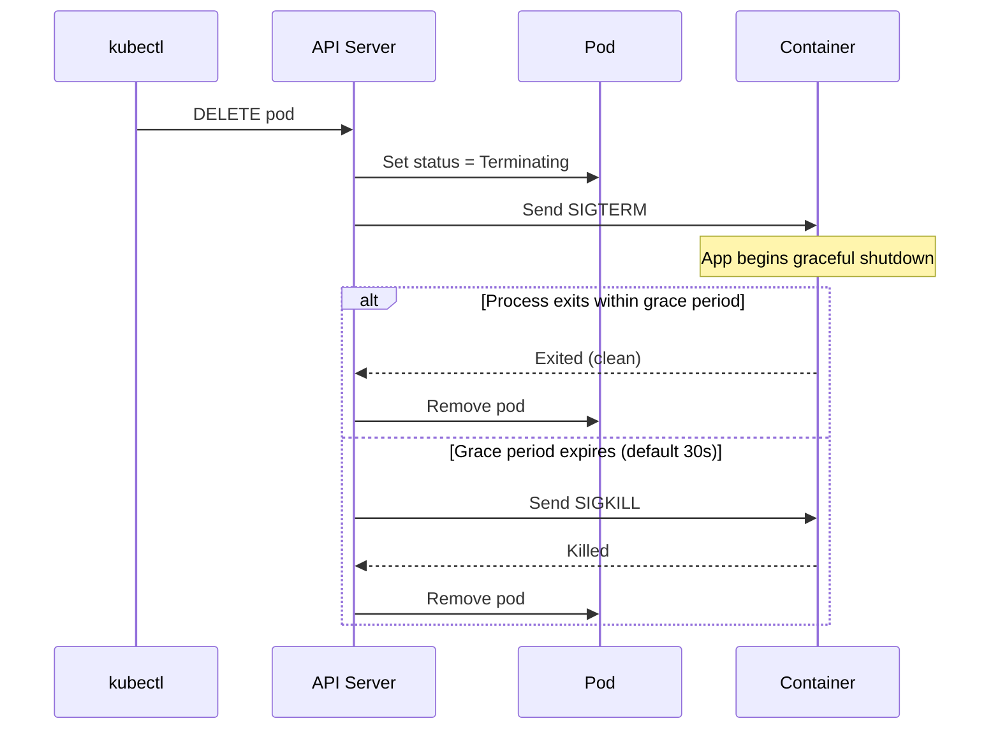

# Deleting and Cleaning Up Resources

Creating resources is only half of the story. Eventually, you need to remove them , to clean up experiments, decommission old services, free resources, or simply reset a namespace to a clean state. Kubernetes provides a thoughtful deletion mechanism that prioritizes graceful application shutdown. Understanding how deletion works, and when to deviate from the defaults, will help you avoid both stuck resources and unexpected downtime.

## The Basic Delete Commands

The most straightforward way to delete a resource is by specifying its type and name:

```bash
kubectl delete pod my-pod
kubectl delete deployment my-deployment
kubectl delete service my-service
```

You can delete multiple resources at once:

```bash
kubectl delete pod pod-one pod-two pod-three
```

Or delete resources of multiple types in a single command:

```bash
kubectl delete pod my-pod service my-service
```

### Deleting from a Manifest File

Just as you can create resources from a manifest file with `kubectl apply -f`, you can delete them using the same file with `kubectl delete -f`:

```bash
kubectl delete -f deployment.yaml
kubectl delete -f ./manifests/
```

This is a natural complement to the declarative workflow. If `kubectl apply -f my-service.yaml` created the resources, then `kubectl delete -f my-service.yaml` removes exactly those resources , Kubernetes reads the resource type and name from the file and deletes the matching objects in the cluster. You do not need to remember the exact names.

:::info
`kubectl delete -f <file>` is the cleanest way to tear down resources you created declaratively, because the manifest file serves as the record of what was created.
:::

## How Kubernetes Deletes: Graceful Termination

When you delete a pod, Kubernetes does not simply kill it instantly. It follows a graceful termination sequence that gives your application time to finish in-flight requests, close connections, and clean up , just like a well-run restaurant that lets you finish your meal even after closing time.

Here is what happens step by step when a pod is deleted:

1. The pod's status is set to `Terminating`.
2. Kubernetes sends a **SIGTERM** signal to the main process inside each container. This is a polite request to shut down.
3. A grace period timer starts (default: 30 seconds).
4. If the process exits before the grace period ends, the pod is deleted immediately.
5. If the process is still running when the grace period expires, Kubernetes sends **SIGKILL:**  an immediate, forceful termination.
6. The pod is removed from the cluster.



Your application should handle SIGTERM by stopping new work and finishing current work. If it does this well, graceful termination means zero dropped requests. This is why well-designed containerized applications always implement a SIGTERM handler.

## Force Deletion: Skipping the Grace Period

Sometimes a pod gets stuck in `Terminating` state and will not go away. This can happen if a node becomes unresponsive, if a finalizer is blocking deletion, or if the application completely ignores SIGTERM. In those situations, you can force Kubernetes to delete the pod immediately, skipping the grace period entirely:

```bash
kubectl delete pod my-stuck-pod --grace-period=0 --force
```

This tells Kubernetes to remove the pod from its records immediately without waiting for the container to exit. The API server removes the pod object right away, even if the container is still technically running on a node.

:::warning
`--force --grace-period=0` is a blunt instrument. It bypasses the graceful shutdown sequence, which can lead to dropped connections and data corruption if the application was in the middle of processing something. Use it only when a pod is genuinely stuck and normal deletion is not working. Never use it routinely as a "faster delete" shortcut.
:::

## Cascade Deletion: How Deletions Propagate

Kubernetes resources often have parent-child relationships. A Deployment owns ReplicaSets, which own Pods. When you delete a Deployment, what happens to the ReplicaSets and Pods it manages?

By default, Kubernetes uses **cascade deletion**: deleting a parent resource also deletes all of the resources it owns. Delete the Deployment, and its ReplicaSets and Pods are deleted too.

```bash
# Deletes the Deployment AND all its ReplicaSets and Pods
kubectl delete deployment my-app
```

This is the behavior you almost always want, because orphaned pods with no owner would just sit there consuming resources without being managed by anything.

### Orphan Mode: Keeping Child Resources

There is a special case where you might want to delete a parent without deleting its children: `--cascade=orphan`. This removes the owner object but leaves the pods running, unattached to any controller.

```bash
# Deletes the Deployment but leaves the Pods running
kubectl delete deployment my-app --cascade=orphan
```

This is occasionally useful for controlled migrations , for example, when you want to transfer ownership of pods from one controller to another, or when you need to keep pods alive while you reconfigure their management. It is a niche use case, but good to know it exists.

:::warning
Orphaned pods are no longer managed by any controller. If they crash, they will not be restarted. If the node they live on dies, they will not be rescheduled. Use `--cascade=orphan` only with a clear plan for what happens next.
:::

## Deleting Namespaces: All or Nothing

Deleting a namespace is the nuclear option. When you delete a namespace, Kubernetes deletes every single resource inside it , every pod, every service, every deployment, every configmap, every secret, every persistent volume claim. All of it.

```bash
kubectl delete namespace staging
```

:::warning
**Deleting a namespace is irreversible and destroys everything inside it.** Double-check you have the right namespace before running this command. There is no "are you sure?" prompt. In production, namespace deletion should be a carefully considered, team-approved action.
:::

The deletion is not instant for large namespaces. Kubernetes works through the contained resources methodically, and the namespace itself will sit in a `Terminating` state until all resources are cleaned up. If a namespace is stuck in `Terminating`, it is usually because a finalizer on one of its resources is not completing , this requires more advanced troubleshooting.

## Deleting Resources by Label

You can delete all resources matching a label selector, which is useful for cleaning up an entire application that spans multiple resource types:

```bash
# Delete all pods with the label app=my-app
kubectl delete pods -l app=my-app

# Delete all resources (of any type) with the label app=my-app
kubectl delete all -l app=my-app
```

## Hands-On Practice

Work through these commands in the terminal. Take particular note of how the termination grace period works , watch the pod status transitions in real time.

```bash
# Create some resources to clean up
kubectl create deployment cleanup-demo --image=nginx --replicas=3
kubectl expose deployment cleanup-demo --port=80

# Check what was created
kubectl get all

# --- Delete by name ---
# First get a pod name
POD_NAME=$(kubectl get pods -l app=cleanup-demo -o jsonpath='{.items[0].metadata.name}')
echo "Pod to delete: $POD_NAME"

# Delete the pod , watch the Deployment immediately create a replacement
kubectl delete pod $POD_NAME &
kubectl get pods -w

# Press Ctrl+C after the new pod reaches Running

# --- Watch the termination grace period ---
# Run a pod that ignores SIGTERM (sleep runs for a long time)
kubectl run grace-demo --image=busybox -- sleep 3600

# Delete it and watch , you will see it in Terminating state
kubectl delete pod grace-demo &
kubectl get pods -w

# Press Ctrl+C after it disappears

# --- Force delete a stuck pod ---
kubectl run stuck-demo --image=busybox -- sleep 3600
kubectl get pods

kubectl delete pod stuck-demo --grace-period=0 --force
kubectl get pods

# --- Cascade behavior ---
# See the ReplicaSets owned by the deployment
kubectl get replicasets

# Delete the deployment , watch ReplicaSets and Pods go too
kubectl delete deployment cleanup-demo
kubectl get all

# --- Delete from manifest ---
kubectl apply -f /tmp/my-deployment.yaml 2>/dev/null || \
  kubectl create deployment manifest-demo --image=nginx

kubectl delete -f /tmp/my-deployment.yaml 2>/dev/null || \
  kubectl delete deployment manifest-demo

# --- Delete by label ---
kubectl create deployment label-demo --image=nginx
kubectl label deployment label-demo tier=experiment

kubectl delete all -l tier=experiment
kubectl get all

# Clean up remaining resources
kubectl delete service cleanup-demo 2>/dev/null; true
```

As you practice, pay attention to the pod status transitions in `kubectl get pods -w`. Watching a pod move from `Running` to `Terminating` to disappearing entirely gives you a concrete feel for the termination lifecycle , knowledge that will serve you well when troubleshooting stuck deletions in the future.
