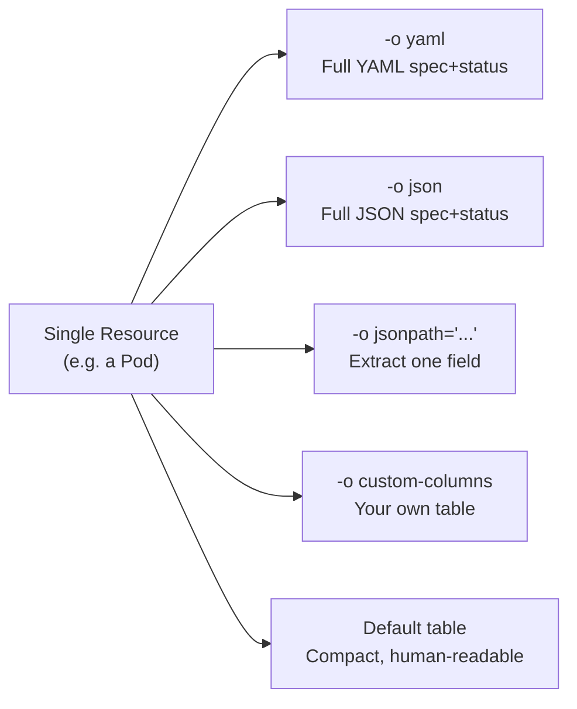

# Formatting kubectl Output and Productivity Tips

Once you are comfortable with the core kubectl commands, the next step is learning to use them _efficiently_. The default table view only scratches the surface of what Kubernetes resources contain. kubectl offers powerful output formatting options, from extracting a single field to building a custom table, and a few shell tricks that can dramatically speed up your daily workflow.

:::info
Mastering `-o jsonpath` and `-o custom-columns` will save you significant time when scripting or investigating complex cluster states. Combined with shell aliases and tab completion, your kubectl workflow becomes noticeably faster.
:::

## Output Formats: Getting the Data You Need

Every `kubectl get` command accepts an `-o` flag that controls the output format. The default is a human-readable table, but you can switch to a variety of other formats depending on what you are trying to accomplish.

### -o yaml: The Full Picture

`-o yaml` outputs the complete resource definition as YAML, every field, including the status Kubernetes has filled in, auto-generated metadata, and any annotations and labels. Reach for this when you want to deeply understand a resource, copy it as a base for a new manifest, or troubleshoot unexpected behavior.

```bash
kubectl get pod my-pod -o yaml
kubectl get deployment my-app -o yaml
```

### -o json: Machine-Friendly Output

`-o json` is the same information as `-o yaml`, but in JSON format. Most programmatic tools and scripts prefer JSON because JSON parsers are ubiquitous. If you are piping kubectl output into `jq` for processing, this is your starting point.

```bash
kubectl get pod my-pod -o json | jq '.spec.containers[0].image'
```

### -o jsonpath: Extract Specific Fields

JSONPath is a query language for JSON documents, and kubectl's `-o jsonpath` flag lets you extract any field from a resource using a path expression. This is ideal when you need a single value, a pod's IP address, an image name, a service's ClusterIP, with no extra formatting.

```bash
# Get just the pod's IP address
kubectl get pod my-pod -o jsonpath='{.status.podIP}'

# Get the image of the first container
kubectl get pod my-pod -o jsonpath='{.spec.containers[0].image}'

# Get the name and status phase of all pods (iterating over a list)
kubectl get pods -o jsonpath='{range .items[*]}{.metadata.name}{"\t"}{.status.phase}{"\n"}{end}'
```

The `{range .items[*]}...{end}` pattern iterates over a list, which is essential when working with multiple resources. JSONPath takes a little practice to write fluently, but once you can read and write it, you will use it constantly in scripts and automation.

### -o custom-columns: Build Your Own Table

If the default table is missing a column you care about, you can define your own with `-o custom-columns`. Specify each column as a `NAME:JSONPATH` pair:

```bash
kubectl get pods -o custom-columns='NAME:.metadata.name,STATUS:.status.phase,NODE:.spec.nodeName'
```

This gives you a clean, readable table with exactly the columns you want. It is particularly useful when presenting information to teammates or generating reports.

### --sort-by: Order Your Results

The `--sort-by` flag takes a JSONPath expression and sorts the output by that field. The most common use case is sorting by creation time to find the newest or oldest resources:

```bash
# Newest pods last
kubectl get pods --sort-by=.metadata.creationTimestamp

# Sort deployments by name
kubectl get deployments --sort-by=.metadata.name
```

:::info
You can combine output format flags freely. For example, `kubectl get pods -A -o custom-columns='NAMESPACE:.metadata.namespace,NAME:.metadata.name,STATUS:.status.phase' --sort-by=.metadata.namespace` gives you a cross-namespace pod view sorted by namespace, something the default output cannot easily provide.
:::

## Visualizing Output Formats



Each format serves a different audience: the default table for quick human scanning, YAML and JSON for deep inspection and scripting, JSONPath and custom-columns for extracting exactly what you need.

## kubectl explain: Inline Documentation

One of the most underused features in kubectl is `kubectl explain`. It gives you the Kubernetes API reference without leaving your terminal, look up any resource type and any field within it:

```bash
# Explain the Deployment resource
kubectl explain deployment

# Explain a specific field
kubectl explain deployment.spec.strategy

# Explain pod spec containers
kubectl explain pod.spec.containers

# Explain resource limits
kubectl explain pod.spec.containers.resources.limits
```

The output shows the field type, whether it is required or optional, and a description of what it does. Instead of switching to a browser to look up the API docs, check `kubectl explain` right in your terminal.

## Watching Resources for Changes

The `--watch` flag (short: `-w`) keeps kubectl running and prints new output lines whenever a resource changes. It is invaluable when monitoring a rolling update, watching a pod reach the Running state, or observing a node go offline.

```bash
kubectl get pods -w
kubectl get deployments -w
```

Each change to a resource in the list produces a new line in the output. Press `Ctrl+C` to stop watching.

## Shell Aliases: Typing Less

Power kubectl users rarely type the full word "kubectl". They set up shell aliases for their most common commands:

```bash
# Not supported by the simulator
# Add to your ~/.bashrc or ~/.zshrc
alias k='kubectl'
alias kgp='kubectl get pods'
alias kgs='kubectl get services'
alias kgd='kubectl get deployments'
alias kga='kubectl get all'
alias kaf='kubectl apply -f'
alias kdel='kubectl delete'
alias kl='kubectl logs'
alias kex='kubectl exec -it'
alias kns='kubectl config set-context --current --namespace'
```

After adding these, reload your shell with `source ~/.bashrc` and type `kgp` to see all pods. With a few keystrokes saved per command, these aliases pay dividends quickly.

## Tab Completion: Let the Shell Do the Typing

kubectl has built-in support for shell completion. Once enabled, you can press Tab to autocomplete resource types, resource names, flag names, and even namespace names.

```bash
# For bash (add to ~/.bashrc)
source <(kubectl completion bash)

# For zsh (add to ~/.zshrc)
source <(kubectl completion zsh)

# If you use the 'k' alias, enable completion for it too
complete -F __start_kubectl k   # bash
compdef k=kubectl               # zsh
```

After reloading your shell, try typing `kubectl get dep` and pressing Tab, it will complete to `deployments`. Or type `kubectl delete pod ` and press Tab, it will list your pod names.

:::info
Many kubectl plugin managers, such as `krew`, install tools that enhance completion further, for example, `kubens` and `kubectx` for switching namespaces and contexts quickly, both with completion support.
:::

:::warning
Shell completion only works when your terminal has a proper connection to the cluster. If your kubeconfig is misconfigured or the cluster is unreachable, completion may be slow or produce no results.
:::

## Hands-On Practice

Open the terminal on the right and explore these output formatting tools. Start with a few running pods so you have something to query.

```bash
# Make sure you have some resources to inspect
kubectl create deployment format-demo --image=nginx --replicas=3

# Wait for pods to be ready
kubectl get pods -w
# Press Ctrl+C once they are Running

# --- Output formats ---

# Full YAML of the deployment
kubectl get deployment format-demo -o yaml

# Full JSON
kubectl get deployment format-demo -o json

# Extract just the number of replicas
kubectl get deployment format-demo -o jsonpath='{.spec.replicas}'

# Extract pod IPs for all pods
kubectl get pods -o jsonpath='{range .items[*]}{.metadata.name}{"\t"}{.status.podIP}{"\n"}{end}'

# Custom columns table
kubectl get pods -o custom-columns='NAME:.metadata.name,STATUS:.status.phase,IP:.status.podIP,NODE:.spec.nodeName'

# Sort pods by creation time
kubectl get pods --sort-by=.metadata.creationTimestamp

# --- kubectl explain ---

kubectl explain deployment
kubectl explain deployment.spec.replicas
kubectl explain pod.spec.containers.resources

# --- Clean up ---
kubectl delete deployment format-demo
```

These formatting tools and productivity shortcuts become essential as your Kubernetes environments grow in complexity. A well-crafted JSONPath query or custom-columns output can turn a five-minute debugging task into a five-second one.
