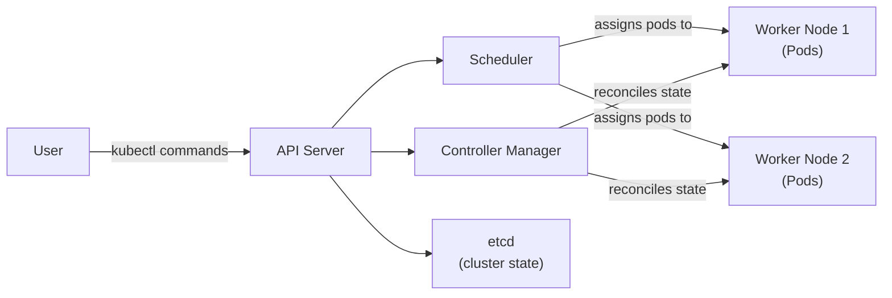

# What Is Kubernetes?

Imagine you are the air traffic controller at a busy international airport. Dozens of planes are in the air at any given moment, each needing to land, refuel, and take off again. You have to decide which runway each plane uses, sequence the arrivals to avoid collisions, reroute flights around bad weather, and respond instantly when a plane declares an emergency. You are not flying any of the planes yourself — your job is to coordinate the entire system so that everything moves safely and efficiently.

Kubernetes does for containers what an air traffic controller does for planes. It does not run your application code — that is the job of the containers themselves. What Kubernetes does is coordinate all of those containers across a fleet of machines, making sure the right containers run in the right places, that failed ones are replaced, and that the whole system adapts to changing conditions without human intervention.

## The Problem Kubernetes Solves

To understand why Kubernetes exists, you first need to understand the problem it was created to solve. Containers are a remarkably powerful packaging technology. They bundle an application and all its dependencies into a single, portable unit that runs consistently regardless of where it is deployed. But a single container, on a single machine, is easy to manage manually. The challenge appears when you have hundreds or thousands of containers, spread across dozens or hundreds of machines, all needing to work together.

Consider a modern web application. You might have a frontend container, a backend API container, a database container, a caching container, and a background worker container. Now multiply that by the fact that you need multiple copies of each for redundancy and load distribution. Then consider that these containers need to communicate with each other, that they need to recover automatically when a machine crashes, that you want to deploy new versions without downtime, and that traffic patterns shift throughout the day so you need to scale up and down dynamically.

Doing all of that manually — tracking which container is on which machine, restarting failed ones, updating them in a rolling fashion — is simply not feasible at scale. You need a system that handles this orchestration automatically. That system is Kubernetes.

## What Kubernetes Actually Does

Kubernetes provides a set of capabilities that together solve the container management problem:

**Scheduling** is the process of deciding which machine a container runs on, based on available resources, constraints, and policies. When you tell Kubernetes "I need three copies of this web server," Kubernetes figures out which nodes have enough CPU and memory, and places the containers accordingly.

**Self-healing** means that Kubernetes continuously monitors the state of your workloads. If a container crashes, Kubernetes restarts it. If a node goes down, Kubernetes reschedules the workloads that were running on it to other nodes. You describe the desired state — "I want three replicas" — and Kubernetes works continuously to maintain that state.

**Scaling** allows Kubernetes to adjust the number of running containers up or down in response to demand. This can be done manually or automatically based on metrics like CPU usage.

**Service discovery and load balancing** let containers find each other and communicate without hardcoding IP addresses. Kubernetes assigns stable names and manages how traffic is routed between containers.

**Configuration management** separates your application configuration from your container images. You can inject environment variables, config files, and secrets into your containers without rebuilding images.

:::info
A core idea in Kubernetes is the concept of *desired state*. Rather than issuing commands like "start container X," you tell Kubernetes "I want the cluster to look like this," and Kubernetes figures out the steps needed to reach that state — and stays vigilant to keep it there.
:::

## What Kubernetes Does NOT Do

Understanding the boundaries of Kubernetes is just as important as understanding its capabilities. Kubernetes is often mischaracterized as a Platform-as-a-Service (PaaS), but it is not. It is a lower-level infrastructure layer — a foundation on which platforms can be built.

Kubernetes does not build your container images. That is the job of a build tool like Docker or Buildah. You bring your images to Kubernetes; Kubernetes runs them.

Kubernetes does not handle application-level logging or monitoring by default. It can expose logs from containers, but setting up a full logging and monitoring pipeline — shipping logs to a central store, creating dashboards, configuring alerts — requires additional tools layered on top.

Kubernetes does not enforce what languages or frameworks your application uses. It is completely agnostic about what runs inside your containers. As long as it is packaged as a container image, Kubernetes can run it.

:::warning
A common early mistake is assuming Kubernetes will "just handle" things like CI/CD pipelines, secret rotation, application observability, or multi-cluster networking. These require additional tools from the broader cloud-native ecosystem. Kubernetes is the foundation, not the entire building.
:::

## A Brief History

Kubernetes was born at Google. Before it existed, Google managed its own internal container orchestration system called Borg, which had been running at enormous scale since around 2003. Borg handled billions of container instances per week across Google's global infrastructure. When container technology became available to the broader world, Google decided to build a new system inspired by Borg's lessons and share it openly.

Kubernetes was announced in 2014 and donated to the Cloud Native Computing Foundation (CNCF) in 2016. The CNCF is a vendor-neutral home for cloud-native open-source projects, and Kubernetes quickly became its flagship project. Today, Kubernetes is maintained by thousands of contributors from hundreds of companies, and it has become the de facto standard for container orchestration globally.

The name comes from the Greek word for "helmsman" or "pilot" — the person who steers a ship. The logo is a ship's helm with seven spokes, a nod to the seven of nine Borg characters from Star Trek (a playful internal reference from the original engineers). The abbreviated name, K8s, comes from replacing the eight letters between the "K" and the "s" with the number 8.

## How It All Connects

Here is a simplified picture of how you interact with Kubernetes:



You, the user, interact with the cluster through `kubectl`, which talks to the API server. The API server is the front door of Kubernetes — every command, every configuration change, every query goes through it. Behind the API server, the scheduler decides where to place new workloads, the controller manager ensures the cluster stays in the desired state, and `etcd` stores the source of truth about what the cluster should look like.

We will explore each of these components in detail in the architecture lessons that follow.

## Hands-On Practice

Let's explore your cluster through `kubectl` and get a feel for the kind of information Kubernetes tracks.

Check the cluster information:

```
kubectl cluster-info
```

Expected output:

```
Kubernetes control plane is running at https://192.168.0.2:6443
CoreDNS is running at https://192.168.0.2:6443/api/v1/namespaces/kube-system/services/kube-dns:dns/proxy
```

This shows you the endpoint of the API server — the address that `kubectl` sends commands to.

View all the resource types Kubernetes knows about:

```
kubectl api-resources | head -20
```

Expected output (first 20 lines):

```
NAME                              SHORTNAMES   APIVERSION                             NAMESPACED   KIND
bindings                                       v1                                     true         Binding
componentstatuses                 cs           v1                                     false        ComponentStatus
configmaps                        cm           v1                                     true         ConfigMap
endpoints                         ep           v1                                     true         Endpoints
events                            ev           v1                                     true         Event
limitranges                       limits       v1                                     true         LimitRange
namespaces                        ns           v1                                     false        Namespace
nodes                             no           v1                                     false        Node
persistentvolumeclaims            pvc          v1                                     true         PersistentVolumeClaim
...
```

This gives you a sense of how rich the Kubernetes API is. Each row is a type of object Kubernetes can manage. You will meet many of these throughout the course.

Finally, look at the system components running in the `kube-system` namespace — these are the internal Kubernetes control plane workloads:

```
kubectl get pods -n kube-system
```

Expected output:

```
NAME                                   READY   STATUS    RESTARTS   AGE
coredns-5d78c9869d-6lz8n               1/1     Running   0          25m
coredns-5d78c9869d-xqbp2               1/1     Running   0          25m
etcd-controlplane                      1/1     Running   0          25m
kube-apiserver-controlplane            1/1     Running   0          25m
kube-controller-manager-controlplane   1/1     Running   0          25m
kube-proxy-4hj5k                       1/1     Running   0          24m
kube-scheduler-controlplane            1/1     Running   0          25m
```

These are the internal workloads that make Kubernetes function. Notice `etcd`, `kube-apiserver`, `kube-controller-manager`, and `kube-scheduler` — these are the control plane components you just read about. They are themselves running as pods. In the cluster visualizer (telescope icon), you can see exactly where these pods are placed.

## Wrapping Up

Kubernetes is a container orchestrator — a system that automates the scheduling, scaling, healing, and networking of containerized workloads across a cluster of machines. It was born from Google's decade of experience with Borg, and today it is the industry standard for running containers at scale. In the next lesson, we will look at how we arrived here: the evolution from bare-metal servers through virtual machines to containers and orchestration.
