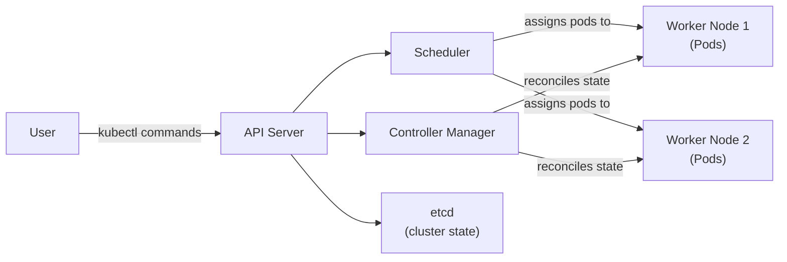

# What Is Kubernetes?

Imagine you are the air traffic controller at a busy international airport. Dozens of planes are in the air at any given moment, each needing to land, refuel, and take off again. You decide which runway each plane uses, sequence arrivals, reroute around bad weather, and respond when a plane declares an emergency. You are not flying any of the planes yourself; your job is to coordinate the whole system.

Kubernetes does for containers what an air traffic controller does for planes. It does not run your application code; that is the job of the containers. Kubernetes coordinates those containers across a fleet of machines: the right containers in the right places, failed ones replaced, and the system adapting to changing conditions without human intervention.

## The Problem Kubernetes Solves

Containers bundle an application and its dependencies into a single, portable unit that runs consistently wherever it is deployed. A single container on a single machine is easy to manage. The challenge appears when you have hundreds or thousands of containers spread across many machines.

Consider a modern web app: frontend, backend API, database, cache, background workers. Multiply by redundancy and load distribution. Those containers need to communicate, recover when a machine crashes, deploy new versions without downtime, and scale up and down with traffic.

Doing all of that manually is not feasible at scale. You need a system that handles orchestration automatically. That system is Kubernetes.

## What Kubernetes Actually Does

Kubernetes provides a set of capabilities that solve the container management problem:

- **Scheduling** — Decides which machine a container runs on, based on resources, constraints, and policies. You say "I need three copies of this web server"; Kubernetes places them on nodes with enough CPU and memory.

- **Self-healing** — Continuously monitors your workloads. If a container crashes, Kubernetes restarts it. If a node goes down, it reschedules those workloads elsewhere. You describe the desired state ("I want three replicas"); Kubernetes keeps it that way.

- **Scaling** — Adjusts the number of running containers up or down, manually or automatically (e.g. based on CPU).

- **Service discovery and load balancing** — Containers find each other and communicate without hardcoding IPs. Kubernetes assigns stable names and routes traffic.

- **Configuration management** — Separates config from container images. You inject environment variables, config files, and secrets without rebuilding images.

:::info
A core idea is *desired state*. Instead of "start container X," you say "I want the cluster to look like this." Kubernetes figures out the steps and keeps it there.
:::

## What Kubernetes Does NOT Do

Kubernetes is often mischaracterized as a Platform-as-a-Service (PaaS). It is not. It is a lower-level foundation on which platforms can be built.

- Kubernetes does **not** build your container images. That is the job of Docker, Buildah, or similar. You bring images to Kubernetes; Kubernetes runs them.

- It does **not** handle application-level logging or monitoring by default. It can expose container logs, but a full pipeline (central store, dashboards, alerts) requires extra tools.

- It is **agnostic** about languages and frameworks. Whatever runs inside the container, as long as it is packaged as an image, Kubernetes can run it.

:::warning
A common mistake is assuming Kubernetes will "just handle" CI/CD, secret rotation, observability, or multi-cluster networking. These need additional tools from the cloud-native ecosystem. Kubernetes is the foundation, not the entire building.
:::

## A Brief History

Kubernetes was born at Google. Before it, Google ran Borg, an internal container orchestration system at enormous scale since around 2003. When containers became available to the wider world, Google built a new system inspired by Borg and shared it openly.

Kubernetes was announced in 2014 and donated to the Cloud Native Computing Foundation (CNCF) in 2016. Today it is maintained by thousands of contributors and is the de facto standard for container orchestration.

The name comes from the Greek for "helmsman" or "pilot." The logo is a ship's helm. The abbreviation **K8s** replaces the eight letters between "K" and "s" with the number 8.

## How It All Connects

A simplified picture of how you interact with Kubernetes:



You interact through `kubectl`, which talks to the API server. The API server is the front door: every command and query goes through it. Behind it, the scheduler places new workloads, the controller manager keeps the cluster in the desired state, and etcd stores the source of truth.

We will explore each component in the architecture lessons that follow.

## Hands-On Practice

Check cluster information:

```bash
kubectl cluster-info
```

You should see the API server endpoint (the address `kubectl` uses). Then list resource types Kubernetes knows about:

```bash
kubectl api-resources | head -20
```

Each row is a type of object Kubernetes can manage. Finally, look at the control plane workloads in `kube-system`:

```bash
kubectl get pods -n kube-system
```

You will see etcd, kube-apiserver, kube-controller-manager, kube-scheduler, and others. These are the components from the diagram above, running as pods. In the cluster visualizer (telescope icon), you can see where they run.

## Wrapping Up

Kubernetes is a container orchestrator: it automates scheduling, scaling, healing, and networking of containerized workloads across a cluster. It grew out of Google's experience with Borg and is now the industry standard. In the next lesson, we look at how we got here: from bare metal through virtual machines to containers and orchestration.
