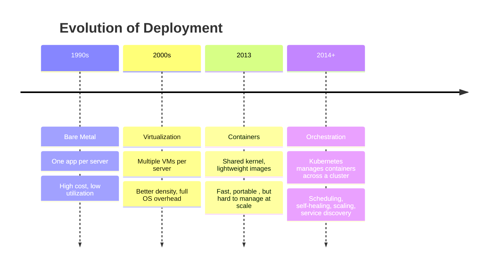

# The Evolution of Deployment

To truly appreciate Kubernetes, you need to understand the journey that led to it. The way we deploy and run software has changed dramatically over the past three decades, driven by a relentless search for better resource utilization, faster delivery, and greater reliability. Each era introduced new possibilities , and new problems , that pushed the industry toward the next evolution.

Think of it like the history of human accommodation. Early travellers had to buy an entire house just to have a place to sleep. Then apartments made it possible to share a building. Then hostels allowed sharing a room. Then co-living spaces emerged where every resource , kitchen, laundry, workspace , is shared intelligently, with just the right amount of space allocated to each person as they need it. Software deployment has followed a strikingly similar arc.

## Era 1 , Bare Metal: One App Per Server

In the beginning, deploying software meant deploying it directly onto physical servers , bare metal machines sitting in data centers or server rooms. The model was simple: one application, one server. If you were running a web server, a database, and an email service, you typically needed three separate physical machines.

This approach was reliable in a narrow sense , there was no competition for resources, no "noisy neighbor" problem, no isolation worries. But the cost was enormous. Servers are expensive to purchase, house, power, cool, and maintain. And most of the time, a given server was wildly underutilized. A web server handling moderate traffic might use only 15% of its CPU on average. The remaining 85% was simply wasted, silently burning electricity and sitting idle.

Scaling was also painful. If your application needed more capacity, you had to physically acquire more hardware, rack it, cable it, install an operating system, configure it, and deploy your application , a process that could take days or weeks. There was no elasticity. You either had enough hardware or you did not.

:::info
"Bare metal" is still used today for specific workloads that demand maximum performance with zero virtualization overhead, such as high-frequency trading systems or certain high-performance computing tasks. But for general application workloads, it has largely been replaced by the approaches that followed.
:::

## Era 2 , Virtualization: Better Density, Still Heavyweight

The virtual machine changed everything. The key insight was simple but powerful: if a physical server is only using 15% of its resources, why not run multiple isolated operating systems on that same hardware simultaneously, each with its own slice of CPU, memory, and storage?

Virtualization hypervisors like VMware and later KVM made this possible. Suddenly, one physical server could host ten, twenty, or more virtual machines. Resource utilization jumped dramatically. You could also take snapshots of VMs, migrate them between physical hosts, and resize them as needed. Provisioning a new environment went from weeks to minutes.

But virtual machines carry significant overhead. Each VM runs a full operating system , its own kernel, its own init system, its own set of background processes , in addition to the application you actually care about. A VM for a simple Node.js API might consume 2 GB of memory just for the OS, even if the application itself only needs 200 MB. Booting a VM takes minutes. Copying a VM image across a network moves gigabytes of data. The density improved enormously over bare metal, but there was still a great deal of weight to carry around.

## Era 3 , Containers: Lightweight and Portable

Containers took a radically different approach to isolation. Rather than virtualizing the hardware (as VMs do), containers share the host operating system's kernel but isolate the application's view of the filesystem, processes, and network using kernel features called namespaces and cgroups.

The result is dramatically lighter than a VM. A container image for the same Node.js API might be 150 MB instead of 2 GB. Containers start in milliseconds rather than minutes. You can run dozens or hundreds of containers on a single machine. And because a container image bundles the application with all its dependencies, it runs identically on a developer's laptop, a CI/CD server, and a production machine , the "it works on my machine" problem largely disappears.

Docker, launched in 2013, made containers accessible to ordinary developers and accelerated their adoption enormously. Teams began packaging their applications as container images, versioning them, and shipping them through automated pipelines.

But a new problem emerged. If you have a hundred containers spread across ten machines, managing them manually is chaos. Which containers are running on which hosts? If a host goes down, how do you know which containers were on it and need to be restarted elsewhere? How do you roll out a new version of your application without downtime? How do containers find each other across different hosts? The technology to run containers had outpaced the technology to manage them.

:::warning
Containers are not inherently secure just because they are isolated. A misconfigured container can still be exploited to affect the host or other containers. Security in a containerized environment is an active discipline, not a property you get automatically.
:::

## Era 4 , Orchestration: Kubernetes Answers the Question

The fourth era is the one we are in now, and it is the answer to the question containers raised: who manages hundreds of containers across many machines?

Kubernetes. (And a handful of competitors that have largely converged toward or been displaced by Kubernetes.)

An orchestrator treats your cluster of machines as a single pool of resources and handles all the complexity of placing, running, and managing containers across it. You stop thinking about individual machines and start thinking about desired states. Instead of "start this container on server 12," you say "I want three replicas of this web server, always running, with at least 512 MB of memory each." Kubernetes figures out the rest , and keeps figuring it out continuously, even as machines fail, traffic spikes, and new versions are deployed.

Kubernetes brought together the best ideas from a decade of Google's internal experience with Borg and Omega, and made them available to the entire industry. It added cluster-level networking, standardized APIs, a rich extension model, and a vibrant ecosystem of tooling.



## The Analogy in Full

Returning to the accommodation analogy: bare metal is like buying a house , you have the whole building to yourself, but most rooms sit empty and the cost is enormous. Virtualization is like apartments , you share the building's infrastructure but have your own front door and walls. Containers are like a hostel , you share far more (the kitchen, the bathrooms), which makes things cheaper and more flexible, but now someone needs to coordinate who sleeps in which bed and make sure the common areas stay functional. Kubernetes is the co-living operator , the intelligent system that manages all of that coordination, allocates resources fairly, handles maintenance, and ensures everyone has what they need without anyone having to manage it manually.

:::info
The "eras" of deployment are not mutually exclusive. Many real-world environments today run all four simultaneously: bare metal for performance-critical workloads, VMs for legacy systems, containers for modern applications, and Kubernetes to orchestrate the containers. Understanding all four helps you navigate these mixed environments.
:::

## Hands-On Practice

Let's observe how Kubernetes abstracts away the notion of individual machines. When you deploy a workload, you do not choose which node it runs on , Kubernetes does.

Create a simple deployment with three replicas:

```
kubectl create deployment web --image=nginx --replicas=3
```

Expected output:

```
deployment.apps/web created
```

Now list the pods and see which nodes they were placed on:

```
kubectl get pods -o wide
```

Expected output:

```
NAME                   READY   STATUS    RESTARTS   AGE   IP            NODE     NOMINATED NODE   READINESS GATES
web-6d6b4f8d5-2xk4p   1/1     Running   0          15s   10.244.1.3    node01   <none>           <none>
web-6d6b4f8d5-9hbf7   1/1     Running   0          15s   10.244.1.4    node01   <none>           <none>
web-6d6b4f8d5-tnq8v   1/1     Running   0          15s   10.244.0.5    controlplane   <none>     <none>
```

Notice that Kubernetes distributed the three pods across the available nodes automatically. You did not specify where they should go , the scheduler made that decision. Open the cluster visualizer now (telescope icon) to see this placement rendered visually.

Now delete one of the pods by name (use one of the names from your output):

```
kubectl delete pod web-6d6b4f8d5-2xk4p
```

Wait a few seconds, then list the pods again:

```
kubectl get pods -o wide
```

You will see that Kubernetes has automatically created a replacement pod. The self-healing mechanism noticed that the desired state (three replicas) did not match the actual state (two replicas) and corrected it instantly. This is the core value proposition of orchestration.

Clean up when you are done:

```
kubectl delete deployment web
```

## Wrapping Up

The journey from bare metal to orchestration reflects a continuous push toward better resource efficiency, faster deployment cycles, and higher reliability. Each era solved the key problems of the previous one and introduced new challenges that drove the next innovation. Kubernetes is the current answer to those challenges , but it is also a foundation, not a ceiling. In the next lesson, we zoom into the architecture of a Kubernetes cluster itself and explore what the control plane and worker nodes actually are.
