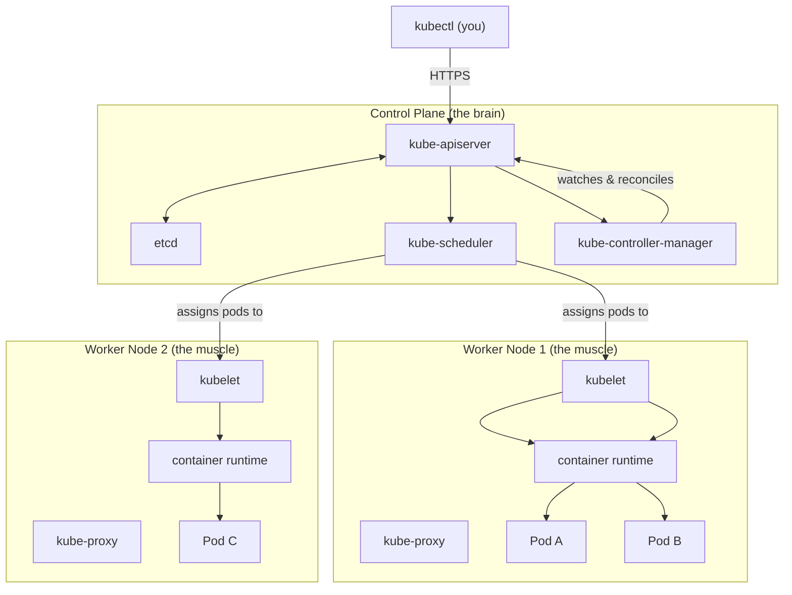

# Cluster Architecture Overview

Picture a busy restaurant kitchen on a Saturday night. Out front, orders are pouring in. Someone needs to decide what gets cooked next, who cooks it, and in what order. That someone is the head chef — the person with the full picture, making decisions, directing the flow. Meanwhile, the line cooks are heads down at their stations, actually preparing the food. They do not worry about the big picture; they focus on executing the tasks assigned to them. The head chef does not fry the onions; the line cooks do not plan the evening's menu. Each role is distinct, and together they keep the kitchen running.

A Kubernetes cluster works in exactly this way. There are machines that make decisions — the control plane — and machines that do the work — the worker nodes. Understanding this division is the single most important mental model you will carry through everything else in Kubernetes.

## The Two Halves of a Cluster

A Kubernetes cluster is made up of at least two kinds of machines, called nodes. In a minimal setup there is one of each, but production clusters typically have multiple of both for redundancy and capacity.

The **control plane** is the brain of the cluster. It makes all the decisions: where to run workloads, how many copies to maintain, what the current state of the cluster is, and what needs to change to reach the desired state. The control plane does not run your application workloads — it manages everything that does.

The **worker nodes** are the muscle. They receive instructions from the control plane and actually run your application containers. When you deploy a web server or a database, the containers end up on worker nodes, not on the control plane. Each worker node has the software needed to run containers and report back to the control plane about what is happening.

:::info
In small development environments, it is possible to run workloads on the control plane node itself (this is sometimes called a "single-node cluster" or is configured using a concept called "taints"). In production, however, the control plane is almost always kept separate from worker nodes to protect cluster stability.
:::

## The Control Plane: The Brain

The control plane is responsible for the cluster's global state. It stores the desired state of all resources — every deployment, every service, every pod specification — and continuously reconciles the actual state of the cluster against that desired state.

The control plane exposes an API that is the single point of communication for everything in the cluster. When you run `kubectl get pods`, your command goes to the control plane. When a container crashes on a worker node and a new one needs to be scheduled, the control plane handles that. When you scale a deployment from three to ten replicas, the control plane receives the request, records the new desired state, and orchestrates the changes.

The control plane is composed of several components, each with a focused responsibility. You will meet them in depth in the next lesson. For now, think of them as the different specialists in the management layer: the receptionist who handles incoming requests, the database that remembers everything, the planner who decides where work goes, and the supervisor who ensures the right amount of work is always happening.

## Worker Nodes: The Muscle

Worker nodes are where your application actually lives. Each node is a machine — physical or virtual — running a minimal set of Kubernetes software that allows it to receive work from the control plane, run containers, and report status back.

When Kubernetes schedules a Pod (the smallest deployable unit in Kubernetes, which wraps one or more containers) to run on a node, the worker node receives the specification and instructs its local container runtime to pull the image and start the container. From that point, the node monitors the container and reports back to the control plane if anything changes.

A cluster can have anywhere from one worker node to thousands, depending on the workload. The control plane is designed to manage this scale gracefully — the same API and the same components handle a three-node cluster and a three-thousand-node cluster.

## High-Level Component Overview

Here is a map of the key components at each level:

**Control plane components:**

- **kube-apiserver** — the front door; all communication enters through here
- **etcd** — the cluster's database; stores all state as key-value pairs
- **kube-scheduler** — assigns new Pods to nodes based on resources and constraints
- **kube-controller-manager** — runs the control loops that keep the cluster in its desired state

**Worker node components:**

- **kubelet** — the agent on each node; ensures containers specified by the control plane are running
- **kube-proxy** — manages network rules so that Pods and Services can communicate
- **Container runtime** — the software that actually starts and stops containers (commonly containerd)



## The Kitchen Analogy in Full

Let's revisit the restaurant kitchen and map each piece to the architecture:

The **head chef** is the kube-scheduler — surveying the kitchen, deciding who gets which order based on who has capacity. The **kitchen manager** is the kube-controller-manager — ensuring that the right number of orders are being prepared at all times, and escalating when something goes wrong. The **order book** (the place where every order is recorded and tracked) is etcd — the authoritative record of what should be happening. The **pass-through window** where orders arrive and finished dishes are sent out is the kube-apiserver — every interaction flows through it.

The **line cooks** are the kubelets on each worker node — they receive their assigned tasks and execute them. The **runners** who carry dishes between stations are the kube-proxies — ensuring the right food gets to the right table. The **stoves and ovens** are the container runtimes — the actual machinery that produces the output.

No one in the kitchen needs to understand the entire operation. The head chef does not need to know how to operate the oven; the cooks do not need to understand inventory management. This separation of concerns is what makes the system scalable and maintainable — and it is why Kubernetes can manage thousands of workloads across hundreds of nodes without becoming unmanageable.

:::info
You will sometimes hear the control plane referred to as the "master" in older documentation. The Kubernetes community has moved away from this terminology in favor of "control plane." If you see the word "master" in older tutorials or exam materials, it refers to the same concept.
:::

## Hands-On Practice

Let's explore the nodes in your practice cluster and see the architecture in action.

List your nodes with extra detail:

```
kubectl get nodes -o wide
```

Expected output:

```
NAME           STATUS   ROLES           AGE   VERSION   INTERNAL-IP   EXTERNAL-IP   OS-IMAGE             KERNEL-VERSION   CONTAINER-RUNTIME
controlplane   Ready    control-plane   30m   v1.30.0   192.168.0.2   <none>        Ubuntu 22.04.3 LTS   5.15.0-91        containerd://1.7.0
node01         Ready    <none>          29m   v1.30.0   192.168.0.3   <none>        Ubuntu 22.04.3 LTS   5.15.0-91        containerd://1.7.0
```

Notice the `ROLES` column. The control plane node shows `control-plane`, while the worker node shows `<none>` (worker nodes do not have an explicit role label by default in many clusters).

Now get detailed information about a specific node to see its resources and running pods:

```
kubectl describe node node01
```

This produces a long output. Scan through it and note these important sections:

- **Conditions**: shows if the node is healthy (`Ready`)
- **Capacity** and **Allocatable**: the total and available CPU/memory on the node
- **Non-terminated Pods**: lists every pod currently running on this node

Check which pods are running on the control plane (the system components we saw earlier):

```
kubectl get pods -n kube-system -o wide
```

Expected output:

```
NAME                                   READY   STATUS    RESTARTS   AGE   NODE
coredns-5d78c9869d-6lz8n               1/1     Running   0          30m   controlplane
etcd-controlplane                      1/1     Running   0          30m   controlplane
kube-apiserver-controlplane            1/1     Running   0          30m   controlplane
kube-controller-manager-controlplane   1/1     Running   0          30m   controlplane
kube-proxy-4hj5k                       1/1     Running   0          29m   node01
kube-scheduler-controlplane            1/1     Running   0          30m   controlplane
```

Look at the `NODE` column. The control plane components (`etcd`, `kube-apiserver`, `kube-controller-manager`, `kube-scheduler`) all run on the `controlplane` node. The `kube-proxy` runs on every node, including worker nodes. This is exactly the architecture we just described. Open the cluster visualizer to see this laid out graphically.

## Wrapping Up

A Kubernetes cluster is divided into two logical layers: the control plane, which manages and orchestrates everything, and the worker nodes, which run the actual workloads. This separation of concerns is fundamental to how Kubernetes achieves the reliability and scalability it is known for. In the next two lessons, we will go deeper into the individual components of each layer, starting with the control plane.
