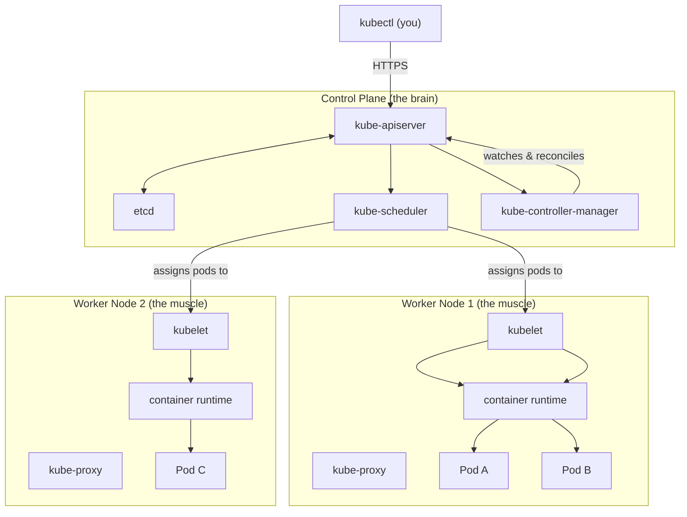

# Cluster Architecture Overview

A Kubernetes cluster is made up of at least two kinds of machines, called nodes. In a minimal setup there is one of each, but production clusters typically have multiple of both for redundancy and capacity.

The **control plane** is the brain of the cluster. It makes all the decisions: where to run workloads, how many copies to maintain, what the current state of the cluster is, and what needs to change to reach the desired state. The control plane does not run your application workloads, it manages everything that does.

The **worker nodes** are the muscle. They receive instructions from the control plane and actually run your application containers. Each worker node has the software needed to run containers and report back to the control plane about what is happening.

:::info
In small development environments, it is possible to run workloads on the control plane node itself (sometimes called a "single-node cluster"). In production, however, the control plane is almost always kept separate from worker nodes to protect cluster stability.
:::

## The Control Plane: The Brain

The control plane is responsible for the cluster's global state. It stores the desired state of all resources, every deployment, every service, every pod specification, and continuously reconciles the actual state of the cluster against that desired state.

Everything flows through the control plane's API: your `kubectl get pods`, a container crash triggering rescheduling, a deployment scaling from three to ten replicas. The control plane receives the request, records the new desired state, and orchestrates the changes.

## Worker Nodes: The Muscle

Worker nodes are where your application actually lives. Each node, physical or virtual, runs a minimal set of Kubernetes software that allows it to receive work from the control plane, run containers, and report status back.

When Kubernetes schedules a Pod to run on a node, the worker node receives the specification and instructs its local container runtime to pull the image and start the container. From that point, the node monitors the container and reports back to the control plane if anything changes.

A cluster can have anywhere from one worker node to thousands. The control plane is designed to manage this scale gracefully, the same API and the same components handle a three-node cluster and a three-thousand-node cluster.

## High-Level Component Overview

Here is a map of the key components at each level:

**Control plane components:**

- **kube-apiserver:** the front door; all communication enters through here
- **etcd:** the cluster's database; stores all state as key-value pairs
- **kube-scheduler:** assigns new Pods to nodes based on resources and constraints
- **kube-controller-manager:** runs the control loops that keep the cluster in its desired state

**Worker node components:**

- **kubelet:** the agent on each node; ensures containers specified by the control plane are running
- **kube-proxy:** manages network rules so that Pods and Services can communicate
- **Container runtime:** the software that actually starts and stops containers (commonly containerd)



## The Kitchen Analogy in Full

Mapping each kitchen role to the Kubernetes architecture:

- **Head chef** → `kube-scheduler`: surveys the kitchen, decides who gets which order based on who has capacity
- **Kitchen manager** → `kube-controller-manager`: ensures the right number of orders are being prepared, escalates when something goes wrong
- **Order book** → `etcd`: the authoritative record of what should be happening
- **Pass-through window** → `kube-apiserver`: every interaction flows through it, in and out
- **Line cooks** → `kubelet` on each worker node: receive assigned tasks and execute them
- **Runners** → `kube-proxy`: carry dishes between stations, ensuring the right food reaches the right table
- **Stoves and ovens** → container runtime: the actual machinery that produces the output

No one in the kitchen needs to understand the entire operation. The head chef does not need to know how to operate the oven; the cooks do not need to understand inventory management. This separation of concerns is what makes the system scalable and maintainable, and it is why Kubernetes can manage thousands of workloads across hundreds of nodes without becoming unmanageable.

:::info
You will sometimes hear the control plane referred to as the "master" in older documentation. The Kubernetes community has moved away from this terminology in favor of "control plane." If you see the word "master" in older tutorials or exam materials, it refers to the same concept.
:::

## Hands-On Practice

Let's explore the nodes in your practice cluster and see the architecture in action.

List your nodes with extra detail:

```bash
kubectl get nodes -o wide
```

Expected output:

```bash
NAME                STATUS   ROLES           AGE   VERSION   INTERNAL-IP   EXTERNAL-IP   OS-IMAGE                         KERNEL-VERSION                     CONTAINER-RUNTIME
sim-control-plane   Ready    control-plane   2m    v1.35.0   172.18.0.2    <none>        Debian GNU/Linux 12 (bookworm)   6.6.87.2-microsoft-standard-WSL2   containerd://2.2.0
sim-worker          Ready    <none>          2m    v1.35.0   172.18.0.3    <none>        Debian GNU/Linux 12 (bookworm)   6.6.87.2-microsoft-standard-WSL2   containerd://2.2.0
sim-worker2         Ready    <none>          2m    v1.35.0   172.18.0.4    <none>        Debian GNU/Linux 12 (bookworm)   6.6.87.2-microsoft-standard-WSL2   containerd://2.2.0
```

Notice the `ROLES` column. The control plane node shows `control-plane`, while the worker node shows `<none>` (worker nodes do not have an explicit role label by default in many clusters).

Now get detailed information about a specific node to see its resources and running pods:

```bash
kubectl describe node sim-worker
```

This produces a long output. Scan through it and note these important sections:

- **Conditions**: shows if the node is healthy (`Ready`)
- **Capacity** and **Allocatable**: the total and available CPU/memory on the node
- **Non-terminated Pods**: lists every pod currently running on this node

Check which pods are running on the control plane (the system components we saw earlier), the `-n kube-system` flag is used to list pods in the kube-system namespace, we will learn more about namespaces in later lessons:

```bash
kubectl get pods -n kube-system -o wide
```

Expected output:

```
NAME                                        READY   STATUS    RESTARTS   AGE   IP               NODE                NOMINATED NODE   READINESS GATES
etcd-sim-control-plane                      1/1     Running          0   4m    10.244.33.147    sim-control-plane   <none>           <none>
kube-apiserver-sim-control-plane            1/1     Running          0   4m    10.244.68.104    sim-control-plane   <none>           <none>
kube-controller-manager-sim-control-plane   1/1     Running          0   4m    10.244.239.54    sim-control-plane   <none>           <none>
kube-scheduler-sim-control-plane            1/1     Running          0   4m    10.244.62.178    sim-control-plane   <none>           <none>
kindnet-gk6vf                               1/1     Running          0   4m    10.244.104.225   sim-control-plane   <none>           <none>
kindnet-njmjr                               1/1     Running          0   4m    10.244.15.85     sim-worker          <none>           <none>
kindnet-5gsl1                               1/1     Running          0   4m    10.244.108.16    sim-worker2         <none>           <none>
coredns-004db73bf1-i1iz0                    1/1     Running          0   4m    10.244.30.42     sim-control-plane   <none>           <none>
coredns-004db73bf1-c4440                    1/1     Running          0   4m    10.244.246.175   sim-control-plane   <none>           <none>
kube-proxy-gixqr                            1/1     Running          0   4m    10.244.82.75     sim-control-plane   <none>           <none>
kube-proxy-1ymin                            1/1     Running          0   4m    10.244.143.244   sim-worker          <none>           <none>
kube-proxy-3tx2p                            1/1     Running          0   4m    10.244.68.119    sim-worker2         <none>           <none>
```

Look at the `NODE` column. The control plane components (`etcd`, `kube-apiserver`, `kube-controller-manager`, `kube-scheduler`) all run on the `controlplane` node. The `kube-proxy` runs on every node, including worker nodes. This is exactly the architecture we just described. Open the cluster visualizer to see this laid out graphically.

## Wrapping Up

A Kubernetes cluster is divided into two logical layers: the control plane, which manages and orchestrates everything, and the worker nodes, which run the actual workloads. This separation of concerns is fundamental to how Kubernetes achieves the reliability and scalability it is known for. In the next two lessons, we will go deeper into the individual components of each layer, starting with the control plane.
