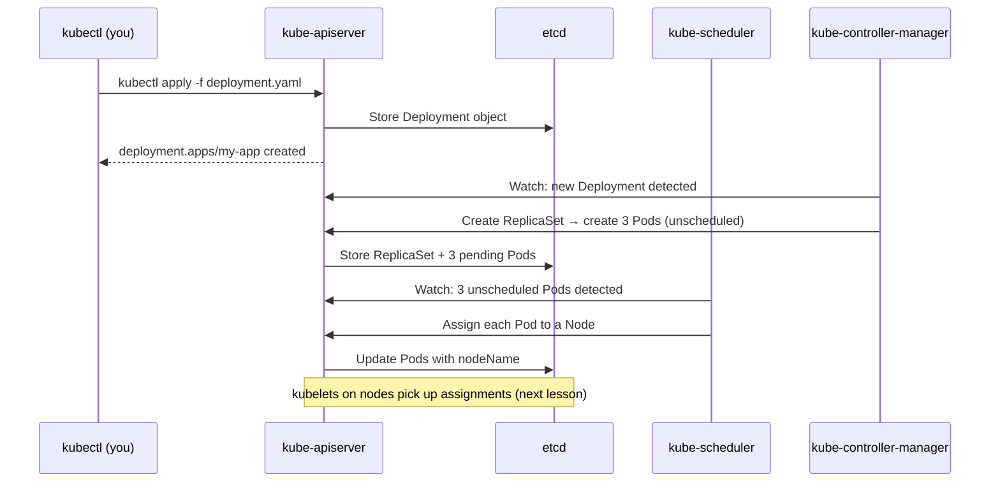

# Control Plane Components in Depth

In the previous lesson, we established that the control plane is the brain of a Kubernetes cluster, the layer responsible for decision-making, state management, and orchestration. But the control plane is not a monolith. It is composed of several distinct processes, each with a clearly defined responsibility.

Think of these components as the different departments of a well-run operations center: the receptionist handles all incoming requests, the archive room stores all records, the logistics planner decides who gets which task, the supervisors make sure every ongoing task is executed correctly. Each department has one job and does it well, and they coordinate through a shared system of record.

:::info
All four core components, `kube-apiserver`, `etcd`, `kube-scheduler`, and `kube-controller-manager`, run as static Pods on the control plane node. You can inspect them directly with `kubectl get pods -n kube-system`.
:::

## kube-apiserver: The Front Door

The `kube-apiserver` is the central component of the entire control plane. Every interaction with a Kubernetes cluster goes through it, every `kubectl` command you run, every health check a node submits, every query from another control plane component. Nothing happens in a Kubernetes cluster without passing through the API server.

When you run `kubectl get pods`, your client sends an HTTP request to the API server. The server authenticates who you are, checks whether you are authorized, validates the request, and retrieves the relevant data from `etcd`. When you run `kubectl apply -f deployment.yaml`, the API server validates the YAML, stores the new object in `etcd`, and notifies the relevant controllers that a change has been made.

The API server is stateless in its own right, it does not store anything locally. All state lives in `etcd`. This is a deliberate design: it makes the API server horizontally scalable, meaning you can run multiple instances for high availability, each reading from and writing to the same `etcd` cluster.

:::info
The API server exposes a RESTful API over HTTPS. Everything in Kubernetes is a resource with standard HTTP verbs: GET, POST, PUT, PATCH, DELETE. This makes it straightforward to interact with the cluster from any HTTP client, not just `kubectl`. Tools like Helm, ArgoCD, and custom operators all communicate via the API server.
:::

## etcd: The Cluster's Source of Truth

`etcd` is a distributed key-value store that serves as Kubernetes' database. Every piece of cluster state, every object definition, every configuration, every status update, is stored in `etcd`. If you wanted to know what the cluster "thinks" should be happening, you would find it there.

The "distributed" part is important. `etcd` is designed to run as a cluster of typically three or five nodes (an odd number, for quorum reasons), spread across different failure zones. It uses the Raft consensus algorithm to ensure all nodes agree on the current state before a write is committed.

Because `etcd` is the single source of truth for the entire cluster, losing it without a backup is catastrophic. A corrupted or unavailable `etcd` means the control plane cannot function, it cannot schedule new pods, update deployments, or respond to failures. This is why backing up `etcd` is a critical operational practice and a significant topic in the CKA exam.

:::warning
Only the `kube-apiserver` should communicate with `etcd` directly. Other components, schedulers, controllers, kubelets, all go through the API server. This is enforced in well-configured clusters and is important for security and consistency.
:::

## kube-scheduler: The Placement Planner

The `kube-scheduler` is responsible for one job: watching for newly created Pods that have not yet been assigned to a node, and selecting the best node for each one.

The scheduling decision happens in two phases. First, the scheduler **filters** out nodes that cannot possibly run the Pod. Then, from the remaining eligible nodes, it **scores** each one and picks the highest-scoring option. The factors considered during filtering and scoring include:

- **Resource requests**: how much CPU and memory the Pod needs vs. what each node has available
- **Affinity and anti-affinity rules**: e.g., "prefer nodes with SSD storage" or "never run on the same node as Pod X"
- **Taints and tolerations**: a mechanism for marking nodes as unsuitable for certain workloads unless the workload explicitly tolerates the taint
- **Custom scheduling policies**: configured by the cluster administrator

When the scheduler has made its decision, it writes the chosen `nodeName` back to the Pod object via the API server. The kubelet on the chosen node then picks up the assignment and starts the container. The scheduler does not start containers itself, it only makes the placement decision.

## kube-controller-manager: The Supervisors

The `kube-controller-manager` is a single binary that runs many control loops simultaneously. Each control loop, called a **controller**, watches a specific type of resource and reconciles its actual state with its desired state.

Think of a controller as a diligent supervisor with a simple job: look at what *should* be happening, look at what *is* happening, and if there is a difference, do something about it. This loop runs continuously, which is why Kubernetes is described as a self-healing system.

Some of the most important controllers:

- **Deployment controller**: watches for Deployment objects and ensures the correct number of ReplicaSets exist
- **ReplicaSet controller**: ensures the correct number of Pods are running; creates a replacement if a Pod dies
- **Node controller**: monitors nodes for failure; marks unresponsive nodes as unavailable and evicts their pods for rescheduling
- **Endpoints controller**: keeps the list of IP addresses behind a Service up to date as Pods come and go

All of these controllers run as goroutines within the single `kube-controller-manager` process, a pragmatic design that reduces operational overhead while maintaining logical separation between each controller's responsibilities.

## cloud-controller-manager: The Cloud Integration Layer

The `cloud-controller-manager` is an optional component that integrates Kubernetes with the API of a cloud provider. When you run Kubernetes on AWS, GCP, or Azure, it bridges the gap between Kubernetes concepts and cloud-provider resources.

For example, when you create a Service of type `LoadBalancer`, Kubernetes needs to provision an actual load balancer in your cloud provider's infrastructure. The cloud-controller-manager handles this, it also manages node lifecycle as cloud instances are added or removed, provisions cloud storage volumes, and sets cloud-specific routes.

This design allows Kubernetes to be cloud-agnostic at its core. The core components, API server, etcd, scheduler, controller manager, know nothing about AWS or Azure. All cloud-specific logic is encapsulated in the cloud-controller-manager, which is provided and maintained by each cloud vendor. If you are running Kubernetes on-premises or in a local learning environment, it is simply absent.

## How They Work Together



Every step of this flow goes through the API server. `etcd` is written to at each stage. The scheduler and controller manager are passive watchers, they use a watch mechanism that notifies them when relevant objects change, rather than polling constantly. This event-driven design keeps the control plane efficient even in large clusters.

## Hands-On Practice

Let's inspect the control plane components running in your cluster.

View the control plane pods directly:

```bash
kubectl get pods -n kube-system -l tier=control-plane
```

Expected output:

```bash
NAME                                        READY   STATUS    RESTARTS   AGE
etcd-sim-control-plane                      1/1     Running   0          1m
kube-apiserver-sim-control-plane            1/1     Running   0          1m
kube-controller-manager-sim-control-plane   1/1     Running   0          1m
kube-scheduler-sim-control-plane            1/1     Running   0          1m
```

These are the four core control plane components, each running as a Pod on the control plane node.

Examine the API server's configuration flags, they reveal a lot about how it is configured:

```bash
kubectl describe pod kube-apiserver-sim-control-plane -n kube-system
```

Expected output (partial):

```bash
Command:
  kube-apiserver
  --advertise-address=192.168.0.2
  --allow-privileged=true
  --authorization-mode=Node,RBAC
  --etcd-servers=https://127.0.0.1:2379
  --service-cluster-ip-range=10.96.0.0/12
  ...
```

Notice the `--etcd-servers` flag, it shows the API server connecting to etcd on `localhost:2379`. The `--authorization-mode=Node,RBAC` tells you the cluster is using Role-Based Access Control.

Check the scheduler's logs to see recent scheduling decisions:

```bash
kubectl logs kube-scheduler-sim-control-plane -n kube-system --tail=20
```

The output will show recent events, potentially including pod scheduling decisions with node names. This is the live activity log of the scheduler doing its job.

Finally, look at the controller manager's logs to observe reconciliation loops in action:

```
kubectl logs kube-controller-manager-controlplane -n kube-system --tail=10
```

## Wrapping Up

The control plane is composed of four core components: the `kube-apiserver` as the central gateway, `etcd` as the persistent store of cluster state, the `kube-scheduler` for pod placement decisions, and the `kube-controller-manager` running all the reconciliation loops that keep the cluster healthy. An optional `cloud-controller-manager` handles cloud-provider integrations. In the next lesson, we shift to the other side of the cluster and explore what runs on every worker node.
