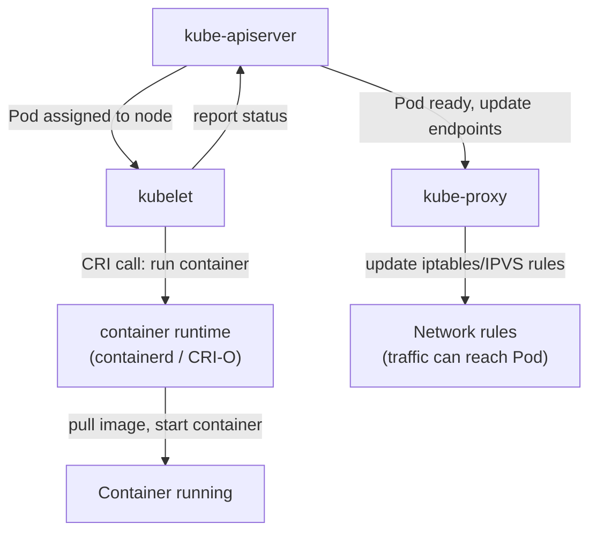

# Worker Node Components

If the control plane is the brain that plans and decides, the worker nodes are the hands that actually do the work. Every container your application runs in lives on a worker node, but a worker node is not just a machine with containers on it. It has a specific set of software components that allow it to participate in the cluster, receive instructions from the control plane, run workloads correctly, and handle network traffic.

## kubelet: The Node Agent

The `kubelet` is the most important component on a worker node. It is a long-running agent that acts as the liaison between the node and the control plane.

Its primary responsibility is to ensure that the containers described in a Pod specification are actually running. When the scheduler assigns a Pod to a node, it writes the node's name into the Pod object via the API server. The kubelet on that node is watching for exactly this kind of event, the moment it sees a new Pod assigned to its node, it reads the Pod specification and instructs the container runtime to pull the image and start the container.

After the container starts, the kubelet continuously monitors it: restarting it if it crashes (according to the Pod's restart policy), running liveness and readiness probes, and reporting results back to the API server so the cluster knows whether the container is healthy. The kubelet's world is defined entirely by Pod specifications received from the API server, if you manually start a container on a node using the container runtime directly, the kubelet will not know about it and will not manage it.

:::info
The kubelet also runs on the control plane node in most cluster setups, that is how the control plane components themselves (the API server, scheduler, etc.) are managed as pods. You can verify this by checking which node the `kube-apiserver` pod runs on: it will be the control plane node, managed by the kubelet on that node.
:::

## kube-proxy: The Network Enabler

Every Pod in a Kubernetes cluster gets its own IP address. But Pod IPs are ephemeral: when a Pod is deleted and replaced, the new Pod gets a new IP. If other services were talking to the old IP, they would break.

This is where Kubernetes Services come in. A Service provides a stable endpoint, a single IP address and DNS name, that remains constant even as the underlying Pods come and go. But how does traffic sent to a Service IP actually reach one of the Pods behind it? That is the job of `kube-proxy`.

`kube-proxy` runs on every node and maintains a set of network rules (using the Linux kernel's `iptables` or IPVS subsystems) that redirect traffic destined for a Service IP to one of the actual Pod IPs backing that Service. When a new Pod is added or removed from a Service, `kube-proxy` updates the rules to reflect the change. Think of it as a traffic director standing at every intersection: when a packet arrives addressed to "City Hall" (the Service IP), the director knows the current location of City Hall's staff (the Pod IPs) and redirects it accordingly.

:::warning
Despite its name, `kube-proxy` does not proxy traffic in the traditional sense. In modern clusters, it programs kernel-level rules that redirect packets efficiently without involving a proxy process for each connection. The name is a historical artifact.
:::

## Container Runtime: The Execution Engine

The container runtime is the software that actually starts, stops, and manages containers on a node. Kubernetes does not include a container runtime itself, it delegates all container operations to an external runtime via a standardized interface called the **Container Runtime Interface** (CRI).

The CRI is a plugin API that allows Kubernetes to work with any runtime that implements it. The two most common runtimes in modern Kubernetes clusters are:

- **containerd**: the most widely used runtime today, extracted from Docker and focused on high-performance, reliable container execution. The default with most cluster tools.
- **CRI-O**: an alternative designed specifically for Kubernetes, following a minimal-footprint philosophy, just enough to satisfy the CRI specification, no more.

:::info
You may have heard of Docker as a container runtime. Docker was used as the Kubernetes runtime for many years, but support for it (via "dockershim") was removed in Kubernetes 1.24. Today, Docker is still commonly used for building and pushing container images, but the runtime in clusters is containerd or CRI-O, both of which run the same OCI-compliant images that Docker produces.
:::

## How the Three Components Work Together

When a new Pod is scheduled to a node, here is the precise sequence of events:

1. The `kube-scheduler` writes the assigned node name to the Pod object in the API server.
2. The `kubelet` on that node detects the new assignment via its API server watch.
3. The `kubelet` reads the Pod specification and calls the container runtime (via CRI) to pull the required image and start the container.
4. The container runtime pulls the image (if not cached), creates the container, and starts it.
5. The `kubelet` begins monitoring the container and reporting its status back to the API server.
6. Meanwhile, `kube-proxy` detects that a new Pod is ready and updates the network rules so that Service traffic can reach it.



## Hands-On Practice

Let's inspect the node components running in your cluster.

Check which node components are running as pods:

```bash
kubectl get pods -n kube-system -o wide
```

Look at the output and find the `kube-proxy` pod. In a multi-node cluster, there will be one `kube-proxy` pod per node, it is deployed as a DaemonSet, a special workload type that guarantees exactly one pod per node.

Confirm that `kube-proxy` is indeed a DaemonSet:

```bash
kubectl get daemonset -n kube-system
```

Expected output:

```bash
NAME         DESIRED   CURRENT   READY   UP-TO-DATE   AVAILABLE   NODE SELECTOR            AGE
kindnet      3         3         3       3            3           kubernetes.io/os=linux   35s
kube-proxy   3         3         3       3            3           kubernetes.io/os=linux   35s
```

The numbers under DESIRED and CURRENT match the number of nodes in your cluster.

Now verify the container runtime on each node:

```bash
kubectl get nodes -o wide
```

Expected output (partial):

```bash
NAME                STATUS   ...   CONTAINER-RUNTIME
sim-control-plane   Ready    ...   containerd://2.2.0
sim-worker          Ready    ...   containerd://2.2.0
sim-worker2         Ready    ...   containerd://2.2.0
```

Let's deploy a simple pod and watch the kubelet bring it to life in the visualizer (telescope icon):

```bash
kubectl run test-pod --image=nginx
```

Expected progression: Pending -> ContainerCreating -> Running

`Pending` means the scheduler has assigned the pod but the kubelet has not yet pulled the image. `ContainerCreating` means the kubelet has instructed the runtime to pull and start the container. `Running` means the container is live.

Describe the pod to see the full event trace:

```bash
kubectl describe pod test-pod
```

Scroll to the `Events` section at the bottom:

```bash
Events:
  Type    Reason     Age   From               Message
  ----    ------     ----  ----               -------
  Normal  Scheduled  6s    default-scheduler  Successfully assigned default/test-pod to sim-worker
  Normal  Pulled     6s    kubelet            spec.containers{test-pod}: Container image "nginx" already present onmachine and can be accessed by the pod
  Normal  Created    6s    kubelet            spec.containers{test-pod}: Container created
  Normal  Started    6s    kubelet            spec.containers{test-pod}: Container started
```

This event log is a perfect trace of the lifecycle: the scheduler assigned it, the kubelet pulled the image, created the container, and started it. Clean up when done:

```bash
kubectl delete pod test-pod
```

## Wrapping Up

Every worker node runs three critical components: the `kubelet` acts as the node's agent, receiving Pod assignments and ensuring containers run; `kube-proxy` maintains network rules so that Service traffic reaches the right Pods; and the container runtime (typically `containerd`) is the engine that creates and manages containers via the CRI. Together, these three components turn a raw machine into a fully productive member of a Kubernetes cluster. With the architecture of both the control plane and worker nodes now clear, you are ready to start working with the core Kubernetes objects, starting with the smallest deployable unit of all: the Pod.
